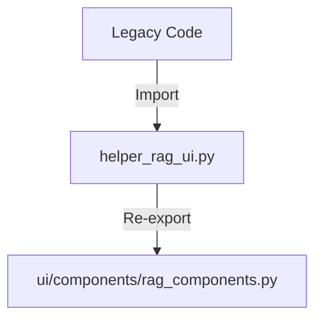

# Helper: RAG UI (後方互換レイヤー)

## 1. 概要
`helper_rag_ui.py` は、RAGデータ前処理用UIコンポーネントのための後方互換性モジュールです。
実際のUIロジックは `ui/components/rag_components.py` に移動されました。このモジュールは、古いインポートパスを使用しているコードが引き続き動作するように、新しいモジュールから関数を再エクスポートします。

**主な責務:**
*   **Re-export**: `ui.components.rag_components` からUI関数をインポートし、同じ名前で公開する。
*   **Backward Compatibility**: 既存の `from helper_rag_ui import ...` というコードの変更を最小限に抑える。

## 2. モジュール構成

### 2.1 依存関係

`ui.components.rag_components` に完全に依存（委譲）しています。



### 2.2 ディレクトリ構成

```
helper_rag_ui.py         # 【本モジュール】後方互換レイヤー
ui/
└── components/
    └── rag_components.py # 新実装
```

## 3. 関数一覧

以下の関数はすべて `ui.components.rag_components` から再エクスポートされています。
詳細な仕様（IPO）については、[ui/components/rag_components.md](../ui/components/rag_components.md) を参照してください。

| 関数名 | 概要 |
| :--- | :--- |
| `select_model` | モデル選択UIを表示。 |
| `show_model_info` | 選択モデルの情報を表示。 |
| `estimate_token_usage` | トークン使用量を推定。 |
| `display_statistics` | データ統計を表示。 |
| `show_usage_instructions` | 使用方法ガイドを表示。 |
| `setup_page_config` | ページ設定を初期化。 |
| `setup_page_header` | ページヘッダーを表示。 |
| `setup_sidebar_header` | サイドバーヘッダーを表示。 |

## 4. 利用方法

### 推奨される利用方法（新規コード）

```python
from ui.components.rag_components import select_model

model = select_model()
```

### 互換性のための利用方法（既存コード）

```python
from helper_rag_ui import select_model

model = select_model()
```
