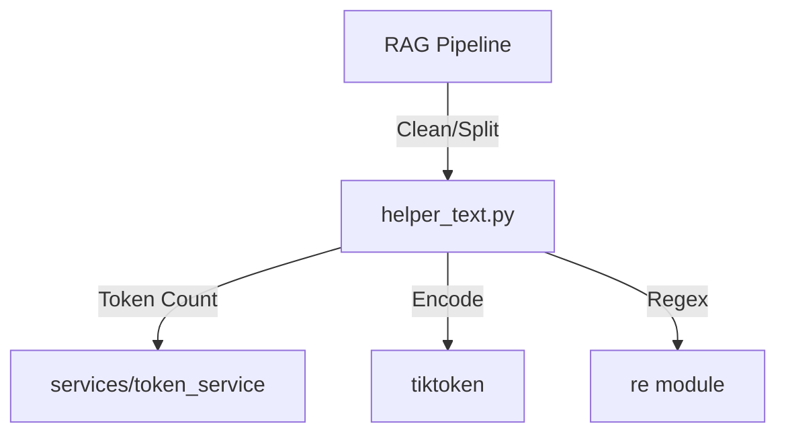
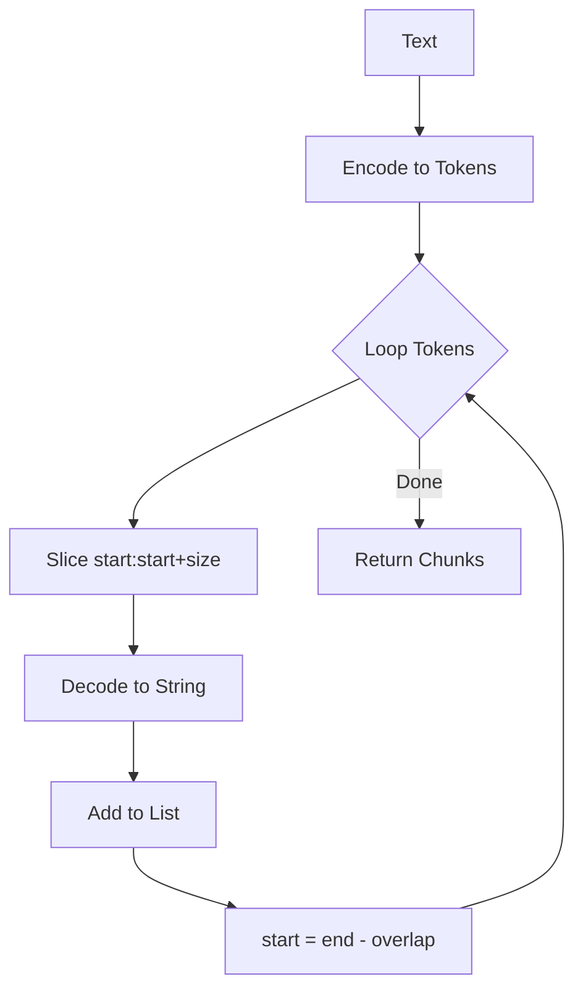

# Helper: Text (テキスト処理ユーティリティ)

## 1. 概要
`helper_text.py` は、テキストデータのクリーニング、正規化、分析、およびチャンク分割を行うためのユーティリティ関数群です。
主にRAGパイプラインの前処理段階で使用され、日本語特有の処理（全角・半角変換、文分割）やトークン数ベースの操作をサポートします。

**主な責務:**
*   **Text Cleaning**: 空白の正規化、引用符の統一、不要な改行の削除。
*   **Normalization**: 日本語テキストの正規化（全角英数→半角、連続句読点の除去）。
*   **Chunking**: トークン数制限に基づいたテキストの分割（オーバーラップ対応）。
*   **Analysis**: 複雑度分析、キーコンセプト抽出、統計情報の取得。

## 2. モジュール構成

### 2.1 依存関係

`tiktoken` ライブラリと、トークン計算のために `services/token_service` を使用します。



### 2.2 ディレクトリ構成

```
helper_text.py           # 【本モジュール】テキスト処理
```

## 3. 関数一覧

### クリーニング・正規化

| 関数名 | 概要 | 主要引数 |
| :--- | :--- | :--- |
| `clean_text` | テキストの基本的なクリーニング（空白・改行・引用符）。 | `text` |
| `normalize_japanese_text` | 日本語テキストの正規化（全角英数→半角）。 | `text` |
| `extract_sentences_japanese` | 日本語テキストを文単位に分割。 | `text` |

#### Function: `clean_text` IPO

*   **Input**:
    *   `text` (str): 元テキスト
*   **Process**:
    1.  Noneや非文字列のチェック（空文字を返す）。
    2.  改行 (`\n`, `\r`) を空白に置換。
    3.  連続する空白 (`\s+`) を1つの空白に置換。
    4.  前後の空白除去。
    5.  引用符の正規化。
*   **Output**:
    *   `str`: クリーニング済みテキスト。

### チャンク分割

| 関数名 | 概要 | 主要引数 |
| :--- | :--- | :--- |
| `split_into_chunks` | テキストを指定トークンサイズで分割。 | `text`, `chunk_size`, `overlap` |
| `split_into_chunks_with_metadata` | メタデータ（ID, 位置情報）付きでチャンク分割。 | `text`, `doc_id`, `chunk_size` |
| `merge_small_chunks` | 小さすぎるチャンクを隣接チャンクと統合。 | `chunks`, `min_tokens` |

#### Function: `split_into_chunks` IPO

*   **Input**:
    *   `text` (str): 分割対象テキスト
    *   `chunk_size` (int): 1チャンクの最大トークン数
    *   `overlap` (int): 重複させるトークン数
*   **Process**:
    1.  `tiktoken` でテキストをトークンIDリストに変換。
    2.  リストを先頭から `chunk_size` 分だけ切り出し、デコードしてチャンク化。
    3.  開始位置を `chunk_size - overlap` 分だけ進める（スライディングウィンドウ）。
    4.  リスト末尾まで繰り返し。
*   **Output**:
    *   `List[str]`: テキストチャンクのリスト。



### 分析・その他

| 関数名 | 概要 | 主要引数 |
| :--- | :--- | :--- |
| `analyze_text_complexity` | 文長やトークン数からテキストの難易度を判定。 | `text` |
| `extract_key_concepts` | 正規表現で簡易的に重要語句を抽出。 | `text`, `max_concepts` |
| `truncate_text` | 指定トークン数でテキストを切り詰め。 | `text`, `max_tokens` |
| `get_text_stats` | 文字数、単語数、トークン数などの統計を取得。 | `text` |

## 4. 利用方法

### テキストのクリーニング

```python
from helper_text import clean_text, normalize_japanese_text

raw_text = "　こんにちは。\n\n ＡＩ です。 "
cleaned = clean_text(raw_text)
normalized = normalize_japanese_text(cleaned)

print(f"'{normalized}'") # 'こんにちは。 AI です。'
```

### チャンク分割

```python
from helper_text import split_into_chunks

long_text = "..." # 長いテキスト
chunks = split_into_chunks(long_text, chunk_size=300, overlap=50)

for i, chunk in enumerate(chunks):
    print(f"Chunk {i}: {len(chunk)} chars")
```

