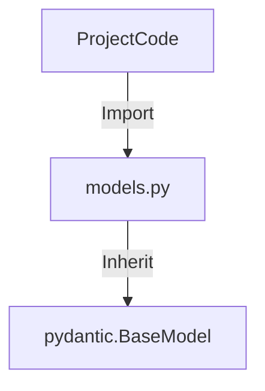
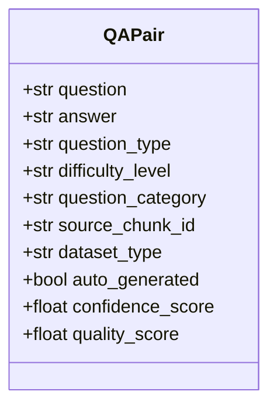

# Helper: Models (Pydanticモデル定義)

## 1. 概要
`models.py` は、プロジェクト全体（Q/A生成、Celeryタスク、Qdrant連携、処理結果）で使用されるデータ構造を一元管理するモジュールです。
Pydanticの `BaseModel` を継承し、型安全性、バリデーション、およびドキュメンテーション機能を提供します。

**主な責務:**
*   **Schema Definition**: 各種データオブジェクトのスキーマ定義。
*   **Validation**: 必須フィールドやデフォルト値の検証。
*   **Serialization**: JSON等へのシリアライズサポート。

## 2. モジュール構成

### 2.1 依存関係

Pydanticライブラリに依存します。



### 2.2 ディレクトリ構成

```
models.py                # 【本モジュール】共通モデル定義
qa_generation/models.py  # (類似) Q/A生成特化モデル
```

## 3. クラス一覧

### Q/A関連

| クラス名 | 概要 |
| :--- | :--- |
| `QAPair` | 質問、回答、メタデータ（タイプ、難易度等）を持つ基本単位。 |
| `QAPairsResponse` | `QAPair` のリストを保持するレスポンスモデル（LLM出力用）。 |

#### Schema: `QAPair`



### チャンク関連

| クラス名 | 概要 |
| :--- | :--- |
| `ChunkData` | 分割されたテキストチャンクとそのメタデータ。 |
| `ChunkComplexity` | チャンクの言語的・概念的複雑度の分析結果。 |

### タスク・処理結果

| クラス名 | 概要 |
| :--- | :--- |
| `QAGenerationResult` | CeleryタスクによるQ/A生成の結果。 |
| `CoverageResult` | カバレッジ分析の統計情報。 |
| `ProcessingResult` | 汎用的な処理成功/失敗結果。 |
| `SavedFilesResult` | ファイル保存操作の結果（パス情報）。 |

### Qdrant関連

| クラス名 | 概要 |
| :--- | :--- |
| `QdrantPointPayload` | ベクトルDBに格納するペイロードの構造。 |
| `QdrantCollectionStats` | コレクションの状態や統計情報。 |

## 4. 利用方法

### Q/Aペアの生成と検証

```python
from models import QAPair

# インスタンス化（バリデーション実行）
qa = QAPair(
    question="GRACEとは何ですか？",
    answer="AIエージェントシステムです。",
    question_type="fact"
)

# 辞書化
data = qa.model_dump()
```

### LLM構造化出力のスキーマとして利用

```python
from helper_llm import create_llm_client
from models import QAPairsResponse

client = create_llm_client()
response = client.generate_structured(
    "Q/Aを作成して", 
    response_schema=QAPairsResponse
)
```
