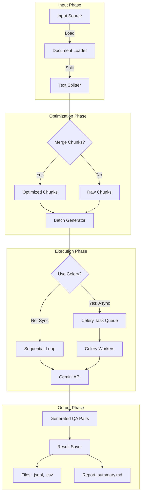

## make_qa.py ドキュメント

| 区分 | 要素 | 内容 | 関連する引数・設定 |
| :--- | :--- | :--- | :--- |
| **Input** | **1. データソース** | ・**Hugging Face Dataset**<br>・**ローカルファイル** (`.txt`, `.csv`, `.jsonl`, `.parquet`) | `--dataset`<br>`--input-file` |
| | **2. 生成モデル** | LLMモデル名（Geminiなど） | `--model` (デフォルト: `gemini-2.0-flash`) |
| | **3. 処理範囲・単位** | ・最大ドキュメント数<br>・テキスト分割設定（最小/最大トークン、オーバーラップ） | `--max-docs`<br>`--min-tokens`, `--max-tokens`, `--overlap-tokens` |
| | **4. 実行制御** | ・並列処理（Celery）の使用<br>・バッチサイズ、マージ設定 | `--use-celery`, `--celery-workers`<br>`--batch-chunks`, `--merge-chunks` |
| | **5. 品質・分析** | ・カバレッジ分析（網羅性チェック）<br>・類似度判定の使用 | `--analyze-coverage`, `--coverage-threshold`<br>`--use-similarity`, `--similarity-threshold` |
| | **6. 認証情報** | APIキー（環境変数） | `GOOGLE_API_KEY` |
| **Process** | **1. 初期化** | パイプライン (`QAPipeline`) の構築 | `QAPipeline(...)` |
| | **2. データロード** | データセットまたはファイルの読み込みとテキスト抽出 | `pipeline.run(...)` 内部処理 |
| | **3. チャンク分割** | 設定に基づきテキストを適切なサイズのチャンクに分割 | `min_tokens`, `max_tokens`, `overlap_tokens` |
| | **4. 生成 (LLM)** | Gemini API を呼び出してQ/Aペアを生成<br>（Celery有効時は並列分散処理） | `model`, `batch_chunks` |
| | **5. 分析・集約** | ・カバレッジ分析（オプション）<br>・生成結果の結合と整形 | `analyze_coverage`, `merge_chunks` |
| **Output** | **1. データファイル** | ・**Q/Aデータ (CSV/JSONL)**<br>・**メタデータ/統計情報** | `--output` (デフォルト: `./outputs`)<br>`qa_dataset_*.csv` |
| | **2. 実行ログ** | ・処理ステータス、生成数<br>・保存ファイルパス | 標準出力 (logging) |

## 1. 概要

`make_qa.py` は、RAG (Retrieval-Augmented Generation) システムの精度向上に不可欠な「高品質なQ/Aペア」を自動生成するためのCLIツールです。

GRACE Agentプロジェクトの新しいアーキテクチャに基づいて設計されており、単純な質問生成だけでなく、ドキュメントの文脈を考慮した高度なQ/A生成をサポートします。また、Celeryを用いた非同期並列処理により、大規模なデータセットからも効率的にデータセットを作成可能です。

### 主な特徴

1.  **Pipeline Architecture:** データ読み込み、前処理（チャンク化）、生成、保存、評価を一貫したパイプラインとして管理。
2.  **Hybrid Generation:** 単純な事実確認だけでなく、推論を要する複雑な質問も生成可能（モデル依存）。
3.  **Optimization:** チャンク統合（Merge）やバッチ処理により、LLM의コンテキストウィンドウを有効活用し、APIコストと処理時間を最適化。
4.  **Scalability:** Celery + Redis による分散タスクキューに対応し、数千〜数万規模のドキュメント処理にも対応。
5.  **Advanced Chunking:** チャンクオーバーラップやベクトル類似度に基づくセマンティック分割をサポート。

---

## 2. モジュール構成と役割

`make_qa.py` はエントリーポイントとして機能し、実際の処理ロジックは `qa_generation` パッケージに委譲されます。

| モジュール | 役割・責務 | 主要コンポーネント |
| :--- | :--- | :--- |
| **CLI Entrypoint** | 引数の解析、環境チェック、パイプラインの起動設定。 | `make_qa.py` |
| **QA Pipeline** | 処理全体のオーケストレーション（ロード→加工→生成→保存）。 | `qa_generation.pipeline.QAPipeline` |
| **Optimization** | トークン数を考慮したチャンクの結合やバッチサイズの調整。 | `Chunk Merger`, `Batch Processor` |
| **Async Executor** | Celeryを用いたタスクの分散実行。 | `Celery Worker`, `Redis` |

---

## 3. コマンドライン引数

### 必須/主要オプション

入力ソースはいずれか一つを必ず指定する必要があります。

| 引数 | 説明 | デフォルト |
| :--- | :--- | :--- |
| `--dataset` | `config.py` で定義済みのデータセット名（例: `livedoor`, `wikipedia`）。`--input-file` とは排他。 | `None` |
| `--input-file` | 処理対象とするローカルファイル（CSV, TXT等）のパス。`--dataset` とは排他。 | `None` |
| `--output` | 生成結果（JSONL, CSV, レポート）の保存先ディレクトリ。 | `qa_output/pipeline` |

### 生成・モデル設定

| 引数 | 説明 | デフォルト |
| :--- | :--- | :--- |
| `--model` | 生成に使用するGeminiモデル名。 | `gemini-2.0-flash` |
| `--max-docs` | テスト用に処理するドキュメント数を制限する場合に指定。 | `None` (全件) |
| `--analyze-coverage` | 生成完了後、元のドキュメント内容をQ/Aがどれだけ網羅しているか分析を行う。 | `False` |

### パフォーマンス・最適化オプション

コストと精度のバランスを調整するための重要なパラメータです。

| 引数 | 説明 | デフォルト |
| :--- | :--- | :--- |
| `--batch-chunks` | 1回のLLM APIコールでまとめて処理するチャンク数 (1-5)。多いほど高速だが、コンテキスト溢れのリスクがある。 | `3` |
| `--merge-chunks` | 小さなチャンクを統合して、より文脈豊かなチャンクを作成するか。 | `True` |
| `--min-tokens` | 統合対象とするチャンクの最小トークン数。これ未満のチャンクは結合候補となる。 | `150` |
| `--max-tokens` | 統合後のチャンクが許容する最大トークン数。 | `400` |
| `--overlap-tokens` | チャンク間の重複トークン数。文脈の維持に有効。 | `0` |
| `--use-similarity` | ベクトル類似度によるセマンティック分割を使用。 | `False` |
| `--similarity-threshold`| セマンティック分割の類似度閾値。 | `0.7` |

### 非同期処理 (Celery)

大規模データを処理する場合の推奨設定です。

| 引数 | 説明 | デフォルト |
| :--- | :--- | :--- |
| `--use-celery` | Celeryワーカーを使用した並列処理を有効化する。 | `False` |
| `--celery-workers` | 並列実行するワーカータスクの同時実行数。Gemini APIのDNS制限を考慮し、**8** 程度を推奨。 | `8` |

---

## 4. 実行プロセスフロー

データ入力から成果物出力までの流れです。



---

## 5. 使用例

### 基本的な使用法（データセット指定）
設定済みのデータセットから、最初の10件のみテスト生成します。

```bash
python make_qa.py --dataset livedoor --max-docs 10
```

### ローカルファイルから生成（チャンク統合あり）
手元のテキストファイルから、文脈を考慮して（チャンクを統合して）生成します。

```bash
python make_qa.py --input-file ./my_docs/manual.txt --merge-chunks --batch-chunks 3
```

### 高度なチャンク分割（オーバーラップあり）
文脈を維持するために50トークンのオーバーラップを設定します。

```bash
python make_qa.py --dataset wikipedia_ja --overlap-tokens 50 --use-celery
```

### 大規模処理（Celery並列実行）
数千件のドキュメントを処理する場合、Celeryを使って並列化します。
※ 事前に `sh start_workers.sh` 等でワーカーを起動しておく必要があります。

**推奨ワーカー数**: Gemini APIのDNS解決制限（503 Service Unavailable）を避けるため、`--celery-workers 8` 程度での実行を推奨します。

```bash
python make_qa.py --dataset wikipedia_ja --use-celery --celery-workers 8
```

### カバレージ分析付き
生成されたQ/Aが元のドキュメントの情報をどの程度カバーしているかを確認します。

```bash
python make_qa.py --dataset tech_blog --analyze-coverage
```

---

## 6. トラブルシューティング

### DNSエラー (503 Service Unavailable)
**症状**: `google.api_core.exceptions.ServiceUnavailable: 503 DNS resolution failed...`
**原因**: 並列実行数が多すぎて、Google APIへのDNSリクエストが一時的に制限されている可能性があります。
**対策**: ワーカー数（`--celery-workers`）を減らしてください（例: 24 -> 8）。

### 型エラー (TypeError: unexpected keyword argument)
**症状**: `TypeError: GenerativeModel.generate_content() got an unexpected keyword argument 'max_output_tokens'`
**原因**: 古いコードベースで発生していましたが、`helper_llm.py` の修正により解決済みです。最新のコードを使用してください。
**対策**: ワーカーを再起動してください（`./start_celery.sh restart`）。

---

## 7. 後続処理: register_qdrant.py の使い方

`make_qa.py` で生成したQ/Aデータセットは、そのままでは検索システムで利用できません。
後続の `register_qdrant.py` を使用して、Qdrantベクトルデータベースに登録する必要があります。

### 登録フロー

1.  **生成ファイルの確認**:
    `qa_output/pipeline/` 配下に生成された最新のCSVファイルを確認します。
    ```bash
    ls -t qa_output/pipeline/qa_pairs_*.csv | head -n 1
    ```

2.  **登録コマンドの実行**:
    以下のコマンドで登録を行います。
    `--recreate` オプションを付けることで、既存のコレクションを初期化してクリーンに登録できます。

    ```bash
    python register_qdrant.py \
      --input-file qa_output/pipeline/qa_pairs_fineweb_edu_ja_20251230_123456.csv \
      --collection qa_fineweb_edu_ja \
      --recreate \
      --batch-size 100
    ```

### 自動連携機能について

`register_qdrant.py` は登録完了後、Web UI (`agent_rag.py`) でのデータプレビュー用に、以下の処理を自動的に行います。

*   **ファイル名の正規化**: 入力ファイル名の日時情報（例: `_20251230...`）を除去した標準名でデータを登録します。
*   **UI用CSVの生成**: `qa_output/` 直下に、日時を含まないファイル名（例: `qa_pairs_fineweb_edu_ja.csv`）で、`question` と `answer` 列のみを抽出した軽量なCSVを生成します。

これにより、いつデータを更新しても、Web UI側は設定変更なしに最新データを表示できるようになります。
詳細な仕様については `doc/register_qdrant.md` を参照してください。