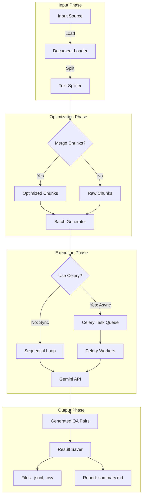

# make_qa.py ドキュメント

## 1. 概要

`make_qa.py` は、RAG (Retrieval-Augmented Generation) システムの精度向上に不可欠な「高品質なQ/Aペア」を自動生成するためのCLIツールです。

GRACE Agentプロジェクトの新しいアーキテクチャに基づいて設計されており、単純な質問生成だけでなく、ドキュメントの文脈を考慮した高度なQ/A生成をサポートします。また、Celeryを用いた非同期並列処理により、大規模なデータセットからも効率的にデータセットを作成可能です。

### 主な特徴

1.  **Pipeline Architecture:** データ読み込み、前処理（チャンク化）、生成、保存、評価を一貫したパイプラインとして管理。
2.  **Hybrid Generation:** 単純な事実確認だけでなく、推論を要する複雑な質問も生成可能（モデル依存）。
3.  **Optimization:** チャンク統合（Merge）やバッチ処理により、LLMのコンテキストウィンドウを有効活用し、APIコストと処理時間を最適化。
4.  **Scalability:** Celery + Redis による分散タスクキューに対応し、数千〜数万規模のドキュメント処理にも対応。

---

## 2. モジュール構成と役割

`make_qa.py` はエントリーポイントとして機能し、実際の処理ロジックは `qa_generation` パッケージに委譲されます。

| モジュール | 役割・責務 | 主要コンポーネント |
| :--- | :--- | :--- |
| **CLI Entrypoint** | 引数の解析、環境チェック、パイプラインの起動設定。 | `make_qa.py` |
| **QA Pipeline** | 処理全体のオーケストレーション（ロード→加工→生成→保存）。 | `qa_generation.pipeline.QAPipeline` |
| **Optimization** | トークン数を考慮したチャンクの結合やバッチサイズの調整。 | `Chunk Merger`, `Batch Processor` |
| **Async Executor** | Celeryを用いたタスクの分散実行。 | `Celery Worker`, `Redis` |

---

## 3. コマンドライン引数

### 必須/主要オプション

入力ソースはいずれか一つを必ず指定する必要があります。

| 引数 | 説明 | デフォルト |
| :--- | :--- | :--- |
| `--dataset` | `config.py` で定義済みのデータセット名（例: `livedoor`, `wikipedia`）。`--input-file` とは排他。 | `None` |
| `--input-file` | 処理対象とするローカルファイル（CSV, TXT等）のパス。`--dataset` とは排他。 | `None` |
| `--output` | 生成結果（JSONL, CSV, レポート）の保存先ディレクトリ。 | `qa_output/pipeline` |

### 生成・モデル設定

| 引数 | 説明 | デフォルト |
| :--- | :--- | :--- |
| `--model` | 生成に使用するGeminiモデル名。 | `gemini-2.0-flash` |
| `--max-docs` | テスト用に処理するドキュメント数を制限する場合に指定。 | `None` (全件) |
| `--analyze-coverage` | 生成完了後、元のドキュメント内容をQ/Aがどれだけ網羅しているか分析を行う。 | `False` |

### パフォーマンス・最適化オプション

コストと精度のバランスを調整するための重要なパラメータです。

| 引数 | 説明 | デフォルト |
| :--- | :--- | :--- |
| `--batch-chunks` | 1回のLLM APIコールでまとめて処理するチャンク数 (1-5)。多いほど高速だが、コンテキスト溢れのリスクがある。 | `3` |
| `--merge-chunks` | 小さなチャンクを統合して、より文脈豊かなチャンクを作成するか。 | `True` |
| `--min-tokens` | 統合対象とするチャンクの最小トークン数。これ未満のチャンクは結合候補となる。 | `150` |
| `--max-tokens` | 統合後のチャンクが許容する最大トークン数。 | `400` |

### 非同期処理 (Celery)

大規模データを処理する場合の推奨設定です。

| 引数 | 説明 | デフォルト |
| :--- | :--- | :--- |
| `--use-celery` | Celeryワーカーを使用した並列処理を有効化する。 | `False` |
| `--celery-workers` | 並列実行するワーカータスクの同時実行数。 | `8` |

---

## 4. 実行プロセスフロー

データ入力から成果物出力までの流れです。



---

## 5. 使用例

### 基本的な使用法（データセット指定）
設定済みのデータセットから、最初の10件のみテスト生成します。

```bash
python make_qa.py --dataset livedoor --max-docs 10
```

### ローカルファイルから生成（チャンク統合あり）
手元のテキストファイルから、文脈を考慮して（チャンクを統合して）生成します。

```bash
python make_qa.py --input-file ./my_docs/manual.txt --merge-chunks --batch-chunks 3
```

### 大規模処理（Celery並列実行）
数千件のドキュメントを処理する場合、Celeryを使って並列化します。
※ 事前に `sh start_workers.sh` 等でワーカーを起動しておく必要があります。

```bash
python make_qa.py --dataset wikipedia_ja --use-celery --celery-workers 16
```

### カバレージ分析付き
生成されたQ/Aが元のドキュメントの情報をどの程度カバーしているかを確認します。

```bash
python make_qa.py --dataset tech_blog --analyze-coverage
```
