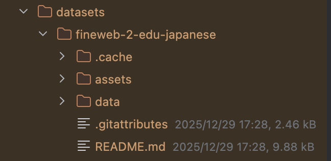
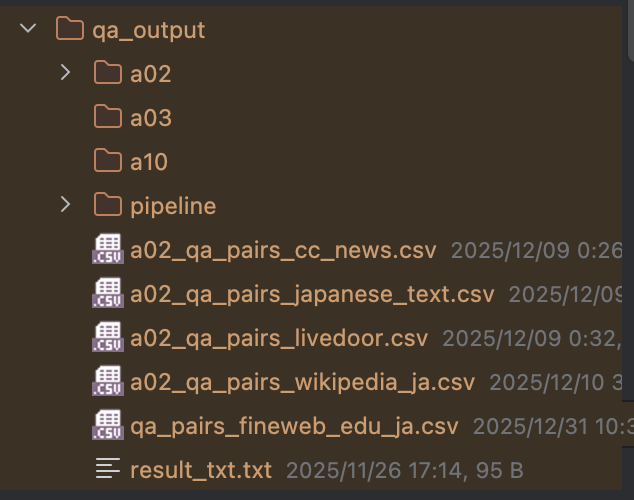
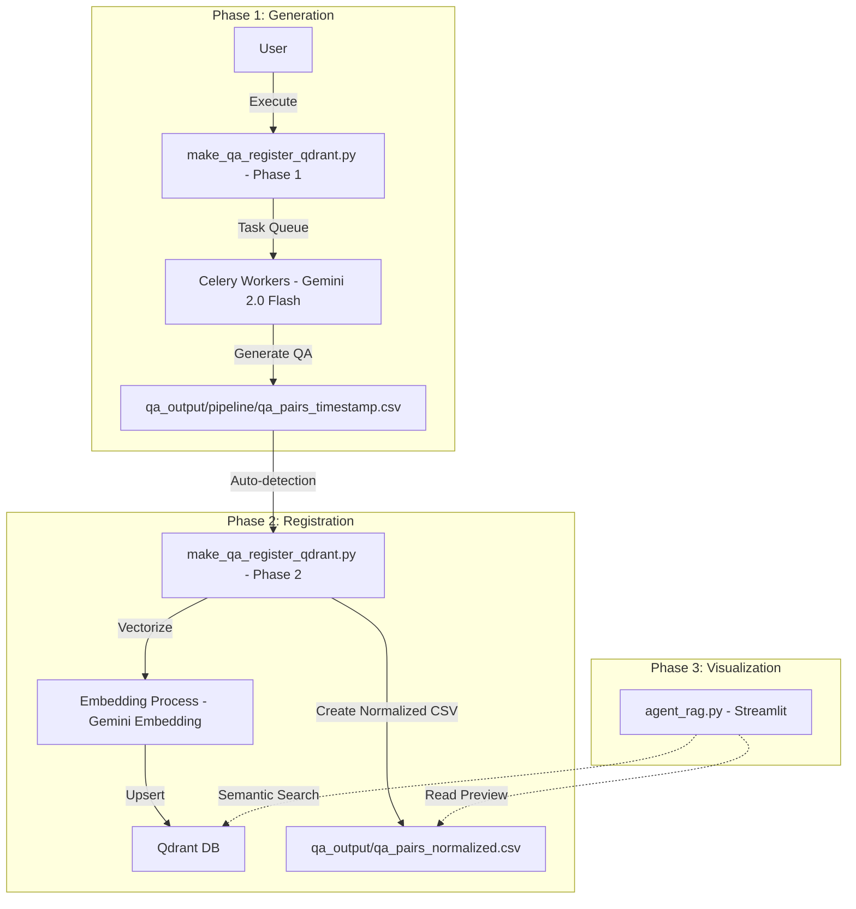
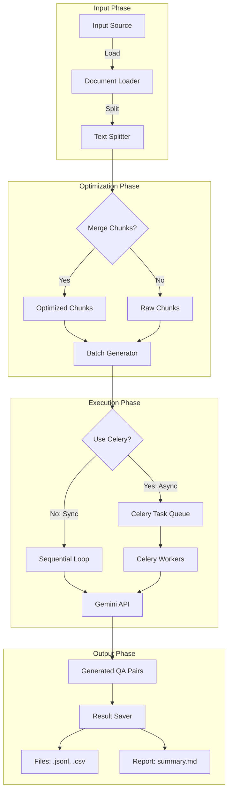

# make_qa_register_qdrant.py 統合ツール実行マニュアル

## 2. 利用環境と事前準備

本コマンドを実行する前に、以下の準備が必要です。

### 2.1 必須要件
*   **Docker**: QdrantサーバーおよびRedisを実行するために必要。
*   **Redis**: Celeryのタスクキューとして使用。
*   **APIキー**: `.env` ファイルに `GOOGLE_API_KEY` が正しく設定されていること。

### 2.2 登録元データ（CSVファイル）の準備
登録したいデータを `datasets/` ディレクトリ配下に準備します。

*   **HuggingFaceから取得する場合**:
    *   多くの場合、Parquet形式でダウンロードされます。
    *   本ツールで利用するには、事前にCSV形式に変換し、`Combined_Text` カラム（タイトルと本文を結合したもの等）を作成しておく前処理が必要です。
    
*   **ファイル形式**:
    *   UTF-8エンコーディングのCSVファイル。
    *   カラム名は後述の `config.py` の設定と一致させる必要があります。
    

### 2.3 `config.py` へのデータセット登録
新しいデータセットを処理対象にする場合、`config.py` の `DatasetConfig.DATASETS` クラスに情報を登録する必要があります。

**登録例:**
```python
# config.py 内
class DatasetConfig:
    DATASETS: Dict[str, DatasetInfo] = {
        "fineweb_edu_ja": DatasetInfo(
            name="FineWeb-Edu日本語版",
            icon="🎓",
            description="教育的価値の高い高品質な日本語Webテキスト",
            file="OUTPUT/preprocessed_fineweb_edu_ja.csv", # 読み込み元ファイルパス
            text_column="Combined_Text",                  # 解析対象のカラム名
            chunk_size=300,                               # チャンク分割サイズ
            qa_per_chunk=3,                               # 1チャンクあたりの生成数
            lang="ja",
        ),
        # ここに新しいデータセットの設定を追加
    }
```

### 2.4 サービスの起動とワーカーの管理
Q/A生成には並列処理を行う Celery ワーカーが必要です。

**サービスの起動 (Docker):**
```bash
# Qdrant & Redis の起動
docker-compose -f docker-compose/docker-compose.yml up -d
```

**Celeryワーカーの管理:**
PCのスペック（CPUコア数・メモリ）に合わせてワーカー数を調整してください（Gemini API制限を考慮し `8` を推奨）。

```bash
# ワーカーの起動 (例: 8ワーカー)
./start_celery.sh start -w 8

# ステータス確認 (正常に稼働しているか確認)
./start_celery.sh status

# 停止
./start_celery.sh stop

# 再起動 (設定変更後など)
./start_celery.sh restart -w 24
```

**モニタリング (Flower):**
ブラウザ（デフォルト: `http://localhost:5555`）でタスクの進捗をリアルタイムに確認できます。
```bash
celery -A celery_config flower --port=5555
```

---

## 3. コマンドの使い方

### 基本コマンド形式

```bash
python make_qa_register_qdrant.py --dataset <名前> --collection <名前> [オプション]
```

### 主要な引数


| 引数           | 説明                                                    | デフォルト         |
| :------------- | :------------------------------------------------------ | :----------------- |
| `--dataset`    | 処理対象のデータセット（`config.py`に定義済みのもの）。 | **必須**           |
| `--collection` | Qdrantの登録先コレクション名。                          | **必須**           |
| `--max-docs`   | 処理する最大文書数（テスト時は少量指定を推奨）。        | 全件               |
| `--use-celery` | Celeryによる並列生成を有効にするフラグ。                | False              |
| `--recreate`   | 既存のコレクションを削除して作り直すフラグ。            | False              |
| `--model`      | Q/A生成に使用するモデル。                               | `gemini-2.0-flash` |

### 実行例

```bash
python make_qa_register_qdrant.py \
  --dataset fineweb_edu_ja \
  --collection qa_fineweb_edu_ja \
  --use-celery \
  --celery-workers 24 \
  --recreate
```

---

## 4. 処理の流れ (Process Flow)

### 全体フロー

1. **Phase 1 (Generation)**: 指定されたデータセットを読み込み、チャンク化。Celeryワーカーを用いてQ/Aペアを生成し、`qa_output/pipeline/` に日時付きCSVを出力。
2. **Phase 2 (Registration)**: 生成されたCSVを読み込み、テキストをEmbedding（ベクトル化）。Qdrantにポイントをアップサート。
3. **Phase 3 (Post-Process)**: Web UI用に必要なカラムのみを抽出した「正規化CSV（日時なし）」を `qa_output/` に出力。

### Mermaid Diagram



## make_qa.py ドキュメント

## 1. 概要

`make_qa.py` は、RAG (Retrieval-Augmented Generation) システムの精度向上に不可欠な「高品質なQ/Aペア」を自動生成するためのCLIツールです。

GRACE Agentプロジェクトの新しいアーキテクチャに基づいて設計されており、単純な質問生成だけでなく、ドキュメントの文脈を考慮した高度なQ/A生成をサポートします。また、Celeryを用いた非同期並列処理により、大規模なデータセットからも効率的にデータセットを作成可能です。

### 主な特徴

1.  **Pipeline Architecture:** データ読み込み、前処理（チャンク化）、生成、保存、評価を一貫したパイプラインとして管理。
2.  **Hybrid Generation:** 単純な事実確認だけでなく、推論を要する複雑な質問も生成可能（モデル依存）。
3.  **Optimization:** チャンク統合（Merge）やバッチ処理により、LLMのコンテキストウィンドウを有効活用し、APIコストと処理時間を最適化。
4.  **Scalability:** Celery + Redis による分散タスクキューに対応し、数千〜数万規模のドキュメント処理にも対応。

---

## 2. モジュール構成と役割

`make_qa.py` はエントリーポイントとして機能し、実際の処理ロジックは `qa_generation` パッケージに委譲されます。

| モジュール | 役割・責務 | 主要コンポーネント |
| :--- | :--- | :--- |
| **CLI Entrypoint** | 引数の解析、環境チェック、パイプラインの起動設定。 | `make_qa.py` |
| **QA Pipeline** | 処理全体のオーケストレーション（ロード→加工→生成→保存）。 | `qa_generation.pipeline.QAPipeline` |
| **Optimization** | トークン数を考慮したチャンクの結合やバッチサイズの調整。 | `Chunk Merger`, `Batch Processor` |
| **Async Executor** | Celeryを用いたタスクの分散実行。 | `Celery Worker`, `Redis` |

---

## 3. コマンドライン引数

### 必須/主要オプション

入力ソースはいずれか一つを必ず指定する必要があります。

| 引数 | 説明 | デフォルト |
| :--- | :--- | :--- |
| `--dataset` | `config.py` で定義済みのデータセット名（例: `livedoor`, `wikipedia`）。`--input-file` とは排他。 | `None` |
| `--input-file` | 処理対象とするローカルファイル（CSV, TXT等）のパス。`--dataset` とは排他。 | `None` |
| `--output` | 生成結果（JSONL, CSV, レポート）の保存先ディレクトリ。 | `qa_output/pipeline` |

### 生成・モデル設定

| 引数 | 説明 | デフォルト |
| :--- | :--- | :--- |
| `--model` | 生成に使用するGeminiモデル名。 | `gemini-2.0-flash` |
| `--max-docs` | テスト用に処理するドキュメント数を制限する場合に指定。 | `None` (全件) |
| `--analyze-coverage` | 生成完了後、元のドキュメント内容をQ/Aがどれだけ網羅しているか分析を行う。 | `False` |

### パフォーマンス・最適化オプション

コストと精度のバランスを調整するための重要なパラメータです。

| 引数 | 説明 | デフォルト |
| :--- | :--- | :--- |
| `--batch-chunks` | 1回のLLM APIコールでまとめて処理するチャンク数 (1-5)。多いほど高速だが、コンテキスト溢れのリスクがある。 | `3` |
| `--merge-chunks` | 小さなチャンクを統合して、より文脈豊かなチャンクを作成するか。 | `True` |
| `--min-tokens` | 統合対象とするチャンクの最小トークン数。これ未満のチャンクは結合候補となる。 | `150` |
| `--max-tokens` | 統合後のチャンクが許容する最大トークン数。 | `400` |

### 非同期処理 (Celery)

大規模データを処理する場合の推奨設定です。

| 引数 | 説明 | デフォルト |
| :--- | :--- | :--- |
| `--use-celery` | Celeryワーカーを使用した並列処理を有効化する。 | `False` |
| `--celery-workers` | 並列実行するワーカータスクの同時実行数。Gemini APIのDNS制限を考慮し、**8** 程度を推奨。 | `8` |

---

## 4. 実行プロセスフロー

データ入力から成果物出力までの流れです。



---

## 5. 使用例

### 基本的な使用法（データセット指定）
設定済みのデータセットから、最初の10件のみテスト生成します。

```bash
python make_qa.py --dataset livedoor --max-docs 10
```

### ローカルファイルから生成（チャンク統合あり）
手元のテキストファイルから、文脈を考慮して（チャンクを統合して）生成します。

```bash
python make_qa.py --input-file ./my_docs/manual.txt --merge-chunks --batch-chunks 3
```

### 大規模処理（Celery並列実行）
数千件のドキュメントを処理する場合、Celeryを使って並列化します。
※ 事前に `sh start_workers.sh` 等でワーカーを起動しておく必要があります。

**推奨ワーカー数**: Gemini APIのDNS解決制限（503 Service Unavailable）を避けるため、`--celery-workers 8` 程度での実行を推奨します。

```bash
python make_qa.py --dataset wikipedia_ja --use-celery --celery-workers 8
```

### カバレージ分析付き
生成されたQ/Aが元のドキュメントの情報をどの程度カバーしているかを確認します。

```bash
python make_qa.py --dataset tech_blog --analyze-coverage
```

---

## 6. トラブルシューティング

### DNSエラー (503 Service Unavailable)
**症状**: `google.api_core.exceptions.ServiceUnavailable: 503 DNS resolution failed...`
**原因**: 並列実行数が多すぎて、Google APIへのDNSリクエストが一時的に制限されている可能性があります。
**対策**: ワーカー数（`--celery-workers`）を減らしてください（例: 24 -> 8）。

### 型エラー (TypeError: unexpected keyword argument)

**症状**: `TypeError: GenerativeModel.generate_content() got an unexpected keyword argument 'max_output_tokens'`

**原因**: 古いコードベースで発生していましたが、`helper_llm.py` の修正により解決済みです。最新のコードを使用してください。

**対策**: ワーカーを再起動してください（`./start_celery.sh restart`）。


---


## 7. 後続処理: register_qdrant.py の使い方


`make_qa.py` で生成したQ/Aデータセットは、そのままでは検索システムで利用できません。

後続の `register_qdrant.py` を使用して、Qdrantベクトルデータベースに登録する必要があります。


### 登録フロー


1.  **生成ファイルの確認**:

    `qa_output/pipeline/` 配下に生成された最新のCSVファイルを確認します。

    ```bash

    ls -t qa_output/pipeline/qa_pairs_*.csv | head -n 1

    ```


2.  **登録コマンドの実行**:

    以下のコマンドで登録を行います。

    `--recreate` オプションを付けることで、既存のコレクションを初期化してクリーンに登録できます。


    ```bash

    python register_qdrant.py \

      --input-file qa_output/pipeline/qa_pairs_fineweb_edu_ja_20251230_123456.csv \

      --collection qa_fineweb_edu_ja \

      --recreate \

      --batch-size 100

    ```


### 自動連携機能について


`register_qdrant.py` は登録完了後、Web UI (`agent_rag.py`) でのデータプレビュー用に、以下の処理を自動的に行います。
*   **ファイル名の正規化**: 入力ファイル名の日時情報（例: `_20251230...`）を除去した標準名でデータを登録します。

*   **UI用CSVの生成**: `qa_output/` 直下に、日時を含まないファイル名（例: `qa_pairs_fineweb_edu_ja.csv`）で、`question` と `answer` 列のみを抽出した軽量なCSVを生成します。


これにより、いつデータを更新しても、Web UI側は設定変更なしに最新データを表示できるようになります。

詳細な仕様については `doc/register_qdrant.md` を参照してください。
