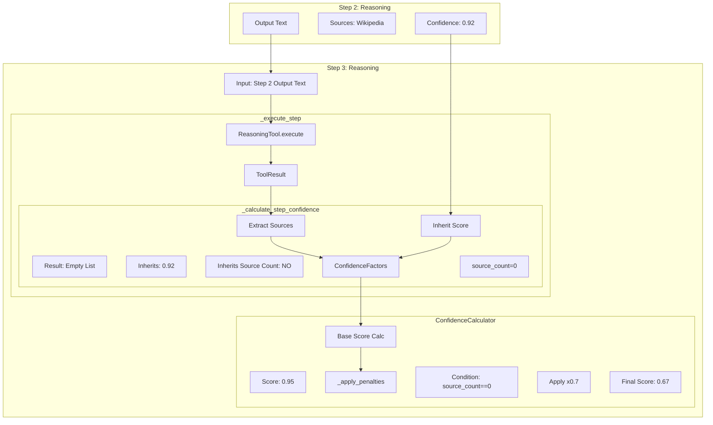

## planデータObjの受け渡し：
grace/planner.py から grace/executor.py へのデータの受け渡しは、`ExecutionPlan` という Pydantic
モデル（データクラス）を介して行われます。

受け渡しの具体的なインターフェースとデータ構造は以下の通りです。

1. インターフェース（どこで受け取っているか）

grace/executor.py の中の以下のメソッドが、Planner が生成した ExecutionPlan オブジェクトを直接引数として受け取ります。

* 一括実行用: Executor.execute_plan(self, plan: ExecutionPlan)
* ストリーミング実行用: Executor.execute_plan_generator(self, plan: ExecutionPlan, ...)

ソースコード抜粋 (`grace/executor.py`):

1     def execute_plan(self, plan: ExecutionPlan) -> ExecutionResult:
2         """
3         計画を実行（GRACEネイティブ実装）
4         Args:
5             plan: 実行する計画 (ExecutionPlanオブジェクト)
6         """
7         # ...
---
025-12-24 22:37:11,060 - grace.planner - INFO - Plan created: 3 steps, complexity=0.60, requires_confirmation=False
2025-12-24 22:37:11,062 - grace.planner - INFO - Final Execution Plan:
{
"original_query": "自然言語の曖昧さを利用してコミュニケーションを継続する例を挙げてください。",
"complexity": 0.6,
"estimated_steps": 3,
"requires_confirmation": false,
"steps": [
  {
    "step_id": 1,
    "action": "rag_search",
    "description": "自然言語の曖昧さを利用したコミュニケーションの継続に関する情報をWikipediaから検索する。",
    "query": "コミュニケーション 自然言語 利用 継続 曖昧さ",
    "collection": "wikipedia_ja",
    "depends_on": [],
    "expected_output": "自然言語の曖昧さを利用したコミュニケーションの継続に関するWikipediaの記事またはその一部。",
    "fallback": null,
    "timeout_seconds": null
  },
  {
    "step_id": 2,
    "action": "reasoning",
    "description": "ステップ1で得られた情報に基づいて、自然言語の曖昧さを利用してコミュニケーションを継続する例を特定する。",
    "query": null,
    "collection": null,
    "depends_on": [
      1
    ],
    "expected_output": "自然言語の曖昧さを利用してコミュニケーションを継続する具体的な例。",
    "fallback": null,
    "timeout_seconds": null
  },
  {
    "step_id": 3,
    "action": "reasoning",
    "description": "ステップ2で特定された例を基に、ユーザーに回答を生成する。",
    "query": null,
    "collection": null,
    "depends_on": [
      2
    ],
    "expected_output": "自然言語の曖昧さを利用してコミュニケーションを継続する例を説明する回答。",
    "fallback": null,
    "timeout_seconds": null
  }
],
"success_criteria": "自然言語の曖昧さを利用してコミュニケーションを継続する例をユーザーに提供できること。",
"created_at": null,
"plan_id": "44607339f87a"
}

---

2. データ構造（どのようなデータか）

受け渡されるデータは grace/schemas.py で定義されている `ExecutionPlan` クラスのインスタンスです。ログに出力されている JSON
は、このオブジェクトをシリアライズしたものです。

主要な構成要素は以下の通りです：

A. 全体情報 (ExecutionPlan)
* plan_id: 実行計画の一意識別子 (例: "44607339f87a")
* original_query: ユーザーが入力した元の質問
* complexity: 質問の複雑度 (0.0 〜 1.0)
* steps: 実行すべき具体的な手順のリスト (PlanStep のリスト)

B. 個別ステップ情報 (PlanStep)
steps リストに含まれる各要素です。Executor はこれを 1 つずつ取り出して実行します。
* step_id: ステップ番号 (1, 2, 3...)
* action: 実行するアクション名 (rag_search, reasoning, ask_user など)
* description: ステップの内容説明
* depends_on: 先行して完了している必要があるステップ ID のリスト
* query: そのステップでツール（QdrantやLLM）に渡す専用のクエリ
* collection: rag_search の場合に使用するコレクション名

---

3. データの流れ（IPO 的な視点）

1. Planner (Input): ユーザーの質問文字列を受け取る。
2. Planner (Process): LLM が質問を分析し、JSON 形式の計画を生成。これを ExecutionPlan オブジェクトに変換（パース）。
3. Planner (Output): `ExecutionPlan` オブジェクトを返却。
4. Executor (Input): `ExecutionPlan` オブジェクトを引数として受け取る。
5. Executor (Process): plan.steps をループで回し、action に応じたツールを呼び出す。

ログに表示されている JSON は、正に 「Planner が作成し終えて Executor に渡す直前の、中身が確定した計画」 を表しています。


## GRACE Agent プロジェクト計画書

> **GRACE** = **G**uided **R**easoning with **A**daptive **C**onfidence **E**xecution
> 適応型計画実行エージェント

---

## ⚠️ Step 3 の IPO 構造解析 (不具合調査結果)

Step 3 (Reasoning) で信頼度が低下する現象についての構造解析結果。

### 1. 担当コンポーネント

* **File:** `grace/executor.py`
* **Class:** `Executor`
* **Method:** `_execute_step` -> `_calculate_step_confidence`

### 2. IPO (Input-Process-Output) 解析

**Process (処理フロー):**

1. `_execute_step` が `reasoning` ツールを実行。
2. ツール実行結果 (`ToolResult`) が返る。
   * Step 3 は Step 2 のテキストを入力としているため、RAG検索などは行われず、ツール自身は `sources` を返さない（空リスト）。
3. `_calculate_step_confidence` が呼ばれる。
4. `ToolResult` から `source_count` を抽出。ツール結果にソースがないため **`source_count = 0`** となる。
5. 依存ステップからの継承ロジックが走るが、**現状のコードでは `source_count` の継承ロジックがない**。
6. `ConfidenceFactors` オブジェクトが `source_count=0` で作成される。
7. `ConfidenceCalculator.calculate` が呼ばれる。
8. `_apply_penalties` で `source_count == 0` が検知され、**ペナルティ (x0.7) が適用される。**

### 3. 構造図



---

## 目次

1. [プロジェクト概要](#1-プロジェクト概要)
2. [アーキテクチャ概要](#2-アーキテクチャ概要)
3. [技術的特徴の比較](#3-技術的特徴の比較)
4. [実装詳細設計（現在の実装）](#4-実装詳細設計（現在の実装）)
5. [実装ロードマップと進捗](#5-実装ロードマップと進捗)
6. [評価方法](#6-評価方法)

---

## 1. プロジェクト概要

### 1.1 背景

現在の `Gemini_Agent_RAG` プロジェクトは、**ReAct + Reflection** パターンを実装した学習用エージェントである。このプロジェクトを発展させ、より高度なエージェントアーキテクチャを学習・実装する。

### 1.2 命名


| 項目                   | 名称                                                |
| ---------------------- | --------------------------------------------------- |
| **プロジェクト名**     | `grace-agent`                                       |
| **アプリ表示名**       | GRACE                                               |
| **サブタイトル**       | Adaptive Research Agent                             |
| **Pythonパッケージ名** | `grace`                                             |
| **正式名称**           | Guided Reasoning with Adaptive Confidence Execution |
| **日本語名**           | 適応型計画実行エージェント                          |

### 1.3 命名の由来

```
G - Guided      : 計画に導かれる + HITL（人間介入）
R - Reasoning   : ReActの思考部分を継承
A - Adaptive    : 動的リプランニング
C - Confidence  : 信頼度ベース判断
E - Execution   : 実行フェーズ
```

### 1.4 ディレクトリ構成（最新）

```
gemini_grace_agent/
├── README.md
├── pyproject.toml
├── grace/                   # GRACE コアパッケージ
│   ├── __init__.py          # パッケージ定義
│   ├── config.py            # 設定管理・Pydanticモデル
│   ├── planner.py           # 計画生成 (Gemini API)
│   ├── executor.py          # 計画実行・状態管理 (Generator対応)
│   ├── tools.py             # ツール定義 (RAG, Reasoning, AskUser)
│   ├── schemas.py           # 共通データモデル (Plan, Result)
│   ├── confidence.py        # 信頼度計算ロジック
│   ├── intervention.py      # HITL介入ハンドラー
│   └── replan.py            # 動的リプランニング戦略
├── doc/                     # ドキュメント
└── tests/                   # テストコード
```

---

## 2. アーキテクチャ概要

### 2.1 GRACE はハイブリッドアーキテクチャ

GRACE は単一のパターンではなく、**複数のエージェントパターンを統合したハイブリッドアーキテクチャ**である。

```
┌─────────────────────────────────────────────────────────┐
│                    GRACE Agent                          │
│         (Hybrid Agentic Architecture)                   │
├─────────────────────────────────────────────────────────┤
│                                                         │
│   ┌─────────────┐   ┌─────────────┐   ┌─────────────┐  │
│   │ Plan-and-   │ + │ ReAct       │ + │ Reflection  │  │
│   │ Execute     │   │ (継承)      │   │ (継承)      │  │
│   └─────────────┘   └─────────────┘   └─────────────┘  │
│          │                                              │
│          ▼                                              │
│   ┌─────────────┐   ┌─────────────┐   ┌─────────────┐  │
│   │ Confidence  │ + │ HITL        │ + │ Adaptive    │  │
│   │ -aware      │   │             │   │ Replanning  │  │
│   └─────────────┘   └─────────────┘   └─────────────┘  │
│                                                         │
└─────────────────────────────────────────────────────────┘
```

### 2.2 学術的な分類

```
GRACE = Plan-and-Execute
        + ReAct (within execution)
        + Reflection
        + Confidence-based HITL
        + Adaptive Replanning
```


| 分類軸     | GRACE の位置づけ        |
| ---------- | ----------------------- |
| 制御フロー | Plan-and-Execute ベース |
| 推論方式   | ReAct（実行時）         |
| 品質管理   | Reflection + Confidence |
| 協調方式   | Human-in-the-Loop       |
| 適応方式   | Adaptive Replanning     |

---

## 3. 技術的特徴の比較

### 3.1 現行 vs 改修版


| # | 特徴       | 現行 (ReAct + Reflection) | GRACE (改修版)                |
| - | ---------- | ------------------------- | ----------------------------- |
| 1 | 思考と行動 | ✅ ReAct                  | ✅ 継承                       |
| 2 | 自己評価   | ✅ Reflection             | ✅ 継承・強化 (LLM Self-Eval) |
| 3 | 事前計画   | ❌                        | ✅**Plan-and-Execute**        |
| 4 | 人間介入   | ❌                        | ✅**HITL (Intervention)**     |
| 5 | 信頼度判断 | ❌                        | ✅**Confidence-aware**        |
| 6 | 動的再計画 | ❌                        | ✅**Adaptive Replanning**     |

---

## 4. 実装詳細設計（現在の実装）

### 4.1 計画スキーマ (Schemas)

`grace/schemas.py` に実装済み。

```python
class PlanStep(BaseModel):
    step_id: int
    action: Literal["rag_search", "web_search", "reasoning", "ask_user", ...]
    description: str
    query: Optional[str] = None
    collection: Optional[str] = None
    depends_on: List[int] = []
    expected_output: str
    fallback: Optional[str] = None
    timeout_seconds: int = 30

class ExecutionPlan(BaseModel):
    original_query: str
    complexity: float       # 0.0-1.0
    estimated_steps: int
    requires_confirmation: bool
    steps: List[PlanStep]
    success_criteria: str
    plan_id: str
```

### 4.2 Confidence Score 計算

`grace/confidence.py` に実装済み。ハイブリッド方式を採用。

**信頼度要素 (ConfidenceFactors):**

* **Search Quality:** 検索結果数、平均スコア、最大スコア、スコア分散
* **Source Agreement:** 複数ソース間の一致度 (Embedding類似度)
* **LLM Self-Eval:** LLMによる自己評価 (正確性、適切性)
* **Tool Success:** ツールの実行成功率
* **Query Coverage:** 回答の質問網羅度

**計算ロジック:**
これらの要素を重み付けして `0.0` 〜 `1.0` のスコアを算出。
さらに以下の介入レベルに分類する。


| レベル       | スコア | 挙動               |
| ------------ | ------ | ------------------ |
| **Silent**   | >= 0.9 | 自動進行           |
| **Notify**   | >= 0.7 | 通知して進行       |
| **Confirm**  | >= 0.4 | ユーザー確認を要求 |
| **Escalate** | < 0.4  | ユーザー入力を要求 |

### 4.3 介入・HITL (Intervention)

`grace/intervention.py` に実装済み。

* **InterventionHandler:** 信頼度に基づいて介入リクエスト (`InterventionRequest`) を発行。
* **DynamicThresholdAdjuster:** ユーザーのフィードバック履歴から閾値を動的に調整。
* **Action:** Proceed, Modify, Cancel, Input, Retry, Skip

### 4.4 動的リプランニング (Replanning)

`grace/replan.py` に実装済み。

**トリガー (ReplanTrigger):**

* ステップ実行失敗 (`STEP_FAILED`)
* 低信頼度 (`LOW_CONFIDENCE`)
* ユーザーからの修正要求 (`USER_FEEDBACK`)
* タイムアウト (`TIMEOUT`)

**戦略 (ReplanStrategy):**

* **Partial:** 失敗したステップ以降のみ再計画
* **Full:** 最初から計画を作り直す
* **Fallback:** 代替アクション（例: RAG → Web検索）へ切り替え
* **Skip:** 失敗ステップをスキップして続行

### 4.5 Executor (実行エンジン)

`grace/executor.py` に実装済み。

* **Generator Support:** `execute_plan_generator` により、ステップごとの進捗やログをUIにストリーミング可能。
* **State Management:** `ExecutionState` クラスで進行状況、結果、経過時間等を管理。
* **Integration:** `ReplanOrchestrator` および `InterventionHandler` と連携し、自律的な回復と人間との協調を行う。

---

## 5. 実装ロードマップと進捗

**現在のステータス:** Phase 4 まで実装完了、UI統合フェーズへ移行中。

### ✅ Phase 1: Plan-and-Execute (完了)

* `Planner`: Geminiを使用した計画生成プロンプトとロジック実装。
* `Executor`: 依存関係解決を含む順次実行ロジック実装。
* `Schemas`: Pydanticモデルによる型定義。

### ✅ Phase 2: Confidence-aware (完了)

* `ConfidenceCalculator`: 検索スコア、ツール結果、LLM自己評価を統合するロジック実装。
* `LLMSelfEvaluator`: 生成回答の品質をLLM自身に評価させる機能。

### ✅ Phase 3: HITL - Human-in-the-Loop (完了)

* `InterventionHandler`: 介入レベルに応じたリクエスト生成。
* `AskUserTool`: ユーザーへ逆質問するツールの実装。
* `DynamicThresholdAdjuster`: フィードバック学習ループの実装。

### ✅ Phase 4: Adaptive Replanning (完了)

* `ReplanManager`: 失敗時の戦略決定ロジック。
* `ReplanOrchestrator`: ExecutorとPlannerを結ぶ再計画フロー。
* 部分再計画、全体再計画、フォールバックの実装。

### 🔄 Phase 5: UI Integration & Optimization (進行中)

> **これからの取り組み**

* **Streamlit UI 統合:** `executor.execute_plan_generator` を使用したチャットUIの実装 (`grace_chat_page.py`)。
* **パラメータ調整:** Confidenceの重みや閾値の実地検証と調整。
* **E2Eテスト:** 複雑なシナリオを用いた統合テスト。

---

## 6. 評価方法

### 6.1 テストシナリオ


| シナリオ              | 期待される動作                                         | 確認状況 |
| --------------------- | ------------------------------------------------------ | -------- |
| **単純な事実質問**    | 高信頼度(Silent)で即答                                 | ✅       |
| **曖昧な質問**        | Plannerが`ask_user` を計画に含める、またはEscalate介入 | ✅       |
| **情報不足/検索失敗** | Confidence低下 → Replan (Web検索や代替手段へ)         | ✅       |
| **ユーザー指摘**      | 介入時に「計画修正」を選択 → Partial Replan           | ✅       |

### 6.2 定量評価指標 (ExecutionResult)

実行結果 (`ExecutionResult`) に以下のメトリクスが含まれる：

* **Overall Confidence:** 最終的な回答の信頼度 (0.0-1.0)
* **Replan Count:** 解決までに要した再計画回数
* **Total Execution Time:** 総実行時間 (ms)
* **Step Success Rate:** 成功ステップ数 / 全ステップ数
* **Token Usage:** 入力/出力トークン数（コスト試算用）

---

**Document Version:** 1.1
**Last Updated:** 2025-12-24
**Status:** Implementation / Testing Phase
