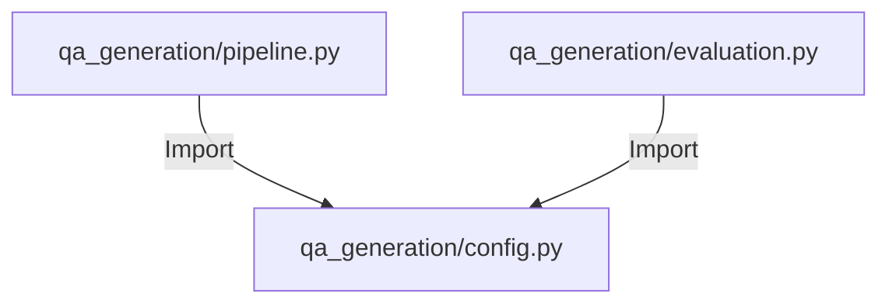

# Module: QA Generation Config (設定管理)

## 1. 概要
`qa_generation/config.py` は、Q/Aペア生成モジュール群で使用される各種設定定数を管理するファイルです。
データセットごとのカバレッジ評価閾値や、ローカル固有の拡張設定（カラムマッピングや言語設定）を一元管理し、ロジックと設定を分離します。

**主な責務:**
*   **Threshold Management**: データセットの特性（ニュース、百科事典など）に応じた、類似度判定の閾値定義。
*   **Dataset Extensions**: グローバル設定 (`config.py`) を補完する、Q/A生成プロセス固有のメタデータ定義。

## 2. モジュール構成

### 2.1 依存関係

本モジュールは他のモジュールに依存しません。逆に、`pipeline.py` や `evaluation.py` などの上位モジュールから参照されます。



### 2.2 ディレクトリ構成

```
qa_generation/
├── config.py            # 【本モジュール】設定定義
└── ...
```

## 3. 定数一覧

### 定数: `OPTIMAL_THRESHOLDS`
データセットの種類ごとに、カバレッジ判定（質問が元のテキストとどれくらい意味的に近いか）の厳しさを定義した辞書です。

| データセット | Strict | Standard | Lenient | 理由 |
| :--- | :--- | :--- | :--- | :--- |
| `cc_news` | 0.80 | 0.70 | 0.60 | 英語ニュース記事。比較的一般的な内容。 |
| `japanese_text` | 0.75 | 0.65 | 0.55 | Webテキスト。多様性が高く、ノイズも含むため低め。 |
| `wikipedia_ja` | 0.85 | 0.75 | 0.65 | 百科事典。専門用語が多く、高い一致度が期待される。 |
| `livedoor` | 0.78 | 0.68 | 0.58 | 日本語ニュース。Wikipediaよりは口語的。 |

**使用方法:**
`analyze_coverage` 関数などで、評価モード (`strict`, `standard`, `lenient`) に応じて閾値を取得するために使用します。

### 定数: `LOCAL_DATASET_EXTENSIONS`
プロジェクトルートの `config.py` にある `DATASET_CONFIGS` を、Q/A生成タスク用に拡張するための設定辞書です。

| キー | 説明 |
| :--- | :--- |
| `text_column` | 前処理後の結合テキストが格納されているカラム名（通常 `Combined_Text`）。 |
| `title_column` | 記事タイトルが格納されているカラム名。ない場合は `None`。 |
| `lang` | テキストの言語コード (`ja`, `en`)。プロンプト切り替えに使用。 |

**使用方法:**
`QAPipeline` の初期化時に、グローバル設定とマージして使用されます。

## 4. 利用方法

```python
from qa_generation.config import OPTIMAL_THRESHOLDS, LOCAL_DATASET_EXTENSIONS

# 特定のデータセットの閾値を取得
dataset = "wikipedia_ja"
threshold = OPTIMAL_THRESHOLDS.get(dataset, {}).get("standard", 0.7)

# 設定のマージ
global_config = {"name": "Wikipedia"} # 仮
local_config = LOCAL_DATASET_EXTENSIONS.get(dataset, {})
merged_config = {**global_config, **local_config}
```
