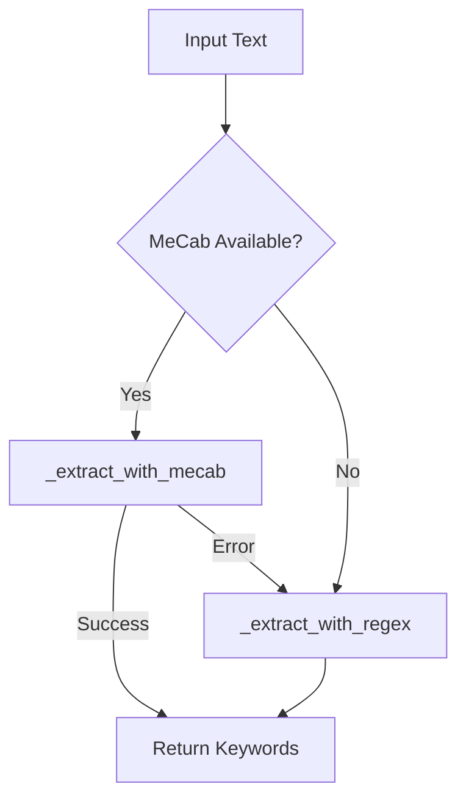
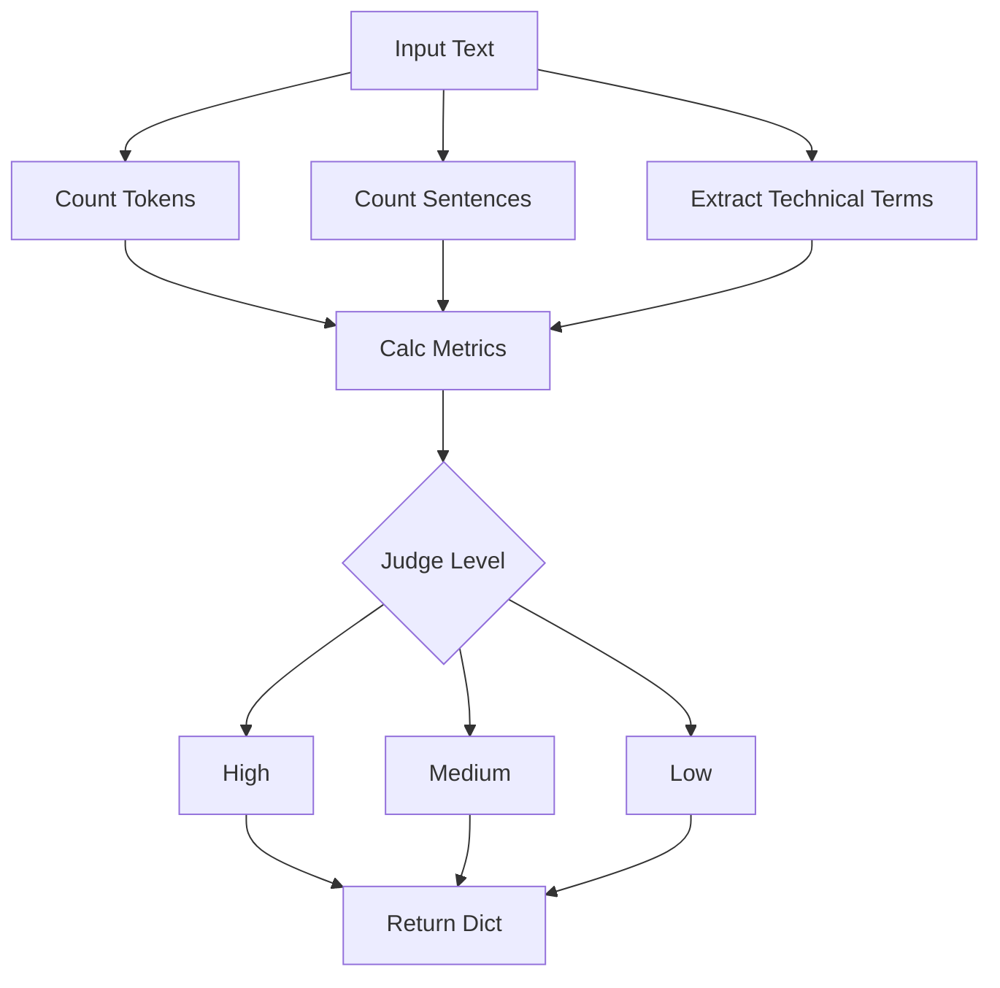

# Module: Content Analysis (コンテンツ分析・キーワード抽出)

## 1. 概要
`qa_generation/content.py` は、テキストコンテンツの特性分析とキーワード抽出を行うモジュールです。
特に `KeywordExtractor` クラスは、日本語テキストに対して MeCab（形態素解析）と正規表現を併用し、高品質な重要語句の抽出を実現します。また、テキストの複雑度分析機能も提供します。

**主な責務:**
*   **Keyword Extraction**: 複合名詞や重要用語を抽出。MeCab利用可否に応じた自動フォールバック機能付き。
*   **Scoring & Ranking**: 頻度、長さ、文字種、重要語リストに基づき、キーワードをスコアリングしてランク付け。
*   **Complexity Analysis**: 文の長さや専門用語の密度から、テキストの難易度（複雑度）を判定。

## 2. モジュール構成

### 2.1 依存関係

形態素解析に `MeCab` (オプショナル)、トークンカウントに `tiktoken` を使用します。

```mermaid
graph TD
    App[QA Generation] -->|Call| Content[content.py]
    
    Content -->|Extract| Extractor[KeywordExtractor]
    
    Extractor -->|Morph Analysis| MeCab[MeCab (Optional)]
    Extractor -->|Regex Match| Regex[re]
    
    Content -->|Tokenize| TikToken[tiktoken]
```

### 2.2 ディレクトリ構成

```
qa_generation/
├── content.py           # 【本モジュール】コンテンツ分析
└── ...
```

## 3. クラス・関数一覧

### クラス: `KeywordExtractor`
キーワード抽出のコアロジックを提供するクラスです。

| メソッド名 | 概要 | 主要引数 |
| :--- | :--- | :--- |
| `__init__` | 初期化。MeCabの可用性チェックを行う。 | `prefer_mecab` |
| `extract` | テキストからキーワードを抽出する（自動フォールバック）。 | `text`, `top_n` |
| `extract_with_details` | 抽出結果に加え、手法別の詳細スコアを返す（分析用）。 | `text`, `top_n` |

#### Method: `extract` IPO

*   **Input**:
    *   `text` (str): 分析対象テキスト
    *   `top_n` (int): 抽出数
    *   `use_scoring` (bool): スコアリングを行うか
*   **Process**:
    1.  MeCabが利用可能かつ優先設定の場合、`_extract_with_mecab` を試行。
    2.  成功すれば結果を返す。
    3.  失敗またはMeCab無効の場合、`_extract_with_regex` にフォールバック。
    4.  内部でフィルタリング（ストップワード除去）とランク付けを実施。
*   **Output**:
    *   `List[str]`: キーワードのリスト。



### 関数: `analyze_chunk_complexity`

| 関数名 | 概要 | 主要引数 |
| :--- | :--- | :--- |
| `analyze_chunk_complexity` | テキストチャンクの複雑度（難易度）を分析する。 | `chunk_text`, `lang` |

#### Function: `analyze_chunk_complexity` IPO

*   **Input**:
    *   `chunk_text` (str): テキスト
    *   `lang` (str): 言語コード ('ja' or 'en')
*   **Process**:
    1.  文数とトークン数をカウント。
    2.  言語に応じた正規表現で専門用語候補を抽出。
    3.  平均文長と概念密度（専門用語率）を計算。
    4.  閾値に基づいて複雑度レベル (high/medium/low) を判定。
*   **Output**:
    *   `Dict`: 複雑度レベル、指標、専門用語リストを含む辞書。



### ユーティリティ関数

| 関数名 | 概要 |
| :--- | :--- |
| `get_keyword_extractor` | `KeywordExtractor` のシングルトンインスタンスを取得。 |
| `extract_key_concepts` | キーワード抽出と複雑度分析を組み合わせて主要概念を抽出。 |

## 4. 利用方法

### キーワード抽出

```python
from qa_generation.content import get_keyword_extractor

extractor = get_keyword_extractor()
text = "人工知能（AI）は、機械学習や深層学習を用いて..."
keywords = extractor.extract(text, top_n=5)
print(keywords)
```

### 複雑度分析

```python
from qa_generation.content import analyze_chunk_complexity

result = analyze_chunk_complexity(text, lang="ja")
print(f"Complexity: {result['complexity_level']}")
```
