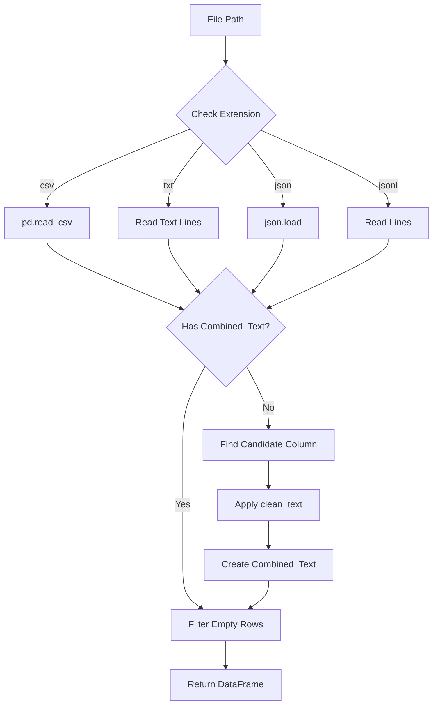
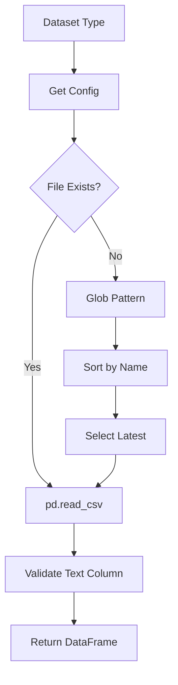
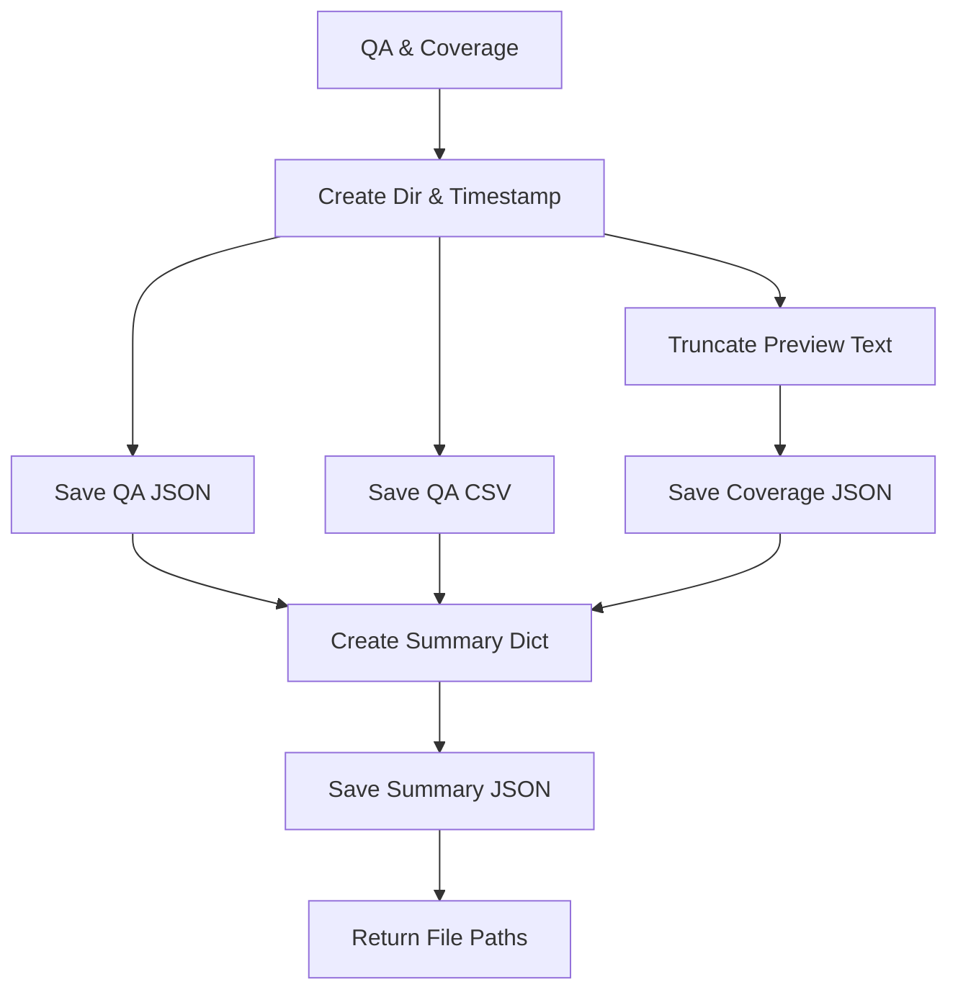

# Module: Data IO (データ入出力)

## 1. 概要
`qa_generation/data_io.py` は、Q/A生成パイプラインにおけるデータの読み込みと保存を抽象化するモジュールです。
多様な入力フォーマット（CSV, TXT, JSON, JSONL）の正規化読み込みと、生成されたQ/Aペア、カバレッジ分析結果、メタデータの構造化保存を提供します。

**主な責務:**
*   **Unified Loading**: 異なるファイル形式を統一されたPandas DataFrame（`Combined_Text` カラム付き）に変換。
*   **Preprocessing Support**: 読み込み時に自動的なテキストクリーニングと結合処理を実施。
*   **Result Persistence**: 生成物（Q/A, カバレッジ, サマリー）を一貫性のある命名規則で保存。
*   **Config Integration**: データセット設定に基づく自動ファイルパス解決。

## 2. モジュール構成

### 2.1 依存関係

データ処理にはPandas、ファイル操作にはpathlib、テキスト処理には `helper_rag` を使用します。

```mermaid
graph TD
    App[QA Pipeline] -->|Load/Save| IO[data_io.py]
    
    IO -->|Read| Files[Input Files (csv/json/txt)]
    IO -->|Clean| Helper[helper_rag.clean_text]
    IO -->|Config| Config[DATASET_CONFIGS]
    
    IO -->|Write| Output[Output Directory]
```

### 2.2 ディレクトリ構成

```
qa_generation/
├── data_io.py           # 【本モジュール】データ入出力
└── ...
```

## 3. 関数一覧

| 関数名 | 概要 | 主要引数 |
| :--- | :--- | :--- |
| `load_uploaded_file` | ローカルファイルを読み込み、テキストを抽出・結合してDataFrame化。 | `file_path` |
| `load_preprocessed_data` | 設定に基づき、前処理済みデータ（OUTPUT/内のファイル等）を読み込み。 | `dataset_type` |
| `save_results` | 生成されたQ/Aペア、カバレッジ結果、サマリーをファイルに保存。 | `qa_pairs`, `coverage_results`, `dataset_type` |

#### Function: `load_uploaded_file` IPO

*   **Input**:
    *   `file_path` (str): 読み込むファイルのパス
*   **Process**:
    1.  拡張子 (.csv, .txt, .json, .jsonl) に基づき、Pandasまたは標準ライブラリでロード。
    2.  `Combined_Text` カラムが存在しない場合、自動生成ロジックを実行:
        *   `text`, `body`, `content` などの候補カラムを探す。
        *   見つかれば `clean_text` を適用。
        *   見つからなければ全カラムを結合して適用。
    3.  空の行を除外し、インデックスをリセット。
*   **Output**:
    *   `pd.DataFrame`: クリーニング済みテキストを含むデータフレーム。



#### Function: `load_preprocessed_data` IPO

*   **Input**:
    *   `dataset_type` (str): データセット識別子
*   **Process**:
    1.  `DATASET_CONFIGS` から設定を取得。
    2.  設定されたファイルパスを確認。
    3.  ファイルが存在しない場合、ディレクトリ内を検索し、タイムスタンプが最新のファイルを自動選択（ワイルドカード検索）。
    4.  CSVとして読み込み、設定された `text_column` の有効性を確認。
*   **Output**:
    *   `pd.DataFrame`: 読み込まれたデータフレーム。



#### Function: `save_results` IPO

*   **Input**:
    *   `qa_pairs` (List[Dict]): Q/Aペアリスト
    *   `coverage_results` (Dict): カバレッジ分析結果
    *   `dataset_type` (str): データセット識別子
    *   `output_dir` (str): 保存先ディレクトリ
*   **Process**:
    1.  保存先ディレクトリを作成。
    2.  現在日時からタイムスタンプを生成。
    3.  **Q/A保存**: JSONとCSV形式で `qa_pairs` を保存。
    4.  **カバレッジ保存**: `uncovered_chunks` のテキストをプレビュー用に短縮し、JSON保存。
    5.  **サマリー作成**: ファイルパス、生成数、カバレッジ率を含むメタデータを作成し、JSON保存。
*   **Output**:
    *   `Dict[str, str]`: 保存された各ファイルのパス。



## 4. 利用方法

### ローカルファイルの読み込み

```python
from qa_generation.data_io import load_uploaded_file

df = load_uploaded_file("data/my_document.txt")
print(df["Combined_Text"].head())
```

### 結果の保存

```python
from qa_generation.data_io import save_results

qa_pairs = [{"question": "...", "answer": "..."}]
coverage = {"coverage_rate": 0.95}

paths = save_results(qa_pairs, coverage, "wikipedia_ja")
print(f"Summary saved at: {paths['summary']}")
```
