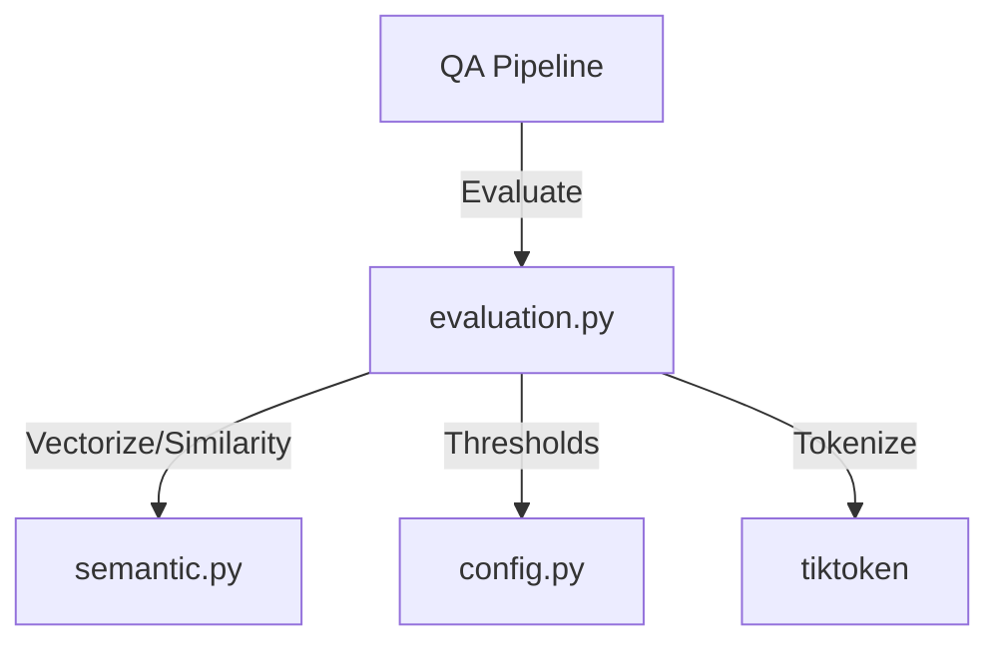
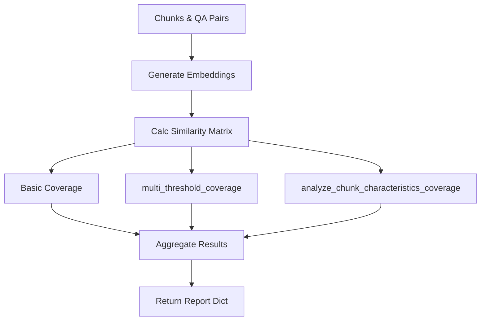
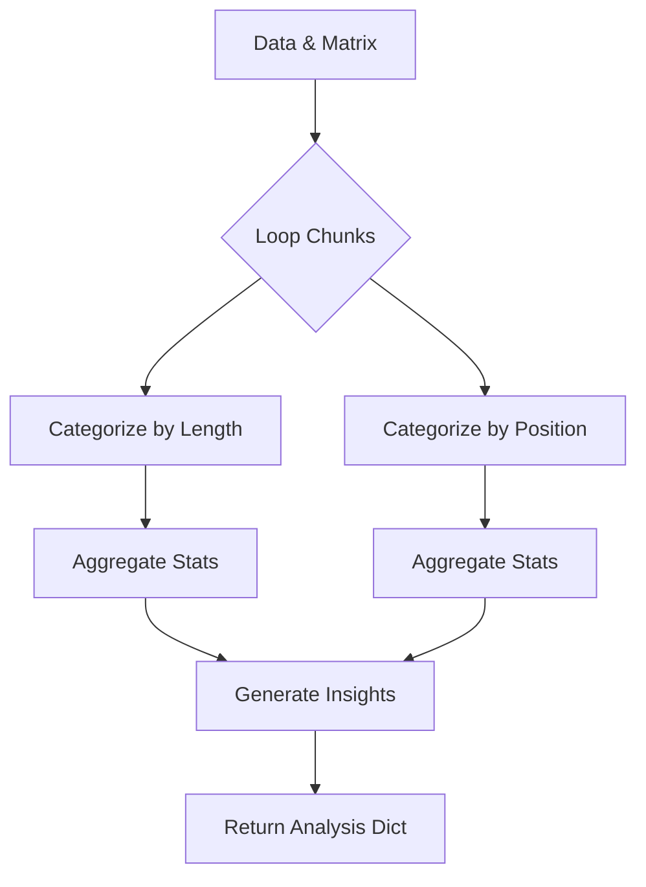

# Module: QA Evaluation (カバレッジ分析)

## 1. 概要
`qa_generation/evaluation.py` は、生成されたQ/Aペアが元の文書をどの程度網羅しているか（カバレッジ）を定量的に評価するモジュールです。
セマンティック分析（EmbeddingとCosine Similarity）を用いて、文書チャンクとQ/Aペアのマッチングを行い、未カバーの領域や品質の低い箇所を特定します。

**主な責務:**
*   **Coverage Calculation**: 文書チャンクとQ/Aペアの類似度行列を計算し、カバレッジ率を算出。
*   **Multi-threshold Analysis**: 厳格(strict)、標準(standard)、寛容(lenient)の3段階の閾値で多角的に評価。
*   **Characteristic Analysis**: チャンクの長さや出現位置によるカバレッジの偏りを分析（例：文書後半のカバレッジが低い等）。
*   **Insight Generation**: 分析結果から改善のためのインサイトを自動生成。

## 2. モジュール構成

### 2.1 依存関係

`qa_generation.semantic` を使用してベクトル化と類似度計算を行います。



### 2.2 ディレクトリ構成

```
qa_generation/
├── evaluation.py        # 【本モジュール】評価ロジック
└── ...
```

## 3. 関数一覧

| 関数名 | 概要 | 主要引数 |
| :--- | :--- | :--- |
| `get_optimal_thresholds` | データセットタイプに応じた閾値セットを取得。 | `dataset_type` |
| `analyze_coverage` | カバレッジ分析のメイン関数。埋め込み生成からレポート作成まで実行。 | `chunks`, `qa_pairs` |
| `multi_threshold_coverage` | 複数の閾値レベルでのカバレッジ詳細分析を実行。 | `coverage_matrix`, `thresholds` |
| `analyze_chunk_characteristics_coverage` | チャンクの属性（長さ・位置）ごとのカバレッジ傾向を分析。 | `chunks`, `coverage_matrix` |

#### Function: `analyze_coverage` IPO

*   **Input**:
    *   `chunks` (List[Dict]): 文書チャンクリスト
    *   `qa_pairs` (List[Dict]): 生成されたQ/Aペアリスト
    *   `dataset_type` (str): データセットの種類
*   **Process**:
    1.  `SemanticCoverage` を使用して、チャンクとQ/Aペアの埋め込みベクトルを一括生成。
    2.  全対全のコサイン類似度行列（Coverage Matrix）を計算。
    3.  `get_optimal_thresholds` で閾値を取得。
    4.  標準閾値に基づき、基本カバレッジ率と未カバーチャンクを特定。
    5.  `multi_threshold_coverage` で多段階評価を実行。
    6.  `analyze_chunk_characteristics_coverage` で特性別分析を実行。
*   **Output**:
    *   `Dict`: 総合的な分析レポート（カバレッジ率、未カバー詳細、特性分析結果、インサイト）。



#### Function: `multi_threshold_coverage` IPO

*   **Input**:
    *   `coverage_matrix` (np.ndarray): 類似度行列
    *   `thresholds` (Dict): 閾値設定 ({strict, standard, lenient})
*   **Process**:
    1.  各チャンクについて、最も類似度の高いQ/Aペアとのスコア（最大類似度）を取得。
    2.  閾値レベルごとにループ:
        *   最大類似度が閾値を超えているチャンク数をカウント。
        *   閾値未満のチャンクを「未カバー」としてリストアップ。
        *   カバレッジ率を計算。
*   **Output**:
    *   `Dict`: レベルごとの詳細分析結果。

#### Function: `analyze_chunk_characteristics_coverage` IPO

*   **Input**:
    *   `chunks`, `coverage_matrix`, `qa_pairs`, `threshold`
*   **Process**:
    1.  **長さ分析**: 各チャンクのトークン数に基づき (short/medium/long) に分類し、グループごとのカバレッジを集計。
    2.  **位置分析**: チャンクのインデックスに基づき (beginning/middle/end) に分類し、グループごとのカバレッジを集計。
    3.  **インサイト生成**: カバレッジが低い（<70%）グループを検出し、警告メッセージを作成。
*   **Output**:
    *   `Dict`: 特性別分析結果とインサイト。



## 4. 利用方法

```python
from qa_generation.evaluation import analyze_coverage

# チャンクとQ/Aペア（生成済み）
chunks = [...]
qa_pairs = [...]

# 分析実行
report = analyze_coverage(chunks, qa_pairs, dataset_type="wikipedia_ja")

print(f"Coverage: {report['coverage_rate']:.1%}")
print(f"Insights: {report['chunk_analysis']['summary']['insights']}")
```
