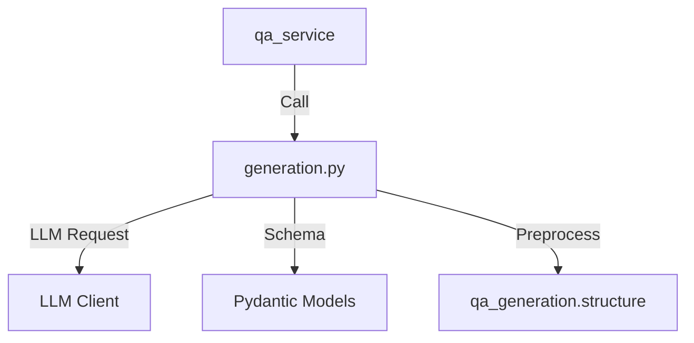
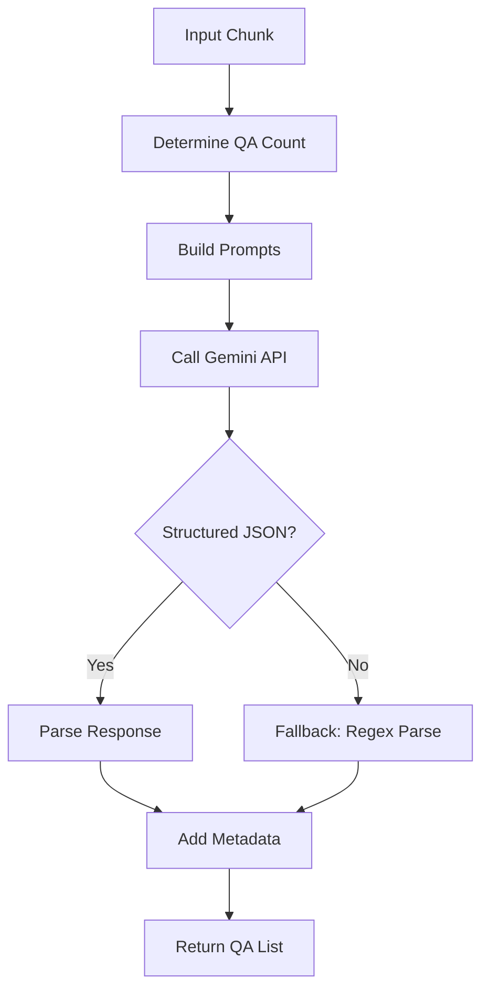
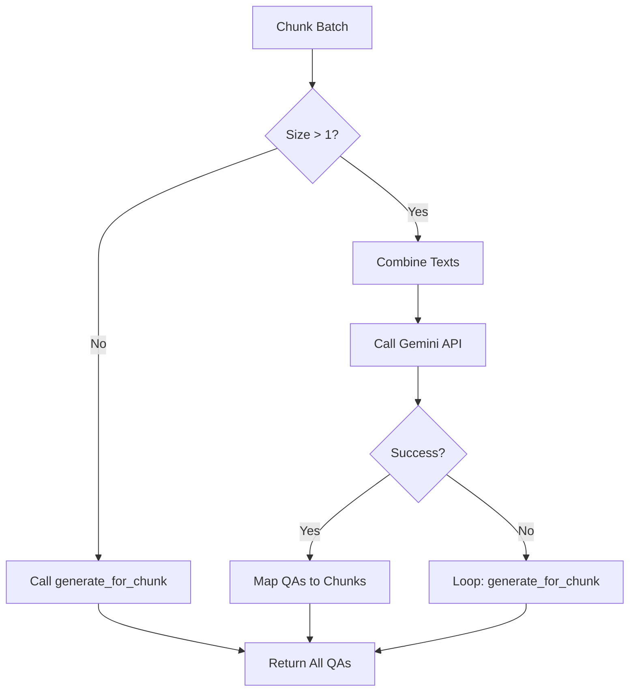

# Module: QA Generation (Q/Aペア生成ロジック)

## 1. 概要
`qa_generation/generation.py` は、テキストチャンクから高品質な質問と回答のペア（Q/A Pairs）を生成するためのコアロジックを提供するモジュールです。
LLM（Gemini API）を活用し、単一チャンク処理、バッチ処理、リトライロジック、および言語ごとのプロンプト切り替え機能などを実装しています。

**主な責務:**
*   **Prompt Engineering**: 言語（日本語/英語）やデータセット設定に応じた最適なプロンプトの構築。
*   **Batch Processing**: 複数のチャンクをまとめて処理し、API呼び出し回数を削減（コスト・速度最適化）。
*   **Robustness**: 構造化出力（JSON）のパース失敗時のフォールバック処理や、APIエラー時のリトライ制御。
*   **Dynamic QA Count**: テキスト量や位置に応じたQ/A生成数の動的調整。

## 2. モジュール構成

### 2.1 依存関係

`helper_llm` を通じてLLMにアクセスし、`qa_generation.structure` でチャンクの前処理を行います。



### 2.2 ディレクトリ構成

```
qa_generation/
├── generation.py        # 【本モジュール】生成ロジック
├── structure.py         # チャンク構造化・結合ロジック
└── ...
```

## 3. クラス・関数一覧

### クラス: `QAGenerator`
Q/A生成のメインロジックをカプセル化したクラスです。

| メソッド名 | 概要 | 主要引数 |
| :--- | :--- | :--- |
| `__init__` | クライアントとモデルの初期化。 | `client`, `model` |
| `determine_qa_count` | チャンクの長さや位置から最適なQ/A数を算出。 | `chunk`, `config` |
| `generate_for_chunk` | 単一のチャンクからQ/Aペアを生成。 | `chunk`, `config` |
| `generate_for_batch` | 複数のチャンクから一括でQ/Aペアを生成。 | `chunks`, `config` |

#### Method: `generate_for_chunk` IPO

*   **Input**:
    *   `chunk` (Dict): テキストチャンク（ID, 本文など）
    *   `config` (Dict): データセット設定（言語, Q/A数など）
*   **Process**:
    1.  `determine_qa_count` で生成数を決定。
    2.  言語（ja/en）に応じたシステムプロンプトとユーザープロンプトを作成。
    3.  `client.generate_structured` を呼び出し、JSON形式で生成。
    4.  レスポンスを解析し、メタデータ（チャンクID等）を付与した辞書リストに変換。
    5.  構造化出力に失敗した場合、通常のテキスト生成と正規表現による抽出にフォールバック。
*   **Output**:
    *   `List[Dict]`: 生成されたQ/Aペアのリスト。



#### Method: `generate_for_batch` IPO

*   **Input**:
    *   `chunks` (List[Dict]): チャンクリスト
    *   `config` (Dict): 設定
*   **Process**:
    1.  チャンク数が1以下の場合は `generate_for_chunk` に委譲。
    2.  各チャンクのテキストを連結し、バッチ用プロンプトを作成。
    3.  `client.generate_structured` を呼び出し、一括生成。
    4.  生成されたQ/Aペアを元のチャンクに対応付け（順序ベース）。
    5.  エラー発生時は、各チャンクごとの個別生成 (`generate_for_chunk`) にフォールバック。
*   **Output**:
    *   `List[Dict]`: 全チャンク分のQ/Aペアリスト。



### 関数: `generate_qa_dataset`

データセット全体の生成フローを制御する関数です。

| 関数名 | 概要 | 主要引数 |
| :--- | :--- | :--- |
| `generate_qa_dataset` | チャンクリスト全体に対してQ/A生成を実行。バッチ処理、リトライ、マージ制御を行う。 | `chunks`, `dataset_type`, `model`, `chunk_batch_size` |

#### Function: `generate_qa_dataset` IPO

*   **Input**:
    *   `chunks` (List[Dict]): 全チャンクリスト
    *   `dataset_type` (str): データセット名
    *   `chunk_batch_size` (int): バッチサイズ
    *   他 (`merge_chunks`, `min_tokens` 等)
*   **Process**:
    1.  `merge_small_chunks` で小さいチャンクを統合（オプション）。
    2.  チャンクリストをバッチサイズごとに分割。
    3.  各バッチについて以下を実行:
        *   `generator.generate_for_batch` (または `_chunk`) を呼び出し。
        *   成功時は結果リストに追加。
        *   失敗時は最大3回リトライ。最終的に失敗した場合は個別処理へフォールバック。
    4.  APIレート制限考慮のための待機 (sleep)。
*   **Output**:
    *   `List[Dict]`: データセット全体のQ/Aペアリスト。

```mermaid
graph TD
    Input[All Chunks] --> Merge[Merge Small Chunks]
    Merge --> Split[Split into Batches]
    
    Split --> LoopBatch{Loop Batches}
    LoopBatch --> Generate[Generate QA (Batch)]
    
    Generate -- Success --> Accumulate[Add to Result]
    Generate -- Fail --> Retry{Retry < 3?}
    Retry -- Yes --> Sleep[Wait & Retry] --> Generate
    Retry -- No --> Fallback[Fallback: Process Individually]
    
    Fallback --> Accumulate
    Accumulate --> RateLimit[Sleep for Rate Limit]
    RateLimit --> LoopBatch
    
    LoopBatch -- Done --> Return[Return Full Dataset]
```

## 4. 利用方法

```python
from qa_generation.generation import generate_qa_dataset

chunks = [{"text": "...", "id": "1"}, {"text": "...", "id": "2"}]
qa_pairs = generate_qa_dataset(
    chunks=chunks,
    dataset_type="wikipedia_ja",
    model="gemini-2.0-flash",
    chunk_batch_size=3
)
```
