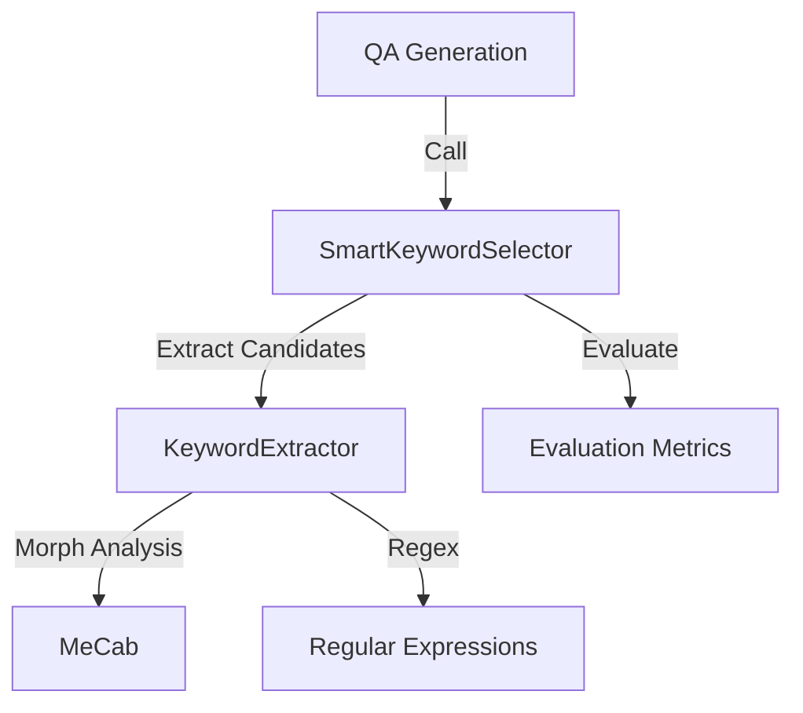
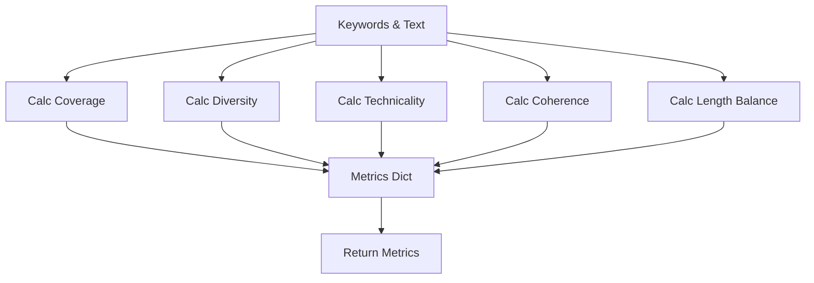
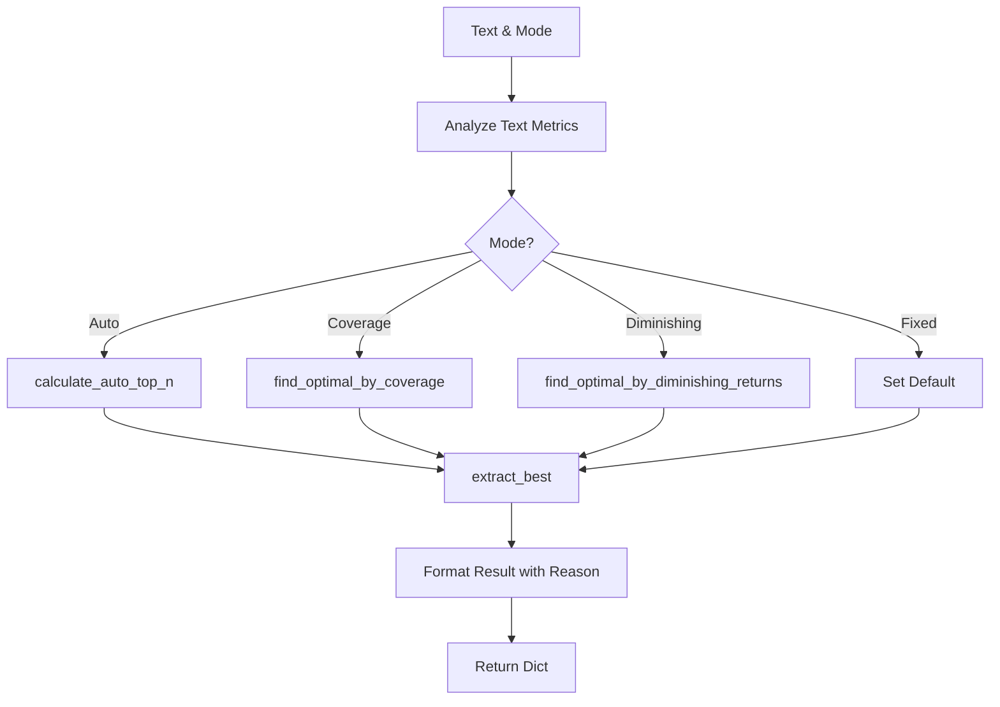

# Module: Keyword Extraction (キーワード抽出)

## 1. 概要
`qa_generation/keyword_extraction.py` は、テキストからQ/A生成の起点となる重要キーワードを抽出するモジュールです。
単純な頻度ベースの手法だけでなく、テキストの長さや特性に応じた「スマート選択」機能を提供し、抽出結果の質を高めるための多面的な評価ロジック（カバレッジ、多様性、専門性など）を実装しています。

**主な責務:**
*   **Keyword Selection**: 複数の抽出手法から最適なキーワードセットを選定。
*   **Quality Evaluation**: カバレッジ率、多様性、専門性などの指標でキーワードを評価。
*   **Auto-Optimization**: テキスト長や専門用語密度に基づいて、抽出数 (`top_n`) を自動調整。
*   **Explanation**: なぜそのキーワードセットが選ばれたかの理由付け（Decision Reason）。

## 2. モジュール構成

### 2.1 依存関係

`regex_mecab` モジュールの `KeywordExtractor` を使用して候補を抽出し、本モジュールで選定ロジックを追加します。



### 2.2 ディレクトリ構成

```
qa_generation/
├── keyword_extraction.py # 【本モジュール】キーワード選定・評価
└── ...
```

## 3. クラス・関数一覧

### クラス: `BestKeywordSelector`
3つの異なる抽出手法を試し、総合スコアが最も高い結果を選択するクラスです。

| メソッド名 | 概要 | 主要引数 |
| :--- | :--- | :--- |
| `__init__` | 初期化。重み設定など。 | `prefer_mecab` |
| `evaluate_keywords` | キーワードセットを多面的に評価。 | `keywords`, `text` |
| `calculate_total_score` | 評価指標から総合スコアを計算。 | `metrics` |
| `extract_best` | 最良のキーワードセットを抽出。 | `text`, `top_n` |

#### Method: `evaluate_keywords` IPO

*   **Input**:
    *   `keywords` (List[str]): 評価対象キーワード
    *   `text` (str): 元テキスト
*   **Process**:
    1.  **Coverage**: テキスト内のキーワード出現箇所をカウントし、カバー率を計算。
    2.  **Diversity**: キーワード長の分散を計算し、適度なばらつきを評価。
    3.  **Technicality**: カタカナ、英字、漢字複合語の割合から専門性を評価。
    4.  **Coherence**: キーワード間の部分一致（共通の文字など）を評価。
    5.  **Length Balance**: 理想的な長さ（2-8文字）の割合を計算。
*   **Output**:
    *   `Dict[str, float]`: 各指標のスコア（0.0-1.0）。



### クラス: `SmartKeywordSelector`
`BestKeywordSelector` を継承し、テキスト特性に応じてパラメータ（`top_n`）を自動調整する機能を追加したクラスです。

| メソッド名 | 概要 | 主要引数 |
| :--- | :--- | :--- |
| `calculate_auto_top_n` | テキスト長と専門用語密度から最適な `top_n` を計算。 | `text` |
| `extract_best_auto` | モード指定に基づき最適化された抽出を実行。 | `text`, `mode` |
| `find_optimal_by_coverage` | 目標カバレッジに達する最小 `top_n` を探索。 | `text`, `target_coverage` |
| `find_optimal_by_diminishing_returns` | スコアの伸びが鈍化する点（収穫逓減点）を探索。 | `text` |

#### Method: `extract_best_auto` IPO

*   **Input**:
    *   `text` (str): 対象テキスト
    *   `mode` (str): 動作モード ("auto", "summary", "coverage" 等)
    *   他 (min/max keywords, target_coverage)
*   **Process**:
    1.  テキストの基本分析（長さ、文数）。
    2.  モードに応じた `top_n` の決定ロジック分岐:
        *   **auto**: `calculate_auto_top_n` で長さ・密度から算出。
        *   **coverage**: `find_optimal_by_coverage` で目標達成点を探索。
        *   **diminishing**: `find_optimal_by_diminishing_returns` で効率点を探索。
        *   **fixed**: 固定値を使用。
    3.  決定した `top_n` で `extract_best` を実行。
    4.  結果に分析情報（決定理由など）を付与。
*   **Output**:
    *   `Dict`: キーワードリスト、使用手法、決定理由などを含む結果辞書。



### ユーティリティ関数

| 関数名 | 概要 |
| :--- | :--- |
| `get_best_keywords` | `BestKeywordSelector` の簡易ラッパー。 |
| `get_smart_keywords` | `SmartKeywordSelector` の簡易ラッパー。 |

## 4. 利用方法

### 自動最適化モードでの抽出

```python
from qa_generation.keyword_extraction import get_smart_keywords

text = "GRACEは、GoogleのGeminiモデルを活用した次世代AIエージェントです..."
result = get_smart_keywords(text, mode="auto")

print(f"Keywords: {result['keywords']}")
print(f"Reason: {result['reason']}")
```

### 固定数での最良抽出

```python
from qa_generation.keyword_extraction import get_best_keywords

keywords = get_best_keywords(text, top_n=5)
print(keywords)
```
