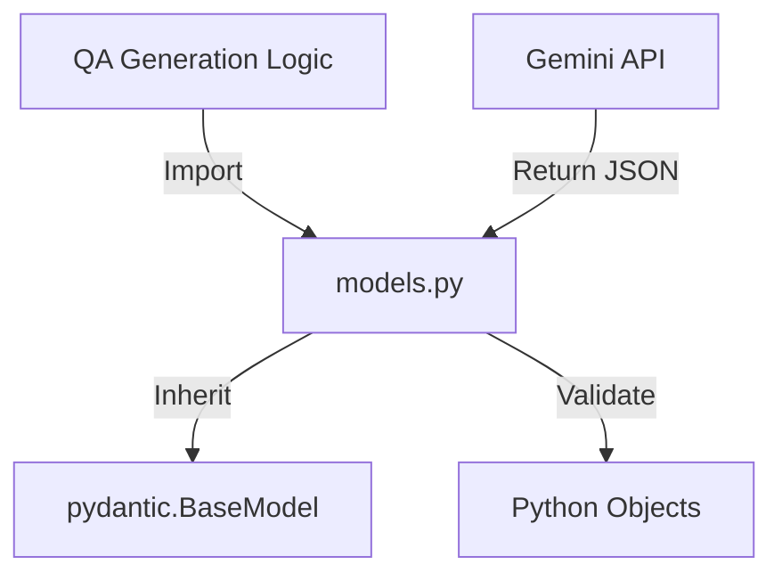
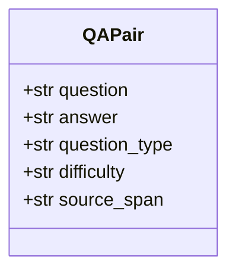
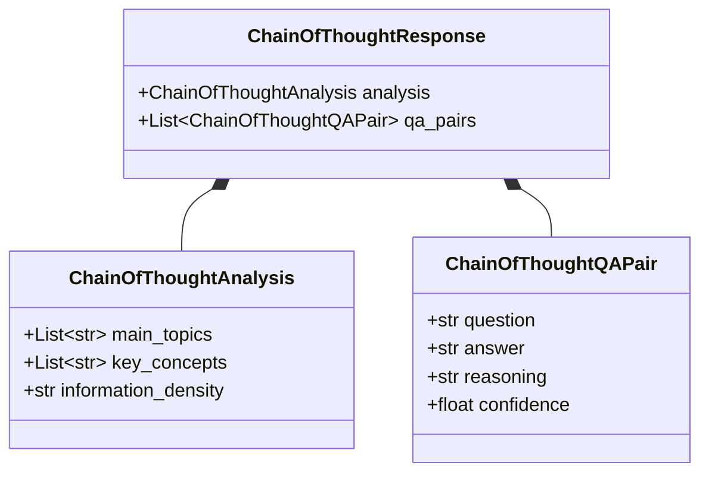

# Module: Models (データスキーマ定義)

## 1. 概要
`qa_generation/models.py` は、Q/A生成プロセスで使用されるデータ構造を Pydantic モデルとして定義したモジュールです。
LLM（Gemini）の Structured Output 機能と連携し、生成されるJSONデータの形式、型、およびバリデーションルールを保証します。

**主な責務:**
*   **Schema Definition**: Q/Aペア、Chain-of-Thought分析、設定パラメータなどのデータ構造定義。
*   **Validation**: 必須フィールド、デフォルト値、値の範囲（`ge`, `le`）などの制約チェック。
*   **Documentation**: 各フィールドの説明（`description`）を提供し、LLMへのプロンプトの一部としても機能。

## 2. モジュール構成

### 2.1 依存関係

Pydanticライブラリを使用してモデルを定義します。



### 2.2 ディレクトリ構成

```
qa_generation/
├── models.py            # 【本モジュール】スキーマ定義
└── ...
```

## 3. クラス一覧

### 基本モデル

| クラス名 | 概要 |
| :--- | :--- |
| `QAPair` | 質問、回答、タイプ、難易度、根拠を含む基本的なQ/Aペア。 |
| `QAPairsList` | `QAPair` のリストを保持するコンテナ。LLMの出力ルートとして使用。 |

#### Schema: `QAPair`

*   **Structure**:
    *   `question` (str): 質問文 (必須)
    *   `answer` (str): 回答文 (必須)
    *   `question_type` (str): 質問タイプ (default: "fact")
    *   `difficulty` (str): 難易度 (default: "medium")
    *   `source_span` (str): 回答の根拠となるテキスト (default: "")



### Chain-of-Thought (CoT) モデル

| クラス名 | 概要 |
| :--- | :--- |
| `ChainOfThoughtAnalysis` | 文書のトピックや概念密度などの分析結果。 |
| `ChainOfThoughtQAPair` | 推論過程 (`reasoning`) と信頼度 (`confidence`) を含む高度なQ/Aペア。 |
| `ChainOfThoughtResponse` | 分析結果とQ/Aペアリストをまとめたレスポンス。 |

#### Schema: `ChainOfThoughtResponse`



### 設定・拡張モデル

| クラス名 | 概要 |
| :--- | :--- |
| `EnhancedQAPair` | シンプルなQ/Aペア（拡張用）。 |
| `QAGenerationConsiderations` | Q/A生成前の事前分析や品質基準を定義する設定モデル。 |

## 4. 利用方法

### LLMからの構造化出力受け取り

```python
from qa_generation.models import QAPairsList
from helper_llm import create_llm_client

client = create_llm_client()
prompt = "以下のテキストからQ/Aペアを作成してください..."

# response_schemaとしてモデルを指定
response = client.generate_structured(
    prompt=prompt,
    response_schema=QAPairsList
)

for qa in response.qa_pairs:
    print(f"Q: {qa.question}, A: {qa.answer}")
```
