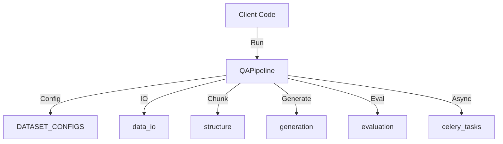
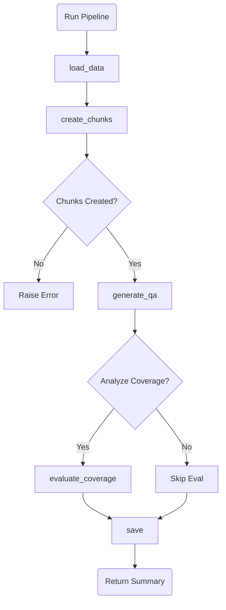
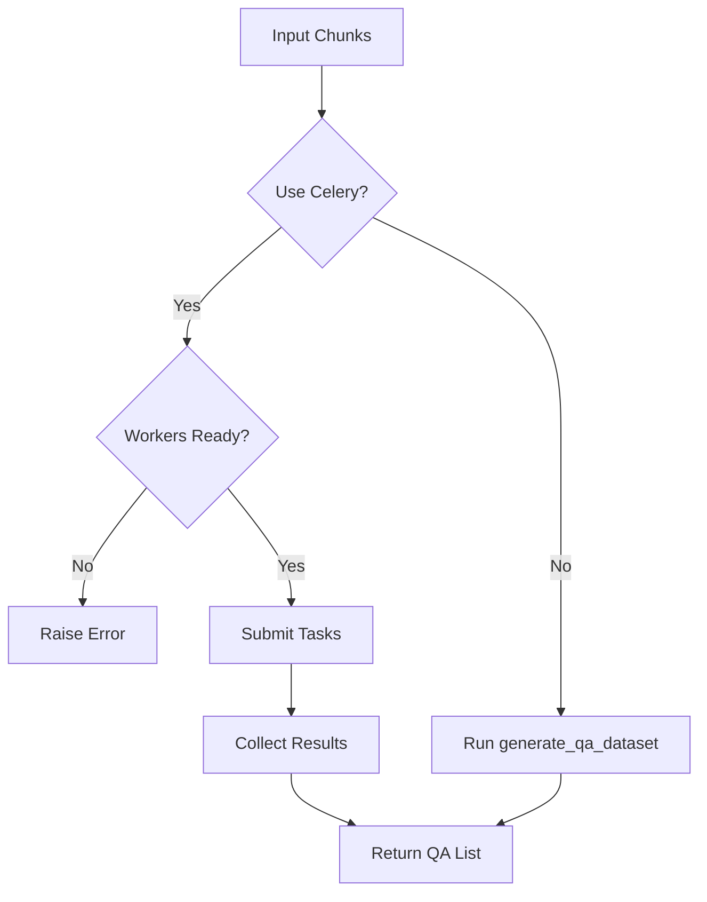

# Module: QA Pipeline (Q/A生成パイプライン制御)

## 1. 概要
`qa_generation/pipeline.py` は、Q/Aデータセット生成の一連のプロセス（データ読み込み、チャンク作成、Q/A生成、評価、保存）を統合・制御するパイプラインモジュールです。
同期処理（ローカル実行）と非同期処理（Celery実行）の両方をサポートし、大規模なデータセット処理にも対応します。

**主な責務:**
*   **Workflow Orchestration**: データロードから保存までの各ステップを順序通りに実行。
*   **Configuration Management**: データセットの種類に応じた設定のロードと適用。
*   **Execution Mode Switching**: 同期処理と非同期分散処理（Celery）の切り替え。
*   **Error Handling**: パイプライン全体のエラー捕捉とログ記録。

## 2. モジュール構成

### 2.1 依存関係

各処理フェーズを担当するサブモジュールを呼び出して連携します。



### 2.2 ディレクトリ構成

```
qa_generation/
├── pipeline.py          # 【本モジュール】パイプライン制御
├── data_io.py           # データ入出力
├── structure.py         # チャンク構造化
├── generation.py        # 生成ロジック
└── evaluation.py        # 評価ロジック
```

## 3. クラス・関数一覧

### クラス: `QAPipeline`
Q/A生成プロセス全体を管理するクラスです。

| メソッド名 | 概要 | 主要引数 |
| :--- | :--- | :--- |
| `__init__` | パイプラインの初期化と設定ロード。 | `dataset_name`, `input_file` |
| `run` | パイプライン全体を実行するメインメソッド。 | `use_celery`, `max_tokens` 等 |
| `load_data` | データソース（ファイルまたはプリセット）からデータを読み込む。 | - |
| `create_chunks` | 読み込んだデータをチャンクに分割する。 | `df` |
| `generate_qa` | チャンクからQ/Aペアを生成する（同期/非同期分岐）。 | `chunks`, `use_celery` |
| `evaluate_coverage` | 生成結果のカバレッジ（網羅性）を評価する。 | `chunks`, `qa_pairs` |
| `save` | 生成結果と評価レポートをファイルに保存する。 | `qa_pairs`, `coverage_results` |

#### Method: `run` IPO

*   **Input**:
    *   `use_celery` (bool): Celeryを使用するか
    *   `batch_chunks` (int): バッチサイズ
    *   `merge_chunks` (bool): チャンク統合を行うか
    *   他 (max_tokens, coverage_threshold 等)
*   **Process**:
    1.  `load_data()`: データ読み込み。
    2.  `create_chunks()`: チャンク分割。
    3.  `generate_qa()`: Q/A生成（同期/非同期）。
    4.  `evaluate_coverage()`: カバレッジ評価（オプション）。
    5.  `save()`: 結果保存。
*   **Output**:
    *   `Dict`: 実行結果サマリー（保存パス、生成数、カバレッジ結果）。



#### Method: `generate_qa` IPO

*   **Input**:
    *   `chunks` (List[Dict]): 処理対象チャンク
    *   `use_celery` (bool): 実行モード
    *   他 (workers, batch_size, tokens等)
*   **Process**:
    *   **Celeryモード (`True`)**:
        1.  ワーカー稼働確認。
        2.  `submit_unified_qa_generation` でタスク分散。
        3.  `collect_results` で結果収集（タイムアウトあり）。
    *   **同期モード (`False`)**:
        1.  `generate_qa_dataset` を呼び出し、ローカルで順次処理。
*   **Output**:
    *   `List[Dict]`: 生成されたQ/Aペアのリスト。



## 4. 利用方法

```python
from qa_generation.pipeline import QAPipeline

# パイプライン初期化
pipeline = QAPipeline(
    dataset_name="wikipedia_ja",
    model="gemini-2.0-flash"
)

# 実行
result = pipeline.run(
    use_celery=False,
    batch_chunks=3,
    analyze_coverage=True
)

print(f"Generated {result['qa_count']} pairs.")
```
