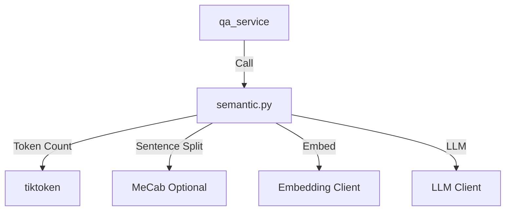
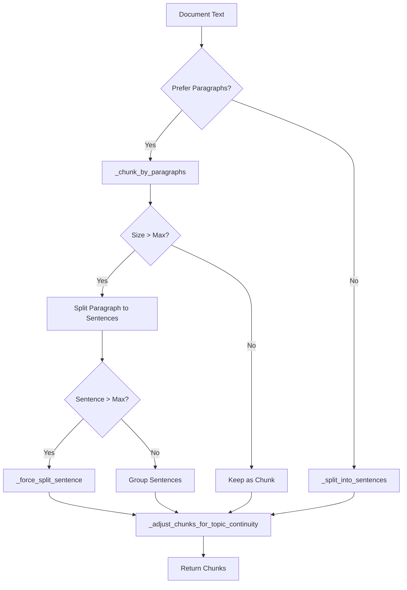
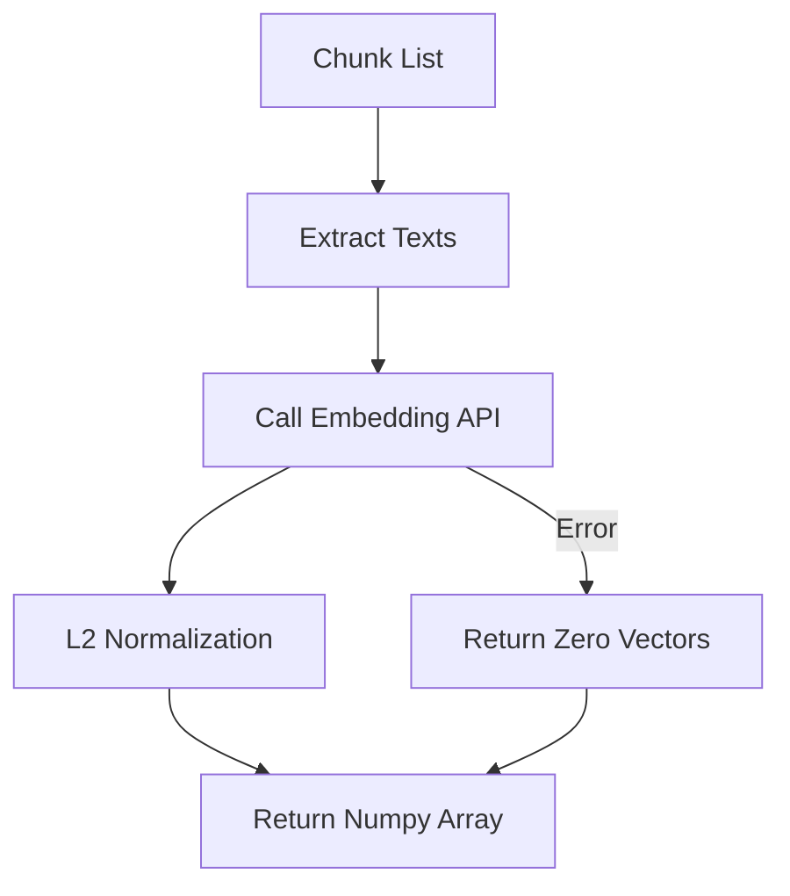

# Module: Semantic Analysis (セマンティック分析・カバレッジ)

## 1. 概要
`qa_generation/semantic.py` は、テキストの意味的なまとまり（セマンティクス）に基づいたチャンク分割と、Embeddingベクトルを用いた類似度計算を提供するモジュールです。
LLMとEmbeddingモデル（Gemini API）を活用し、単純な文字数分割よりも高品質なRAG用データセット作成を支援します。

**主な責務:**
*   **Semantic Chunking**: 段落や文の意味的な境界を検出し、最適なサイズのチャンクに分割。
*   **Embedding Generation**: テキストをベクトル化し、L2正規化を実施。
*   **Similarity Calculation**: コサイン類似度によるベクトル間の意味的距離の測定。
*   **Topic Continuity**: 短すぎるチャンクを統合し、トピックの連続性を維持。

## 2. モジュール構成

### 2.1 依存関係

`helper_llm`, `helper_embedding` を通じてAPIにアクセスし、`tiktoken` でトークン数を厳密に管理します。日本語処理には `MeCab` (利用可能な場合) を使用します。



### 2.2 ディレクトリ構成

```
qa_generation/
├── semantic.py          # 【本モジュール】セマンティック処理
└── ...
```

## 3. クラス・関数一覧

### クラス: `SemanticCoverage`
セマンティック処理のコアロジックを提供するクラスです。

| メソッド名 | 概要 | 主要引数 |
| :--- | :--- | :--- |
| `__init__` | クライアント、トークナイザー、MeCabの初期化。 | `embedding_model` |
| `create_semantic_chunks` | 文書を意味的なチャンクに分割。 | `document`, `max_tokens` |
| `generate_embeddings` | チャンクリストからベクトルを一括生成。 | `doc_chunks` |
| `generate_embedding` | 単一テキストのベクトル生成。 | `text` |
| `cosine_similarity` | 2つのベクトル間の類似度を計算。 | `doc_emb`, `qa_emb` |

#### Method: `create_semantic_chunks` IPO

*   **Input**:
    *   `document` (str): 分割対象の全文
    *   `max_tokens` (int): チャンクの最大トークン数
    *   `min_tokens` (int): チャンクの最小トークン数
    *   `prefer_paragraphs` (bool): 段落分割を優先するか
*   **Process**:
    1.  `prefer_paragraphs` がTrueの場合、まず `_chunk_by_paragraphs` で段落単位に分割。
    2.  段落が `max_tokens` を超える場合は、`_split_into_sentences` で文単位に再分割。
    3.  それでも超える場合は `_force_split_sentence` で強制分割。
    4.  `_adjust_chunks_for_topic_continuity` で、`min_tokens` 未満の短いチャンクを隣接チャンクと統合。
    5.  標準フォーマット（ID, text, type等）の辞書リストに変換。
*   **Output**:
    *   `List[Dict]`: チャンク情報のリスト。



#### Method: `generate_embeddings` IPO

*   **Input**:
    *   `doc_chunks` (List[Dict]): チャンクリスト
*   **Process**:
    1.  チャンクからテキストリストを抽出。
    2.  `embedding_client.embed_texts` を呼び出し、バッチサイズ100でAPIリクエスト。
    3.  取得した各ベクトルに対して L2正規化 (`v / ||v||`) を実施。
    4.  エラー時やAPIキー無し時はゼロベクトルを返す。
*   **Output**:
    *   `np.ndarray`: 正規化済み埋め込みベクトル配列。



#### Method: `cosine_similarity` IPO

*   **Input**:
    *   `doc_emb` (np.ndarray): 文書ベクトル
    *   `qa_emb` (np.ndarray): 質問ベクトル
*   **Process**:
    1.  両ベクトルが正規化済み（ノルム≒1.0）か確認。
    2.  正規化済みなら内積 (`np.dot`) を計算（高速）。
    3.  未正規化なら `dot / (norm * norm)` の公式で計算。
*   **Output**:
    *   `float`: コサイン類似度 (-1.0 ~ 1.0)。

## 4. 利用方法

```python
from qa_generation.semantic import SemanticCoverage

# 初期化
semantic = SemanticCoverage()

# セマンティックチャンク分割
text = "..." # 長いテキスト
chunks = semantic.create_semantic_chunks(text, max_tokens=300)

# 埋め込み生成
embeddings = semantic.generate_embeddings(chunks)

print(f"Generated {len(chunks)} chunks and embeddings.")
```
