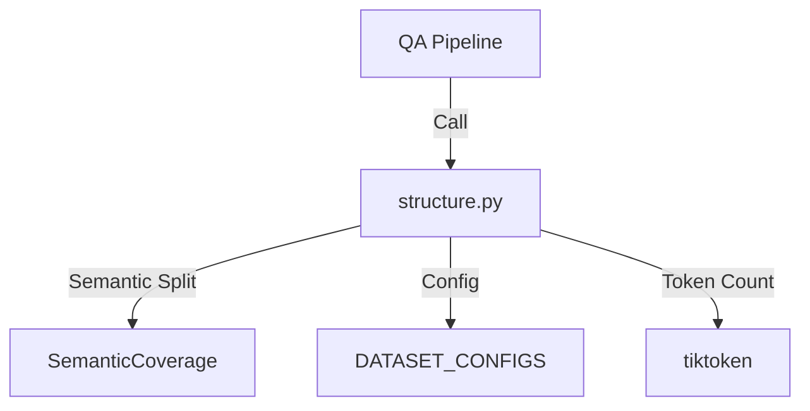
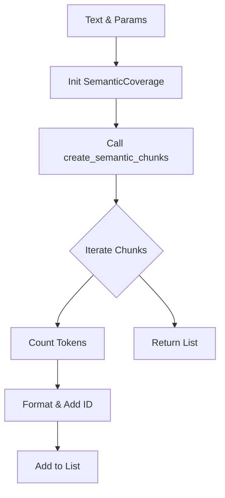
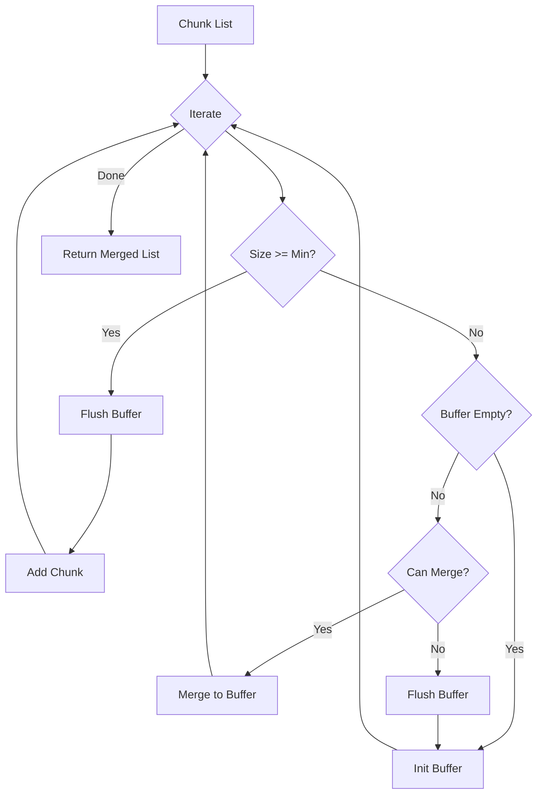

# Module: QA Structure (チャンク作成・統合)

## 1. 概要
`qa_generation/structure.py` は、テキストデータを意味的なまとまり（チャンク）に分割し、必要に応じて統合する構造化ロジックを提供するモジュールです。
単純な文字数分割ではなく、`qa_generation.semantic` を利用した「セマンティック分割」を採用することで、文脈を維持した高品質なチャンク生成を実現します。

**主な責務:**
*   **Semantic Chunking**: 段落や文の意味的な境界を考慮したチャンク分割。
*   **Document Processing**: Pandas DataFrame（複数文書）からのバッチチャンク生成。
*   **Chunk Merging**: トークン数が少なすぎるチャンクを隣接チャンクと統合し、適切なサイズに調整。

## 2. モジュール構成

### 2.1 依存関係

`SemanticCoverage` クラスを使用して分割ロジックを実行し、`tiktoken` でトークン数を管理します。



### 2.2 ディレクトリ構成

```
qa_generation/
├── structure.py         # 【本モジュール】構造化ロジック
└── ...
```

## 3. 関数一覧

| 関数名 | 概要 | 主要引数 |
| :--- | :--- | :--- |
| `create_semantic_chunks` | 単一テキストをセマンティック分割する。 | `text`, `max_tokens` |
| `create_document_chunks` | DataFrame内の全文書を処理し、メタデータ付きチャンクリストを生成。 | `df`, `dataset_type` |
| `merge_small_chunks` | 小さいチャンクを統合してサイズを最適化。 | `chunks`, `min_tokens` |

#### Function: `create_semantic_chunks` IPO

*   **Input**:
    *   `text` (str): 分割対象テキスト
    *   `lang` (str): 言語コード
    *   `max_tokens` (int): 最大トークン数
*   **Process**:
    1.  `SemanticCoverage` インスタンスを初期化。
    2.  `create_semantic_chunks` メソッドを呼び出し、段落優先モードで分割を実行。
    3.  結果の辞書リストを、パイプラインで扱いやすい形式（ID付与、トークン数計算）に変換。
*   **Output**:
    *   `List[Dict]`: チャンク辞書のリスト。



#### Function: `create_document_chunks` IPO

*   **Input**:
    *   `df` (pd.DataFrame): 文書データ
    *   `dataset_type` (str): データセット種類
    *   `max_docs` (Optional[int]): 処理上限数
*   **Process**:
    1.  設定（カラム名、言語）を取得。
    2.  文書数を `max_docs` で制限。
    3.  各文書についてループ処理:
        *   テキストとタイトルを取得。
        *   `create_semantic_chunks` を呼び出し。
        *   生成されたチャンクにメタデータ（文書ID、インデックス等）を付与。
    4.  エラー発生時はログ出力して継続。
*   **Output**:
    *   `List[Dict]`: 全文書のチャンクリスト。

#### Function: `merge_small_chunks` IPO

*   **Input**:
    *   `chunks` (List[Dict]): 元のチャンクリスト
    *   `min_tokens` (int): 統合下限
    *   `max_tokens` (int): 統合上限
*   **Process**:
    1.  チャンクリストを順走査。
    2.  現在のチャンクサイズが `min_tokens` 以上ならそのまま採用。
    3.  `min_tokens` 未満ならバッファ（`current_merge`）に追加を検討。
    4.  バッファとの合計サイズが `max_tokens` 以内、かつ同一文書由来なら統合。
    5.  条件を満たさない場合、バッファを確定して新しいバッファを開始。
*   **Output**:
    *   `List[Dict]`: 統合後のチャンクリスト。



## 4. 利用方法

```python
from qa_generation.structure import create_semantic_chunks, merge_small_chunks

text = "..." # 長いテキスト
chunks = create_semantic_chunks(text, max_tokens=200)

# 小さいチャンクを統合
merged = merge_small_chunks(chunks, min_tokens=100)

print(f"Original: {len(chunks)}, Merged: {len(merged)}")
```
