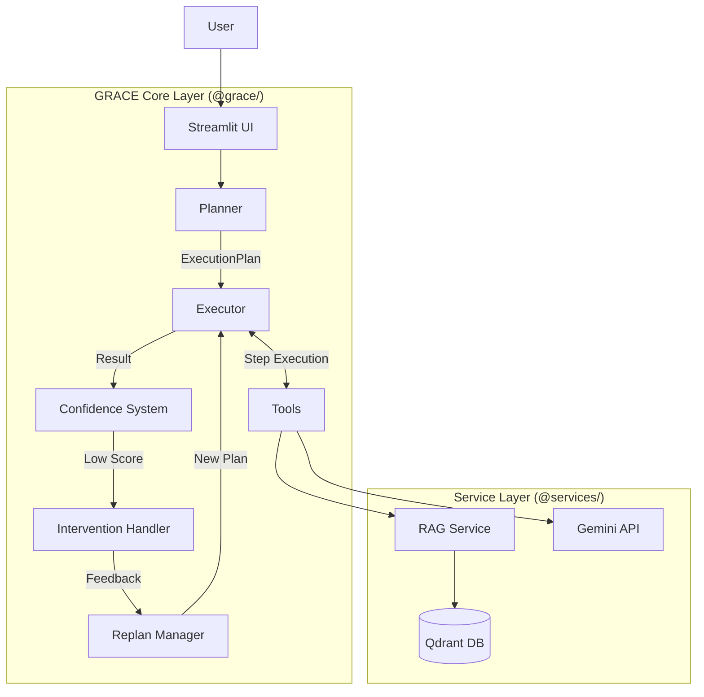

# GRACE (Guided Reasoning with Adaptive Confidence Execution) Agent System


## 1. 概要

本システムは、次世代の自律型AIエージェントアーキテクチャ **「GRACE」** を実装した統合RAGプラットフォームです。
従来の ReAct (Reasoning + Acting) パターンに、**「計画 (Planning)」**、**「信頼度評価 (Confidence-aware)」**、**「適応的再計画 (Adaptive Replanning)」** を導入することで、より複雑で曖昧なタスクに対しても堅牢かつ透明性の高い回答生成を実現しました。

Streamlit ベースの UI を通じて、データセット管理からエージェントとの対話、信頼度スコアのモニタリングまでを一気通貫で行うことができます。

### 主な特徴

1.  **Guided (誘導型計画)**:
    *   ユーザーの質問を分析し、最適な実行ステップ（計画）を事前に生成します。
    *   行き当たりばったりの行動を防ぎ、ゴールに向けた最短経路を設計します。

2.  **Reasoning (推論)**:
    *   各ステップで得られた情報を統合し、論理的な推論を行います。
    *   Gemini 2.0 Flash の高速な推論能力を最大限に活用します。

3.  **Adaptive (適応的実行)**:
    *   実行中のエラーや予期せぬ結果に対して、動的に計画を修正（リプラン）します。
    *   「検索結果なし」などの状況でも、キーワードを変えて再検索するなどの柔軟性を持ちます。

4.  **Confidence (信頼度評価)**:
    *   検索結果の品質、情報源の一致度、LLMの自己評価を数値化 (0.0 - 1.0)。
    *   回答の「確信度」を可視化し、ユーザーに提示します。

5.  **Execution (堅牢な実行)**:
    *   依存関係を考慮したステートマシンによる実行管理。
    *   信頼度が低い場合は、ユーザーに確認や追加情報を求める (Human-in-the-Loop) 機能を提供します。

---

## 2. 目次

1. [概要](#1-概要)
2. [システムアーキテクチャ](#3-システムアーキテクチャ)
3. [GRACE エージェント詳細](#4-grace-エージェント詳細)
    - [Planner (計画)](#planner-計画)
    - [Executor (実行)](#executor-実行)
    - [Confidence (評価)](#confidence-評価)
    - [Intervention (介入)](#intervention-介入)
4. [機能一覧](#5-機能一覧)
5. [セットアップと実行](#6-セットアップと実行)
6. [ディレクトリ構造](#7-ディレクトリ構造)

---

## 3. システムアーキテクチャ

本システムは、UI層、GRACEコア層、サービス層の3層構造で構成されています。



*   **UI層**: `ui/pages/` 配下の Streamlit ページ。ユーザー入力の受付と、エージェントの状態（計画、ログ、信頼度）の可視化を行います。
*   **GRACEコア層**: エージェントの知能を司る中核モジュール群。計画、実行、評価のサイクルを回します。
*   **サービス層**: 外部システム（DB, API）とのインターフェース。RAG検索やデータ処理の実務を担当します。

---

## 4. GRACE エージェント詳細

### Planner (計画)
ユーザーの自然言語入力を解析し、タスクを解決するための「実行計画書 (ExecutionPlan)」をJSON形式で生成します。
タスクの複雑度を推定し、適切なツール（検索、計算、など）を選択します。

### Executor (実行)
生成された計画をステップバイステップで実行するエンジンです。
各ステップの実行結果を保持し、次のステップのコンテキストとして渡します。
従来の `agent_main.py` (Legacy ReAct) の機能を包含しつつ、より構造化された制御を行います。

### Confidence (評価)
実行結果の品質をリアルタイムで評価します。
*   **RAG検索品質**: 検索スコアの高さと分布。
*   **情報源の一致度**: 複数のドキュメントで同じ事実が述べられているか。
*   **LLM自己評価**: 生成された回答が質問に適切に答えているか。

これらを総合して `Confidence Score` (0.0 - 1.0) を算出します。

### Intervention (介入)
信頼度スコアに基づいて、次のアクションを決定します (Human-in-the-Loop)。
*   **High (>0.9)**: 自動進行 (Silent)
*   **Medium (0.7-0.9)**: 通知のみ (Notify)
*   **Low (0.4-0.7)**: ユーザーに確認 (Confirm)
*   **Very Low (<0.4)**: ユーザーに入力を要求 (Escalate)

---

## 5. 機能一覧

本アプリケーション (`agent_rag.py`) は以下の機能を提供します。

| 機能 | 概要 | 担当モジュール |
| :--- | :--- | :--- |
| **GRACE エージェント対話** | 新アーキテクチャによる高信頼性チャット | `ui/pages/grace_chat_page.py` |
| **Legacy エージェント対話** | 従来のReActエージェントとの比較用 | `ui/pages/agent_chat_page.py` |
| **Q/A データ生成** | ドキュメントから学習用Q/Aペアを自動生成 | `ui/pages/qa_generation_page.py` |
| **RAG データ管理** | Qdrantへのデータ登録、閲覧、統合 | `ui/pages/qdrant_*.py` |
| **データセット管理** | 公開データセットのDLと前処理 | `ui/pages/download_page.py` |

---

## 6. セットアップと実行

### 前提条件
*   Python 3.10+
*   Docker (Qdrant用)
*   Google Cloud Project (Gemini API有効化済み)

### 起動手順

1.  **環境設定**: `.env` ファイルにAPIキーを設定
    ```bash
    GOOGLE_API_KEY="your_api_key"
    ```

2.  **Qdrant起動**:
    ```bash
    docker run -p 6333:6333 -p 6334:6334 qdrant/qdrant
    ```

3.  **アプリ起動**:
    ```bash
    streamlit run agent_rag.py
    ```

---

## 7. ディレクトリ構造

```text
.
├── agent_rag.py            # アプリケーションエントリポイント
├── grace/                  # [NEW] GRACE Core Modules
│   ├── planner.py          # 計画生成
│   ├── executor.py         # 実行エンジン
│   ├── confidence.py       # 信頼度計算
│   ├── intervention.py     # ユーザー介入ロジック
│   └── tools.py            # エージェント用ツール定義
├── services/               # [Shared] Business Logic Services
│   ├── agent_service.py    # Legacy ReAct Logic
│   ├── qdrant_service.py   # Vector DB Operations
│   └── ...
├── ui/                     # [UI] Streamlit Interface
│   ├── components/         # 再利用可能なUI部品
│   └── pages/              # 各機能ページ
└── doc/                    # ドキュメント
```

詳細な仕様については [doc/grace.md](doc/grace.md) および [doc/ui.md](doc/ui.md) を参照してください。
