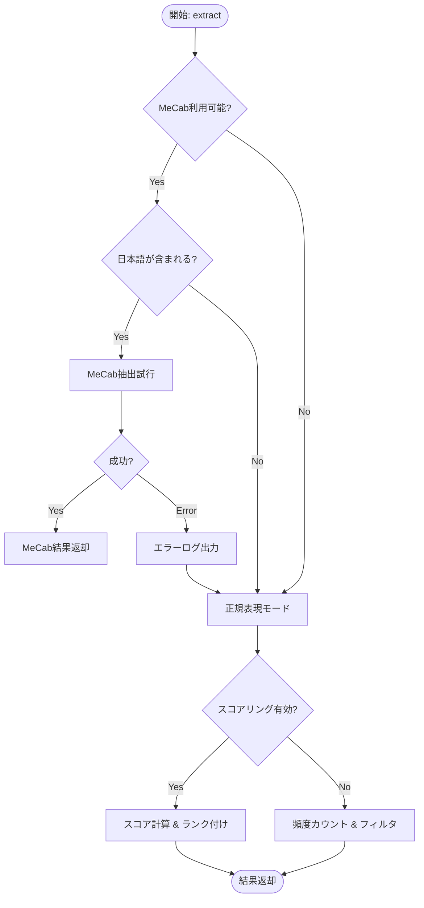

# KeywordExtractor 詳細設計書 (`regex_mecab.py`)

本ドキュメントは、`regex_mecab.py` に実装された「MeCab複合名詞版と正規表現版を統合したロバストなキーワード抽出システム」の詳細設計をまとめたものである。

## 1. 概要 (Overview)

本モジュールは、環境依存性の高い形態素解析器（MeCab）への依存を柔軟に管理し、利用可能な環境では高精度な「複合名詞抽出」を行い、利用不可な環境や非日本語テキストに対しては「正規表現」による抽出に自動的にフォールバックする機能を提供する。

### 主な特徴
1.  **自動フォールバック**: MeCab未インストール環境や実行時エラー時に、シームレスに正規表現モードへ切り替える。
2.  **複合名詞の構築**: 単なる名詞の羅列ではなく、連続する名詞を結合して1つのキーワード（例：「人工」「知能」→「人工知能」）として抽出する。
3.  **ハイブリッド言語対応**: 日本語（漢字・ひらがな・カタカナ）と英語（英数字）の両方に対応。
4.  **高度なスコアリング**: 単純な出現頻度だけでなく、語長、文字種（カタカナ、漢字等）、重要キーワード辞書に基づいた重み付けを行う。

---

## 2. 処理フロー (Processing Flow)

抽出処理の全体フローは以下の通りである。環境と入力テキストに応じて最適な戦略を選択する。



---

## 3. 詳細設計 (IPO)

### 3.1 Class: `KeywordExtractor`

#### コンストラクタ `__init__`
*   **Input**: `prefer_mecab` (bool, default=True)
*   **Process**:
    *   MeCabライブラリのインポートテスト (`_check_mecab_availability`)。
    *   ストップワード（日/英）および重要キーワードリストの初期化。
*   **Output**: インスタンス初期化。

---

### 3.2 Method: `extract` (Main Entry)

*   **Input**:
    *   `text` (str): 分析対象テキスト。
    *   `top_n` (int): 返却するキーワード数。
    *   `use_scoring` (bool): スコアリングアルゴリズムを使用するか否か。
*   **Process**:
    1.  正規表現 `[ぁ-んァ-ヶー一-龠]` で日本語が含まれているか判定。
    2.  **MeCabルート**: `mecab_available`=True かつ `is_japanese`=True の場合、`_extract_with_mecab` を呼び出す。例外発生時は正規表現ルートへ。
    3.  **正規表現ルート**: 上記以外、またはMeCab失敗時、`_extract_with_regex` を呼び出す。
*   **Output**: `List[str]` (キーワードのリスト)。

---

### 3.3 Method: `_extract_with_mecab` (複合名詞抽出)

*   **Process**:
    1.  `MeCab.Tagger` でテキストを解析。
    2.  **複合名詞構築ロジック**:
        *   ノードを順次走査し、品詞が「名詞」である限りバッファ(`compound_buffer`)に追加し続ける。
        *   名詞以外が出現した時点でバッファを結合し、1つの語としてリストに追加。バッファをクリア。
        *   ※英語のゴミ（スペースなしの長大な英文字列）を除外する簡易フィルタを含む。
    3.  抽出された語リストに対して、フィルタリングまたはスコアリングを実施。

---

### 3.4 Method: `_extract_with_regex` (正規表現抽出)

*   **Process**:
    1.  以下のパターンにマッチする文字列を全て抽出する。
        *   `[ァ-ヴー]{2,}`: カタカナ2文字以上
        *   `[一-龥]{2,}`: 漢字2文字以上
        *   `[A-Za-z]{2,}[A-Za-z0-9]*`: アルファベット2文字以上（数字混じり可）
    2.  抽出された語リストに対して、フィルタリングまたはスコアリングを実施。

---

### 3.5 Method: `_score_and_rank` (スコアリングロジック)

単純な頻度だけでなく、キーワードの「質」を評価して順位付けを行う。

**スコア計算式**:
$$ Score = S_{freq} + S_{len} + S_{imp} + S_{char} $$

| 要素 | 変数 | 計算ロジック | 最大寄与 |
| :--- | :--- | :--- | :--- |
| **頻度** | `freq_score` | `min(freq / 3.0, 1.0) * 0.3` <br> (3回出現でカンスト) | 0.3 |
| **長さ** | `length_score` | `min(len(word) / 8.0, 1.0) * 0.3` <br> (8文字でカンスト) | 0.3 |
| **重要語** | `is_important` | 辞書(`important_keywords`)に含まれるか？ | 0.5 |
| **文字種** | `char_score` | カタカナ(3文字+): +0.2 <br> 英大文字(2文字+): +0.3 <br> TitleCase: +0.1 <br> 漢字(4文字+): +0.2 | 0.3 (Max) |

*   **フィルタ**: ストップワードに含まれる語、1文字以下の語は除外。
*   **ソート**: スコアの降順。

---

## 4. モード比較と特性分析 (Comparative Analysis)

`compare_methods` 関数による実行結果に基づく特性の違い。

| 特性 | MeCabモード (複合名詞) | 正規表現モード (Regex) |
| :--- | :--- | :--- |
| **依存ライブラリ** | `mecab-python3` (必須) | 標準 `re` モジュールのみ |
| **処理対象** | 主に日本語テキスト | 日本語・英語・混在テキスト |
| **抽出単位** | **意味的なまとまり**<br>例:「自然言語処理」 | **文字種ごとの連続**<br>例:「自然」「言語」「処理」 |
| **精度 (日本語)** | 高い。文脈に基づき品詞分解するためノイズが少ない。 | 中程度。漢字とひらがなの境界などで切れるため、複合語が分割されがち。 |
| **精度 (英語)** | 低い。MeCabの辞書に依存。 | 高い。スペース区切りに依存せずパターン抽出可能。 |
| **実行速度** | 辞書ロードと解析のため比較的遅い。 | 非常に高速。 |
| **用途** | 高品質なタグ付け、検索クエリ生成、要約 | 環境を選ばない簡易抽出、バックアップ、非日本語環境 |

## 5. 利用例

```python
extractor = KeywordExtractor()

# 通常の抽出 (上位10件)
keywords = extractor.extract(text, top_n=10)

# 詳細デバッグ (各手法の比較)
# extractor.extract_with_details(text) を使用することで、
# MeCab版、正規表現版、統合版のスコア差異を確認可能。
```
