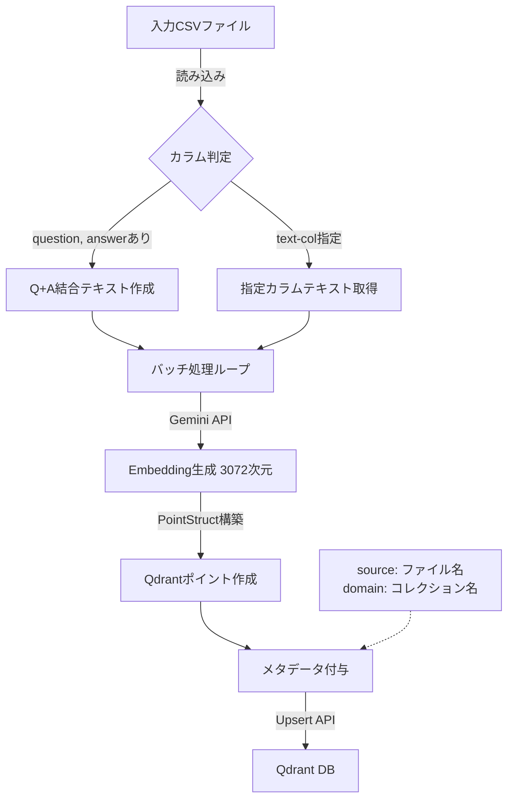

# register_qdrant.py ドキュメント

## 1. 概要

`register_qdrant.py` は、CSV形式のテキストデータ（主に `make_qa.py` で生成されたQ/Aペア）を読み込み、Embedding（ベクトル化）を行って Qdrant ベクトルデータベースに登録するためのCLIツールです。

RAG (Retrieval-Augmented Generation) システムにおいて、生成された知識データを検索可能な状態にする重要な役割を担います。

### 主な特徴

1.  **Q/Aペアの自動結合:** `question` と `answer` カラムを持つCSVの場合、これらを自動的に結合して文脈豊かなベクトルを生成します。
2.  **柔軟な入力対応:** Q/Aペアだけでなく、`Combined_Text` などのカラムを指定して任意のテキストデータを登録可能です。
3.  **Gemini Embedding対応:** Google Gemini API (`gemini-embedding-001`) を使用し、高精度な 3072次元ベクトルを生成します（OpenAIへの切り替えも可能）。
4.  **バッチ処理:** 大規模データでもメモリを圧迫せず、APIレート制限を考慮しながら効率的に登録します。

---

## 2. 使用方法

### 基本コマンド

```bash
python register_qdrant.py --input-file <CSVパス> --collection <コレクション名> [オプション]
```

### 必須引数

| 引数 | 説明 | 例 |
| :--- | :--- | :--- |
| `--input-file` | 登録するCSVファイルのパス。 | `qa_output/pipeline/qa_pairs_xxxx.csv` |
| `--collection` | 登録先のQdrantコレクション名。 | `qa_fineweb_edu_ja` |

### オプション引数

| 引数 | 説明 | デフォルト |
| :--- | :--- | :--- |
| `--recreate` | 指定したコレクションが既に存在する場合、削除して作り直します。 | `False` |
| `--batch-size` | 1回の処理で扱うデータ件数。 | `50` |
| `--text-col` | ベクトル化の対象とするカラム名。指定がない場合、`question`+`answer` または `Combined_Text` を自動検出します。 | `None` |
| `--domain` | ペイロードの `domain` フィールドに設定する値（フィルタリング用）。 | コレクション名 |
| `--max-docs` | 登録する件数を制限します（テスト用）。 | `None` (全件) |
| `--provider` | 使用するEmbeddingプロバイダー (`gemini` or `openai`)。 | `gemini` |

---

## 3. 推奨されるユースケース

### ケース1: 生成したQ/Aペアを登録する（高精度RAG向け）

`make_qa.py` で生成されたファイルを入力とする場合、最も推奨される方法です。
質問と回答が結合されてベクトル化されるため、ユーザーの質問に対して意味的に近い回答を検索しやすくなります。

```bash
python register_qdrant.py \
  --input-file qa_output/pipeline/qa_pairs_fineweb_edu_ja_20251229.csv \
  --collection qa_fineweb_edu_ja \
  --recreate
```

### ケース2: 元のドキュメントを直接登録する（網羅性重視）

Q/A生成前の、前処理済みテキストデータを登録する場合です。
`Combined_Text` カラム（タイトル+本文）を対象にします。

```bash
python register_qdrant.py \
  --input-file OUTPUT/preprocessed_fineweb_edu_ja.csv \
  --collection doc_fineweb_edu_ja \
  --text-col Combined_Text \
  --recreate
```

---

## 4. 処理フロー



## 5. Qdrantコレクション設定

本ツールで作成されるコレクションは以下の設定を持ちます。

*   **Vector Size:** 3072 (Gemini) / 1536 (OpenAI)
*   **Distance Metric:** Cosine (コサイン類似度)
*   **Payload Index:** `domain` (Keyword型) - 高速なフィルタリングのため自動作成されます。
