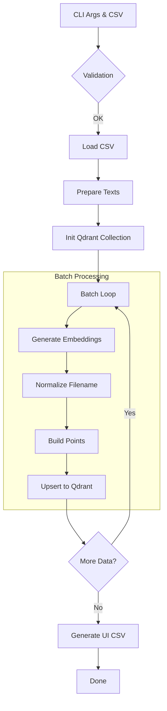
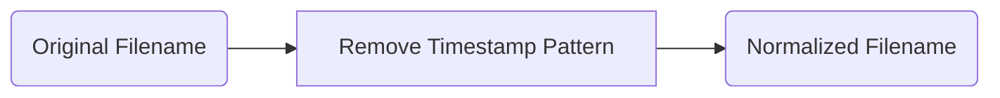

# register_qdrant.py ドキュメント

## 1. 概要

`register_qdrant.py` は、CSV形式のテキストデータ（主に `make_qa.py` で生成されたQ/Aペア）を読み込み、Embedding（ベクトル化）を行って Qdrant ベクトルデータベースに登録するためのCLIツールです。

RAG (Retrieval-Augmented Generation) システムにおいて、生成された知識データを検索可能な状態にする重要な役割を担います。

### 主な特徴

1.  **Q/Aペアの自動結合:** `question` と `answer` カラムを持つCSVの場合、これらを自動的に結合して文脈豊かなベクトルを生成します。
2.  **柔軟な入力対応:** Q/Aペアだけでなく、`Combined_Text` などのカラムを指定して任意のテキストデータを登録可能です。
3.  **Gemini Embedding対応:** Google Gemini API (`gemini-embedding-001`) を使用し、高精度な 3072次元ベクトルを生成します（OpenAIへの切り替えも可能）。
4.  **バッチ処理:** 大規模データでもメモリを圧迫せず、APIレート制限を考慮しながら効率的に登録します。
5.  **ファイル名の正規化:** Qdrant登録時にソースファイル名から日時サフィックスを除去し、UI（`agent_rag.py`）での参照を安定させます。
6.  **UI向け正規化CSVの自動生成:** 登録完了後、UI表示に必要なカラムのみを抽出した軽量なCSVファイルを `qa_output/` に自動生成します。

---

## 2. モジュール構成 (クラス・関数一覧)

`register_qdrant.py` は単一のスクリプトファイルとして構成されていますが、外部サービスモジュール (`services/qdrant_service.py`) と連携して動作します。

| 名称 | 種別 | 概要 | 主要な役割 |
| :--- | :--- | :--- | :--- |
| `main` | 関数 | スクリプトのエントリーポイント。 | 引数解析、ファイル読み込み、処理のオーケストレーション。 |
| `normalize_source_filename` | 関数 | ファイル名から日時情報を除去する。 | UI連携のためのファイル名正規化。 |
| `create_qdrant_client` | 関数 (外部) | Qdrantクライアントを初期化。 | DB接続の確立。 |
| `create_or_recreate_collection...` | 関数 (外部) | コレクションの作成・再作成。 | ベクトル設定を含むDB初期化。 |
| `embed_texts_for_qdrant` | 関数 (外部) | テキストをベクトル化。 | Gemini API呼び出しによるEmbedding生成。 |
| `build_points_for_qdrant` | 関数 (外部) | 登録用データ構造を作成。 | ベクトルとメタデータ（ペイロード）の結合。 |
| `upsert_points_to_qdrant` | 関数 (外部) | データをDBに登録。 | バッチ単位でのアップサート実行。 |

---

## 3. IPO (Input-Process-Output) 詳細

### 3.1 `main` 関数

*   **Input**:
    *   コマンドライン引数 (`--input-file`, `--collection` 等)
    *   入力CSVファイル
    *   環境変数 (`GOOGLE_API_KEY` 等)
*   **Process**:
    1.  引数の検証と設定のロード。
    2.  CSVファイルの読み込みと前処理（件数制限など）。
    3.  ベクトル化対象テキストの抽出（Q/A結合 or 指定カラム）。
    4.  Qdrantコレクションの準備（作成 or 再作成）。
    5.  バッチループ:
        *   テキストのベクトル化 (`embed_texts_for_qdrant`)
        *   ファイル名の正規化 (`normalize_source_filename`)
        *   登録用ポイントデータの構築 (`build_points_for_qdrant`)
        *   Qdrantへの登録 (`upsert_points_to_qdrant`)
    6.  UI表示用CSVファイルの自動生成。
*   **Output**:
    *   Qdrantデータベースへのレコード登録。
    *   `qa_output/` 配下への正規化CSVファイル出力。
    *   実行ログ（コンソール）。



### 3.2 `normalize_source_filename` 関数

*   **Input**:
    *   `filename` (str): 元のファイル名 (例: `data_20251231_120000.csv`)
*   **Process**:
    1.  正規表現 `_\d{8}_\d{6}` を使用して日時パターンを検索。
    2.  該当パターンを空文字に置換して削除。
*   **Output**:
    *   `normalized` (str): 正規化されたファイル名 (例: `data.csv`)



---

## 4. 使用方法

### 基本コマンド

```bash
python register_qdrant.py --input-file <CSVパス> --collection <コレクション名> [オプション]
```

### 必須引数

| 引数 | 説明 | 例 |
| :--- | :--- | :--- |
| `--input-file` | 登録するCSVファイルのパス。 | `qa_output/pipeline/qa_pairs_xxxx.csv` |
| `--collection` | 登録先のQdrantコレクション名。 | `qa_fineweb_edu_ja` |

### オプション引数

| 引数 | 説明 | デフォルト |
| :--- | :--- | :--- |
| `--recreate` | 指定したコレクションが既に存在する場合、削除して作り直す。 | `False` |
| `--batch-size` | 1回の処理で扱うデータ件数。 | `50` |
| `--text-col` | ベクトル化の対象とするカラム名。指定がない場合、自動検出。 | `None` |
| `--max-docs` | 登録する件数を制限します（テスト用）。 | `None` (全件) |

---

## 5. Web UI (agent_rag.py) との連携

本ツールは、Web UIでのデータプレビュー機能を正常に動作させるため、以下の処理を自動的に行います。

### ファイル名の正規化ロジック
入力ファイル名が `qa_pairs_fineweb_edu_ja_20251230_232641.csv` の場合、Qdrantの `source` メタデータおよび生成されるUI用CSV名は `qa_pairs_fineweb_edu_ja.csv` に正規化されます。これにより、データ更新（再登録）を行ってもUI側の参照先を変える必要がありません。

### UI用CSVの出力
登録完了後、`qa_output/` ディレクトリに以下の仕様でCSVが出力されます。
- **ファイル名**: 正規化された名前（例: `qa_pairs_fineweb_edu_ja.csv`）
- **抽出カラム**: `question`, `answer`
- **用途**: `agent_rag.py` の「Qdrant検索」画面でのデータプレビュー表示