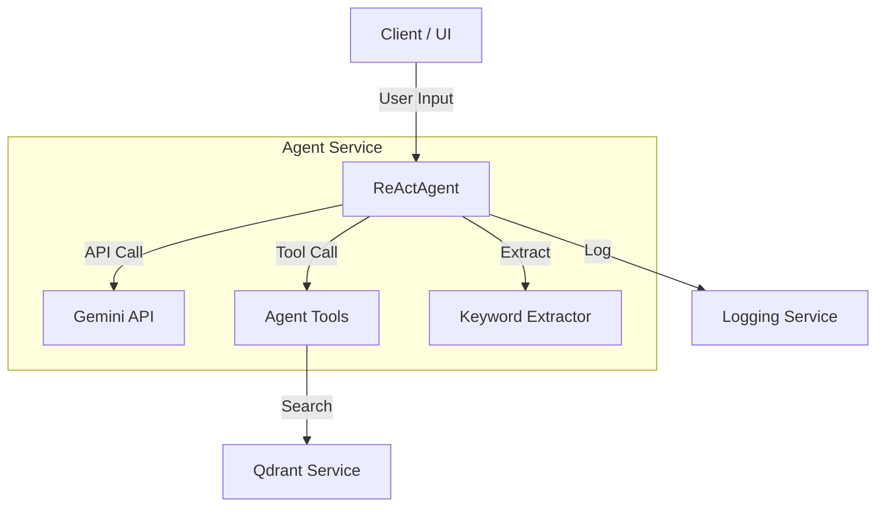
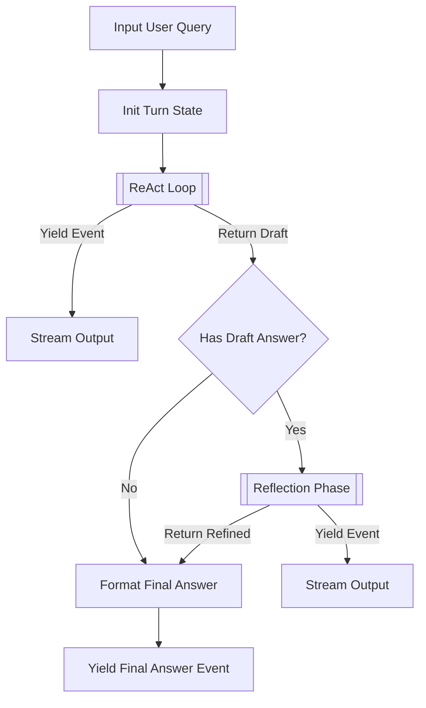
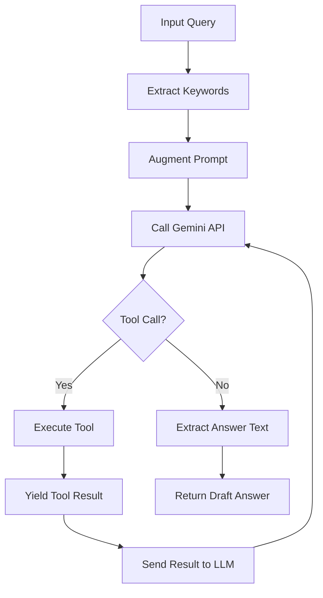
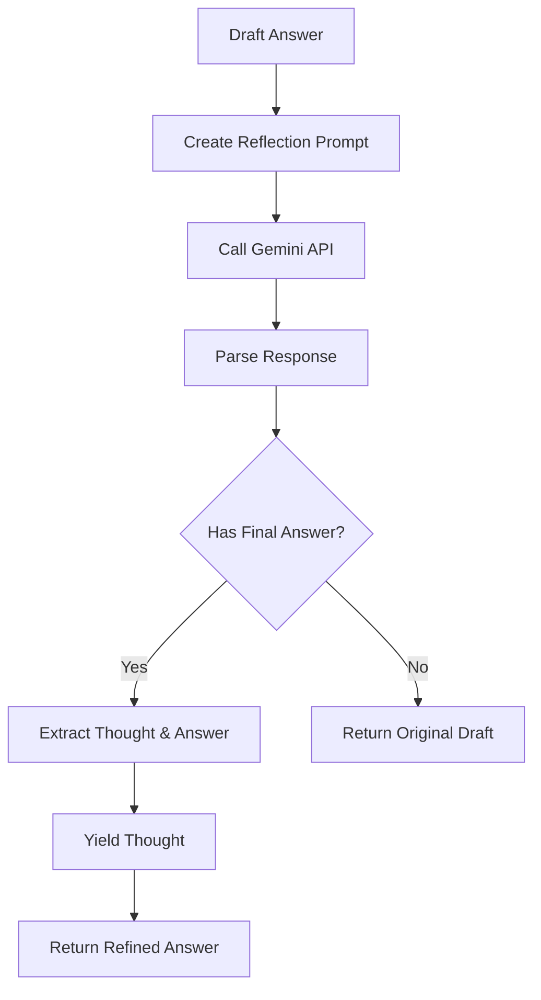

# Service: Agent (レガシーReActエージェント)

## 1. 概要
`AgentService` (および `ReActAgent` クラス) は、GRACEプロジェクトの前身である「Gemini3 Hybrid RAG」の中核コンポーネントであり、ReAct (Reasoning + Acting) パターンに基づく対話型AIエージェントを提供します。

現在は `grace/` パッケージへの移行期間中ですが、レガシー機能の互換性維持や、単純なRAGタスクの実行のために引き続き使用されています。
Google Gemini APIの `ChatSession` をラップし、ツール呼び出し、思考プロセスのログ記録、および自己反省 (Reflection) フェーズを実行します。

**主な責務:**
*   **ReAct Loop**: 思考 (Thought)、行動 (Action/Tool Call)、観察 (Observation/Result) のサイクルを管理。
*   **Reflection**: 回答生成後に自己評価を行い、品質を向上させる。
*   **Tool Integration**: Qdrantを使用したRAG検索ツールとの連携。
*   **State Management**: 会話履歴や思考ログの保持。

## 2. モジュール構成

### 2.1 依存関係

`ReActAgent` は以下の外部サービスおよびモジュールに依存しています。



### 2.2 ディレクトリ構成

```
services/
├── agent_service.py     # 【本モジュール】ReActエージェント実装
├── qdrant_service.py    # ベクトルDB操作
└── log_service.py       # ログ記録
```

## 3. クラス・関数一覧

### クラス: `ReActAgent`
ReActパターンを実装したエージェントクラスです。

| メソッド名 | 概要 | 主要引数 |
| :--- | :--- | :--- |
| `__init__` | エージェントの初期化。セッションとツールのセットアップ。 | `selected_collections`, `model_name` |
| `execute_turn` | **[Main]** ユーザー入力に対する1ターンを実行（ジェネレータ）。 | `user_input`: str |
| `_setup_session` | Gemini ChatSessionの初期化とシステムプロンプト設定。 | - |
| `_execute_react_loop` | ツール使用を含む推論ループの実行。 | `user_input`: str |
| `_execute_reflection_phase` | 生成された回答案に対する自己評価と修正。 | `draft_answer`: str |

#### Method: `execute_turn` IPO

*   **Input**:
    *   `user_input` (str): ユーザーからの質問や指示。
*   **Process**:
    1.  ログと状態の初期化。
    2.  `_execute_react_loop` を呼び出し、ReActサイクルを開始。
        *   LLMからの思考、ツール呼び出し、結果を逐次取得。
        *   UI更新用のイベントを `yield`。
    3.  `_execute_react_loop` からドラフト回答を取得。
    4.  ドラフト回答がある場合、`_execute_reflection_phase` を実行。
        *   自己評価と思考を `yield`。
        *   回答を修正。
    5.  最終回答をフォーマットして `yield`。
*   **Output**:
    *   `Generator[Dict[str, Any], None, None]`: UIイベントのストリーム。



#### Method: `_execute_react_loop` IPO

*   **Input**:
    *   `user_input` (str): ユーザー入力。
*   **Process**:
    1.  キーワード抽出を行い、検索精度向上のための指示を入力に追加。
    2.  最大ターン数まで以下をループ:
        *   LLMにプロンプト送信。
        *   レスポンス解析（思考テキスト、ツール呼び出し）。
        *   ツール呼び出しがあれば実行し、結果をLLMにフィードバック（再送）。
        *   ツール呼び出しがなければ、ループ終了（回答生成とみなす）。
*   **Output**:
    *   `Generator[Dict[str, Any], None, None]`: ストリーミングイベント。
    *   (Return) `str`: 生成されたドラフト回答テキスト。



#### Method: `_execute_reflection_phase` IPO

*   **Input**:
    *   `draft_answer` (str): ReActフェーズで生成された回答案。
*   **Process**:
    1.  回答案と自己評価用プロンプト (`REFLECTION_INSTRUCTION`) をLLMに送信。
    2.  LLMが回答の正確性、適切性、スタイルを評価し、修正案を生成。
    3.  評価思考プロセス (`Thought: ...`) と修正回答 (`Final Answer: ...`) をパース。
*   **Output**:
    *   `Generator[Dict[str, Any], None, str]`: 思考プロセスのイベント。
    *   (Return) `str`: 修正された最終回答（または元の回答）。



### 定数・テンプレート

*   `SYSTEM_INSTRUCTION_TEMPLATE`: エージェントの役割、ツール使用の判断基準、回答スタイルなどを定義したシステムプロンプト。
*   `REFLECTION_INSTRUCTION`: 自己評価フェーズで使用されるプロンプト。正確性、適切性、スタイルをチェックさせます。
*   `TOOLS_MAP`: 関数名と実関数オブジェクトのマッピング辞書。

## 4. 利用方法

```python
from services.agent_service import ReActAgent

# エージェントの初期化
agent = ReActAgent(
    selected_collections=["wikipedia_ja", "livedoor"],
    model_name="gemini-1.5-flash"
)

# ターンの実行（ストリーミング）
user_query = "最近の日本のAI事情について教えて"
for event in agent.execute_turn(user_query):
    if event["type"] == "log":
        print(f"[LOG] {event['content']}")
    elif event["type"] == "tool_call":
        print(f"[TOOL] Using {event['name']}...")
    elif event["type"] == "final_answer":
        print(f"[ANSWER] {event['content']}")
```