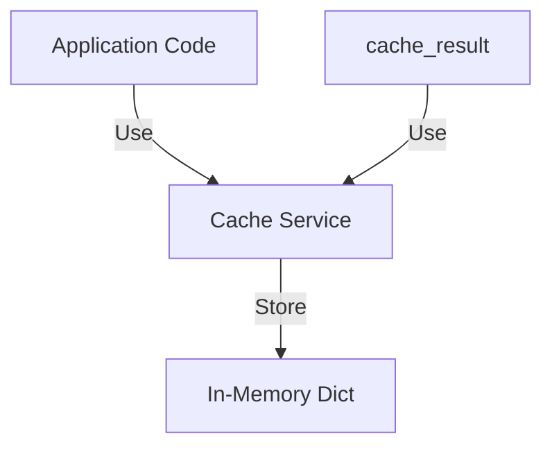
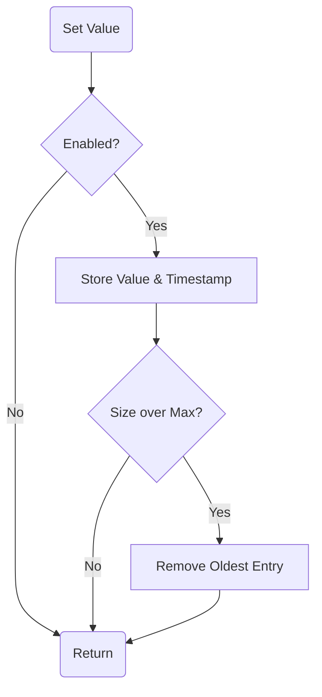

# Service: Cache (キャッシュ管理)

## 1. 概要
`CacheService` は、アプリケーション全体で使用可能な軽量のインメモリキャッシュ機能を提供します。
TTL (Time To Live) ベースの有効期限管理と、最大サイズ制限によるLRUライクな古いエントリの削除機能（eviction）を備えています。
APIコールの結果や、重い計算処理の結果をキャッシュすることで、レスポンス時間の短縮とリソース消費の削減を実現します。

**主な責務:**
*   **In-Memory Caching**: メモリ上へのキーバリューデータの保存と取得。
*   **TTL Management**: 設定された有効期限に基づくデータの自動無効化。
*   **Size Limiting**: 最大エントリ数を超えた場合の古いデータの削除。
*   **Decorator Support**: 関数呼び出しの結果を透過的にキャッシュするためのデコレータ提供。

## 2. モジュール構成

### 2.1 依存関係

CacheServiceは外部依存が少なく、Python標準ライブラリのみで動作します。



### 2.2 ディレクトリ構成

```
services/
├── cache_service.py     # 【本モジュール】キャッシュ実装
└── ...
```

## 3. クラス・関数一覧

### クラス: `MemoryCache`
インメモリキャッシュの実装クラスです。

| メソッド名 | 概要 | 主要引数 |
| :--- | :--- | :--- |
| `__init__` | キャッシュの初期化。 | `enabled`, `ttl`, `max_size` |
| `get` | 値の取得。期限切れや未設定の場合はNone。 | `key`: str |
| `set` | 値の設定。最大サイズ超過時は最古エントリを削除。 | `key`: str, `value`: Any |
| `delete` | 指定キーの削除。 | `key`: str |
| `clear` | 全キャッシュの削除。 | - |
| `cleanup_expired` | 期限切れエントリの一括削除。 | - |
| `has` | 有効なキーの存在確認。 | `key`: str |

#### Method: `set` と Eviction 詳細
新しい値をセットする際、容量制限を確認し、必要であれば最も古いエントリを削除します。



### デコレータ: `cache_result`
関数の戻り値を自動的にキャッシュするためのデコレータです。
引数に基づいて一意のキャッシュキーを生成します。

```python
@cache_result(ttl=60)
def expensive_api_call(user_id):
    # 重い処理...
    return result
```

### グローバルインスタンス関連

| 関数名 | 概要 |
| :--- | :--- |
| `get_global_cache` | アプリケーション全体で共有されるシングルトンインスタンスを取得します。 |
| `init_cache_from_config` | 設定オブジェクト（`ConfigManager`等）からグローバルキャッシュの設定を更新します。 |

## 4. 利用方法

### 基本的な使用法

```python
from services.cache_service import get_global_cache

cache = get_global_cache()

# 値のセット
cache.set("user:123:profile", {"name": "Toshio"}, ttl=300)

# 値の取得
profile = cache.get("user:123:profile")
if profile:
    print(f"Cached profile: {profile}")
else:
    print("Cache miss")
```

### デコレータによる使用

```python
from services.cache_service import cache_result
import time

@cache_result()
def heavy_computation(x, y):
    time.sleep(2)  # 重い処理のシミュレーション
    return x + y

# 1回目: 実行に2秒かかる
print(heavy_computation(10, 20))

# 2回目: キャッシュから即座に返る
print(heavy_computation(10, 20))
```
