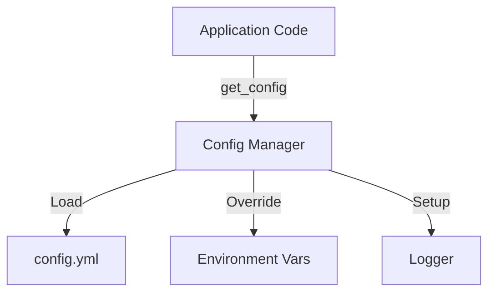
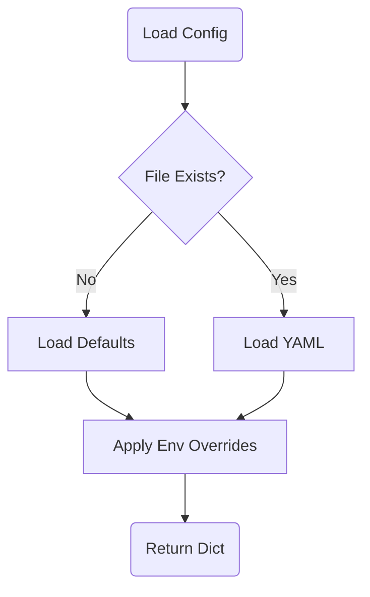

# Service: Config (設定管理)

## 1. 概要
`ConfigService` は、アプリケーション全体の設定情報を一元管理するシングルトンサービスです。
`config.yml` ファイルからの読み込み、環境変数によるオーバーライド、ドット区切りのキーによるアクセス、およびロギング設定の初期化機能を提供します。
`grace/config.py` (Pydanticベース) とは異なり、レガシーコンポーネントや汎用的な設定管理に使用されます。

**主な責務:**
*   **YAML Loading**: 設定ファイル (`config.yml`) の読み込み。
*   **Env Override**: 環境変数による設定値の上書き（APIキーやログレベルなど）。
*   **Dot Notation Access**: `api.timeout` のようなドット区切りキーでの値取得。
*   **Logging Setup**: 設定ファイルに基づいたロガーの初期化（コンソール/ファイル出力）。
*   **Singleton Access**: アプリケーション全体で単一の設定インスタンスを共有。

## 2. モジュール構成

### 2.1 依存関係

ConfigServiceはYAMLパーサーと標準ライブラリを使用します。



### 2.2 ディレクトリ構成

```
services/
├── config_service.py    # 【本モジュール】設定管理実装
└── ...
```

## 3. クラス・関数一覧

### クラス: `ConfigManager`
設定管理のコアクラスです。シングルトンとして実装されています。

| メソッド名 | 概要 | 主要引数 |
| :--- | :--- | :--- |
| `__new__` | シングルトンインスタンスの制御。 | `config_path` |
| `__init__` | 設定読み込みとロガー初期化（初回のみ）。 | `config_path` |
| `get` | 設定値の取得（ドット区切り対応、キャッシュ付き）。 | `key`: str, `default`: Any |
| `set` | 設定値の更新（インメモリのみ）。 | `key`: str, `value`: Any |
| `reload` | 設定ファイルと環境変数の再読み込み。 | - |
| `save` | 現在の設定をYAMLファイルに書き出し。 | `filepath`: str |
| `_load_config` | YAML読み込みと環境変数オーバーライドの実行。 | - |
| `_setup_logger` | 設定に基づきロガー（ハンドラ、フォーマッタ）を構築。 | - |

#### Method: `_load_config` フロー
設定の読み込み順序と優先順位を示します。



### ユーティリティ関数

グローバルインスタンス `config` へのショートカットとして提供されています。

| 関数名 | 概要 |
| :--- | :--- |
| `get_config` | `config.get(key, default)` と等価。 |
| `set_config` | `config.set(key, value)` と等価。 |
| `reload_config` | `config.reload()` と等価。 |

## 4. 設定項目と環境変数

主要な設定項目と、それを上書きする環境変数の対応表です。

| 設定キー (YAML) | 環境変数 | 説明 |
| :--- | :--- | :--- |
| `api.openai_api_key` | `OPENAI_API_KEY` | OpenAI APIキー |
| `api.google_api_key` | `GOOGLE_API_KEY` | Google APIキー |
| `logging.level` | `LOG_LEVEL` | ログレベル (INFO, DEBUG等) |
| `experimental.debug_mode` | `DEBUG_MODE` | デバッグモード有効化 (True/False) |
| `llm.provider` | `LLM_PROVIDER` | LLMプロバイダ (gemini/openai) |

## 5. 利用方法

### 設定値の取得

```python
from services.config_service import get_config, config

# ショートカット関数を使用
timeout = get_config("api.timeout", 30)

# インスタンスを使用
model = config.get("models.default")

print(f"Timeout: {timeout}, Model: {model}")
```

### 設定の動的変更と保存

```python
from services.config_service import config

# 設定を変更（メモリ上）
config.set("ui.page_title", "New Title")

# ファイルに保存
success = config.save()
```
