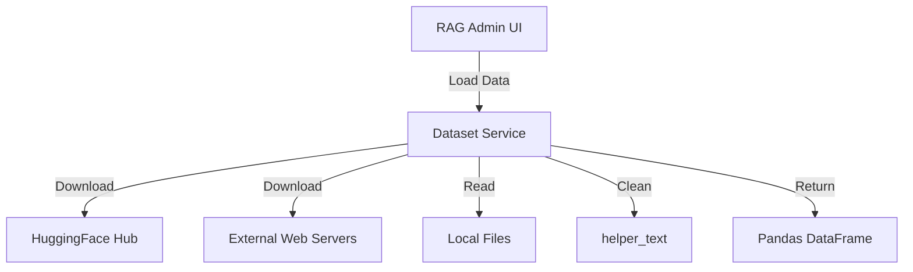
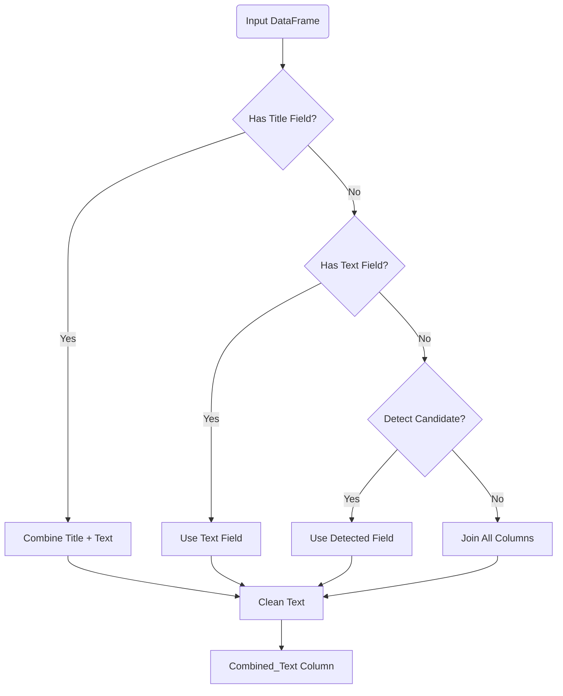

# Service: Dataset (データセット操作)

## 1. 概要
`DatasetService` は、RAG (Retrieval-Augmented Generation) システムのナレッジベース構築に必要なデータの取得、ロード、および前処理を担当します。
HuggingFace Datasets、Livedoorニュースコーパス、およびローカルアップロードファイル（CSV, JSON, Text）など、多様なデータソースに対応し、これらを統一されたフォーマット（DataFrame）に変換します。

**主な責務:**
*   **Data Downloading**: 外部ソース（HuggingFace, Livedoor Corpus）からのデータダウンロードと展開。
*   **Data Loading**: 各種フォーマット（CSV, JSONL, TXT）のファイルを解析し、Pandas DataFrameへ変換。
*   **Preprocessing**: `Combined_Text` カラムの生成やテキストクリーニング (`clean_text`) による正規化。
*   **Standardization**: 異なるソースからのデータを、RAGパイプラインで扱いやすい共通構造に整形。

## 2. モジュール構成

### 2.1 依存関係

データ処理のために Pandas と HuggingFace Datasets ライブラリを使用し、テキスト処理には `helper_text` モジュールを利用します。



### 2.2 ディレクトリ構成

```
services/
├── dataset_service.py   # 【本モジュール】データセット操作
└── ...
```

## 3. 関数一覧

### データ取得・ロード関数

| 関数名 | 概要 | 主要引数 |
| :--- | :--- | :--- |
| `download_livedoor_corpus` | Livedoorニュースコーパスをダウンロード・解凍。 | `save_dir` |
| `load_livedoor_corpus` | 解凍済みLivedoorコーパスをDataFrameとして読み込み。 | `data_dir` |
| `download_hf_dataset` | HuggingFaceからデータセットをストリーミングダウンロード。 | `dataset_name`, `sample_size`, `log_callback` |
| `load_uploaded_file` | Streamlit等でアップロードされたファイルを読み込み。 | `uploaded_file` |

### 前処理関数

| 関数名 | 概要 |
| :--- | :--- |
| `extract_text_content` | DataFrame内の指定カラムからテキストを抽出し、クリーニングして `Combined_Text` カラムを作成。 |

#### Function: `extract_text_content` ロジック

RAGのEmbedding生成元となるテキストを決定します。

1.  **タイトル結合**: `title_field` が指定されていれば、`text_field` と結合。
2.  **テキスト単独**: `text_field` のみを使用。
3.  **自動検出**: `text`, `content`, `body` などの一般的名称のカラムを探索。
4.  **全結合**: 候補が見つからない場合、全カラムの値を結合（フォールバック）。
5.  **クリーニング**: `helper_text.clean_text` を適用して不要な空白や制御文字を除去。



## 4. 対応データソース

| ソース名 | 識別子 | 特徴 |
| :--- | :--- | :--- |
| **Livedoor News** | N/A | 日本語ニュース記事。カテゴリ分類付き。 |
| **Wikipedia (JA)** | `wikimedia/wikipedia` | 日本語Wikipedia記事。 |
| **CC-100 (JA)** | `range3/cc100-ja` | 大規模日本語Webコーパス。 |
| **CC News** | `cc_news` | 英語ニュース記事。 |
| **Local File** | `csv`, `json`, `jsonl`, `txt` | ユーザー独自のデータファイル。 |

## 5. 利用方法

### HuggingFaceデータセットのロード

```python
from services.dataset_service import download_hf_dataset, extract_text_content

# コールバック（ログ出力用）
def log_func(msg):
    print(msg)

# ダウンロード
df = download_hf_dataset(
    dataset_name="wikimedia/wikipedia",
    config_name="20231101.ja",
    split="train",
    sample_size=1000,
    log_callback=log_func
)

# 前処理
config = {"text_field": "text", "title_field": "title"}
df_processed = extract_text_content(df, config)

print(df_processed[["Combined_Text"]].head())
```

### Livedoorコーパスのロード

```python
from services.dataset_service import download_livedoor_corpus, load_livedoor_corpus

# ダウンロードと解凍
data_dir = download_livedoor_corpus()

# ロード
df = load_livedoor_corpus(data_dir)

# 前処理（Livedoorはタイトルとコンテンツが分かれている）
config = {"text_field": "content", "title_field": "title"}
df_processed = extract_text_content(df, config)
```
