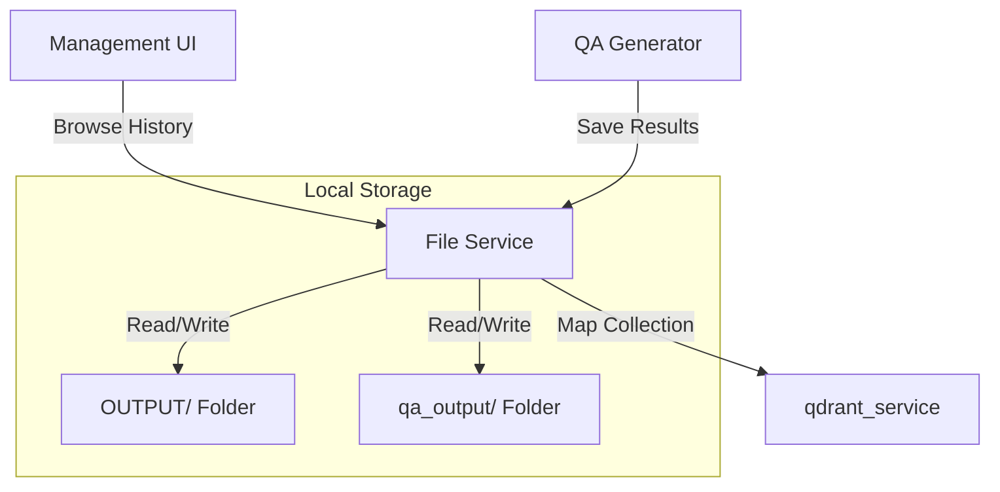
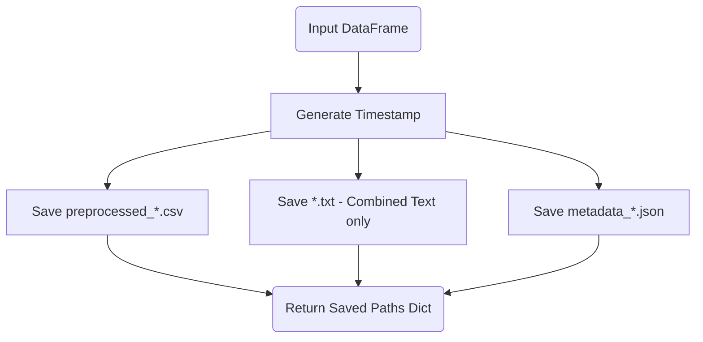

# Service: File (ファイル操作・履歴管理)

## 1. 概要
`FileService` は、RAGパイプラインにおけるデータの永続化と、生成された成果物の履歴管理を担当します。
前処理済みデータ（`OUTPUT/` フォルダ）や、LLMによって生成されたQ&Aペア（`qa_output/` フォルダ）の読み書き、およびメタデータの管理を一元化します。

**主な責務:**
*   **History Management**: `OUTPUT/` および `qa_output/` 内のファイルを走査し、サイズや日付情報を含む履歴リスト（DataFrame）を生成。
*   **File Persistence**: 前処理済みテキスト、CSV、およびメタデータ（JSON）の一括保存。
*   **Data Preview**: コレクションに関連付けられたCSVファイルから、Q&Aのサンプルやプレビューを取得。
*   **Path Mapping**: コレクション名と物理的なCSVファイルの紐付け（`qdrant_service` との連携）。

## 2. モジュール構成

### 2.1 依存関係

FileServiceはローカルファイルシステムに直接アクセスし、Pandasを使用して構造化データを処理します。



### 2.2 ディレクトリ構成

```
services/
├── file_service.py      # 【本モジュール】ファイル操作実装
└── ...
```

## 3. 関数一覧

### 履歴取得関数

| 関数名 | 概要 |
| :--- | :--- |
| `load_qa_output_history` | `qa_output/` 内の生成済みQ&A CSVファイル一覧を取得。 |
| `load_preprocessed_history` | `OUTPUT/` 内の前処理済みCSVファイル一覧を取得。 |

### 保存・読み込み関数

| 関数名 | 概要 | 主要引数 |
| :--- | :--- | :--- |
| `save_to_output` | 前処理済みデータをCSV, TXT, JSON(メタデータ)形式で保存。 | `df`, `dataset_type` |
| `load_sample_questions_from_csv` | 指定されたコレクションのCSVからランダムに質問例を抽出。 | `collection_name` |
| `load_source_qa_data` | 指定されたCSVファイルからQ/Aペアを読み込み。 | `source_filename`, `num_rows` |
| `load_collection_qa_preview` | コレクション名から自動的にファイルを特定し、プレビューを表示。 | `collection_name` |

#### Function: `save_to_output` フロー
1つのデータセットに対して、3種類（CSV, TXT, JSON）のファイルをタイムスタンプ付きで同時生成します。



## 4. 管理ディレクトリ詳細

| ディレクトリ | 用途 | ファイル名の規則 |
| :--- | :--- | :--- |
| **`OUTPUT/`** | 前処理（クリーニング、結合）後のデータ | `preprocessed_{type}_{ts}.csv`, `metadata_{type}_{ts}.json` |
| **`qa_output/`** | LLMが生成したQ&Aペアの最終成果物 | `a0x_qa_pairs_{type}.csv` 等 |

## 5. 利用方法

### 履歴の取得と表示

```python
from services.file_service import load_qa_output_history

# Q&A生成履歴をDataFrameとして取得
df_history = load_qa_output_history()

if not df_history.empty:
    print(f"Latest file: {df_history.iloc[-1]['ファイル名']}")
```

### データの保存

```python
from services.file_service import save_to_output

# 前処理後のDataFrameを保存
saved_paths = save_to_output(df_processed, "wikipedia_ja")

print(f"CSV saved to: {saved_paths['csv']}")
print(f"Metadata saved to: {saved_paths['json']}")
```

### コレクションのサンプル質問取得

```python
from services.file_service import load_sample_questions_from_csv

# 特定のコレクションに関連する質問を3件取得
samples = load_sample_questions_from_csv("livedoor", num_samples=3)

for i, q in enumerate(samples):
    print(f"Sample {i+1}: {q}")
```
