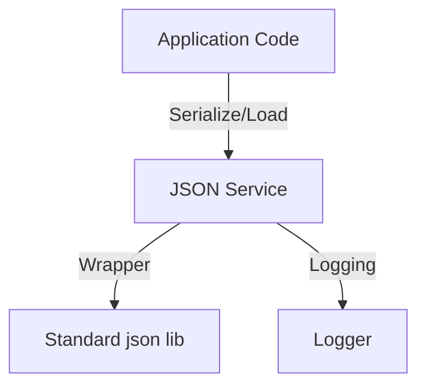

# Service: JSON (JSON操作ユーティリティ)

## 1. 概要
`JsonService` は、Python標準の `json` モジュールを拡張し、AIアプリケーション開発で頻出するデータ型のシリアライズ（`datetime`, `bytes`, Pydanticモデル等）を透過的にサポートします。
また、エラーハンドリングを強化したファイル読み書き機能を提供し、不正なJSONデータによるクラッシュを防ぎます。

**主な責務:**
*   **Custom Serialization**: `datetime` や Pydantic モデルなど、JSON化できないオブジェクトの自動変換。
*   **Safe Operations**: パースエラーやファイル不在を例外ではなくログとして処理し、デフォルト値を返す安全な設計。
*   **File Persistence**: ディレクトリ自動生成を含む堅牢なJSONファイル保存。
*   **Utility**: 整形表示（Pretty Print）やコンパクト化などのフォーマット支援。

## 2. モジュール構成

### 2.1 依存関係

JsonServiceは、標準ライブラリのみで動作する軽量なサービスです。



### 2.2 ディレクトリ構成

```
services/
├── json_service.py      # 【本モジュール】JSON操作実装
└── ...
```

## 3. 関数一覧

### シリアライザ・デシリアライザ

| 関数名 | 概要 | 主要引数 |
| :--- | :--- | :--- |
| `safe_json_dumps` | オブジェクトを安全にJSON文字列へ変換。 | `data`, `**kwargs` |
| `safe_json_loads` | JSON文字列を安全にパース。エラー時はデフォルト値を返す。 | `data`, `default` |
| `safe_json_serializer` | `default` 引数用のカスタムシリアライザ。 | `obj` |

#### Function: `safe_json_serializer` 対応型
以下の型を自動的にJSON互換形式に変換します。

*   **Pydantic Model**: `.model_dump()` または `.dict()`
*   **datetime**: ISO 8601 文字列 (`.isoformat()`)
*   **bytes**: UTF-8デコード、失敗時はHex文字列
*   **set**: リストへの変換
*   **OpenAI Objects**: トークン情報の辞書化など
*   **Other**: 文字列化 (`str()`)

### ファイル操作

| 関数名 | 概要 | 主要引数 |
| :--- | :--- | :--- |
| `load_json_file` | ファイルからロード。エラー時はNone。 | `filepath` |
| `save_json_file` | ファイルへ保存。ディレクトリ自動作成。 | `data`, `filepath` |
| `load_json_file_or_default` | ロード失敗時に指定デフォルト値を返す。 | `filepath`, `default` |
| `merge_json_files` | 複数のJSONファイルを結合。 | `filepaths`, `output_path` |

### ユーティリティ

| 関数名 | 概要 |
| :--- | :--- |
| `is_valid_json` | 文字列が有効なJSONか検証。 |
| `pretty_print_json` | インデント付きで見やすく整形。 |
| `compact_json` | 空白を除去して最小化。 |

## 4. 利用方法

### 安全なシリアライズ

```python
from services.json_service import safe_json_dumps
from datetime import datetime
from pydantic import BaseModel

class User(BaseModel):
    name: str
    created_at: datetime

user = User(name="Toshio", created_at=datetime.now())

# 標準json.dumpsではエラーになるが、これならOK
json_str = safe_json_dumps(user)
print(json_str)
```

### 堅牢なファイル読み書き

```python
from services.json_service import save_json_file, load_json_file_or_default

data = {"key": "value", "items": {1, 2, 3}}  # setも含まれている
filepath = "data/temp/config.json"

# ディレクトリがなくても自動作成して保存
if save_json_file(data, filepath):
    print("Saved!")

# 読み込み（ファイルがなくてもクラッシュせず空辞書を返す）
loaded = load_json_file_or_default(filepath, default={})
```