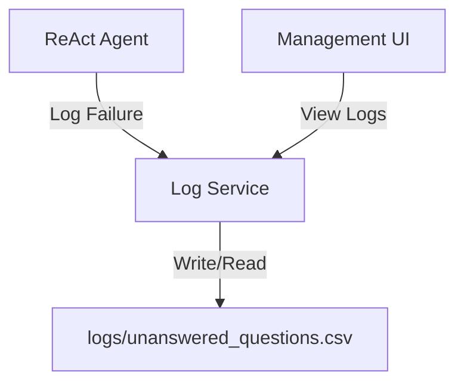
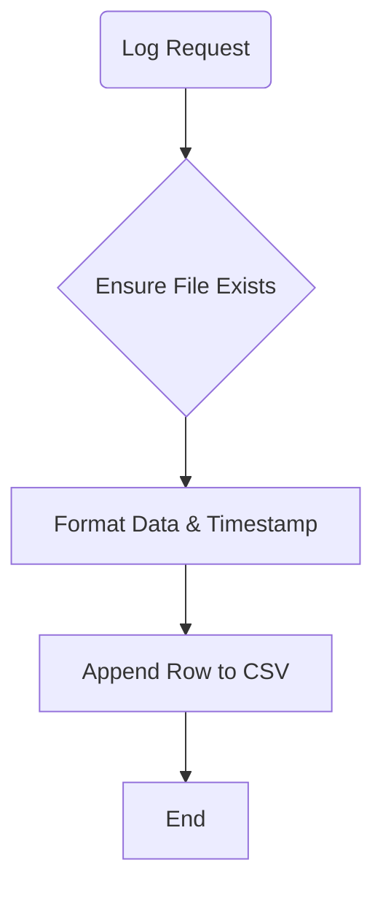

# Service: Log (ログ管理)

## 1. 概要
`LogService` は、システム運用上のイベント、特にRAG検索で回答が得られなかった「未回答質問 (Unanswered Questions)」の記録と管理に特化したサービスです。
一般的なアプリケーションログ（`config_service` で設定されるもの）とは異なり、AIエージェントの品質改善サイクル（分析・チューニング）に使用される構造化データを扱います。

**主な責務:**
*   **Event Logging**: 未回答の質問、使用されたコレクション、失敗理由などをCSV形式で記録。
*   **Log Retrieval**: 記録されたログをPandas DataFrameとして読み込み、分析やUI表示に提供。
*   **Log Management**: ログファイルの初期化やクリアなどのライフサイクル管理。

## 2. モジュール構成

### 2.1 依存関係

LogServiceはローカルファイルシステム上のCSVファイルを操作します。



### 2.2 ディレクトリ構成

```
services/
├── log_service.py       # 【本モジュール】ログ管理実装
└── ...
```

保存先ファイル: `logs/unanswered_questions.csv`

## 3. 関数一覧

### ログ記録・管理

| 関数名 | 概要 | 主要引数 |
| :--- | :--- | :--- |
| `log_unanswered_question` | 未回答質問をCSVに追記。タイムスタンプは自動付与。 | `query`, `collections`, `reason`, `agent_response` |
| `load_unanswered_logs` | ログをDataFrameとして読み込み、最新順にソートして返す。 | - |
| `clear_unanswered_logs` | ログファイルをリセット（ヘッダーのみ再作成）。 | - |
| `_ensure_log_dir` | ログディレクトリとファイルの存在を保証する内部関数。 | - |

#### Function: `log_unanswered_question` フロー

1.  ディレクトリとファイルの存在確認（なければ作成）。
2.  現在時刻の取得。
3.  コレクションリストの文字列化。
4.  CSVへの行追加。



## 4. ログデータ構造

`unanswered_questions.csv` のカラム定義です。

| カラム名 | 説明 |
| :--- | :--- |
| `timestamp` | 発生日時 (YYYY-MM-DD HH:MM:SS) |
| `query` | ユーザーの質問内容 |
| `collections` | 検索対象だったコレクション名（カンマ区切り） |
| `reason` | 未回答の理由 (例: `No RAG results`, `Low score`) |
| `agent_response` | エージェントが返したフォールバック応答 |

## 5. 利用方法

### 未回答ログの記録（エージェント内）

```python
from services.log_service import log_unanswered_question

# 検索結果がなかった場合
log_unanswered_question(
    query="社内規定の秘密のパスワードは？",
    collections=["company_rules"],
    reason="No RAG results",
    agent_response="申し訳ありません、関連情報が見つかりませんでした。"
)
```

### ログの確認（分析ツール/UI内）

```python
from services.log_service import load_unanswered_logs

df = load_unanswered_logs()

print(f"Total unanswered: {len(df)}")
if not df.empty:
    print(df.head())
```
