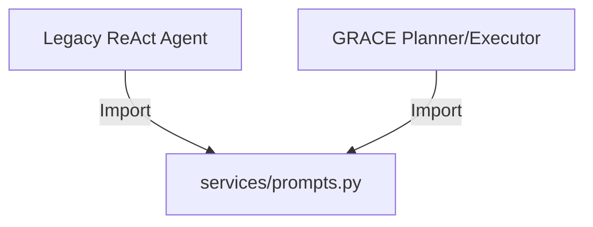

# Service: Prompts (共通プロンプト定義)

## 1. 概要
`Prompts` モジュールは、Legacy Agent (ReAct) と GRACE Agent の双方で共有される、再利用可能なプロンプト定数（命令セット）を提供します。
特に「検索クエリの作成ルール」や「回答生成のスタイルガイド」といった、エージェントの振る舞い品質に直結する重要な指示を一元管理します。

### プロンプトの特性と意図

#### なぜこのプロンプトなのか？
LLMを利用したRAGシステムにおいて、最も重要な要素は「検索精度の向上」と「回答の一貫性」です。これらをコードロジックのみで制御することは困難であり、LLMへの明確な指示（プロンプトエンジニアリング）が不可欠です。本モジュールのプロンプトは、実運用データに基づく検証（例えば、スコア0.8333を達成した事例）から導き出されたベストプラクティスを反映しています。

#### このプロンプトの意味と意図
1.  **検索クエリ作成 (`SEARCH_QUERY_INSTRUCTION`)**:
    *   **意図**: 自然言語の質問を、検索エンジン（Qdrant/BM25）が理解しやすい「キーワードベース」のクエリに変換させること。
    *   **意味**: 「助詞を省く」「具体的文脈を残す」という相反する要件を、具体的な良例・悪例を示すことでLLMに学習させ、検索ヒット率（Recall）と精度（Precision）のバランスを最適化します。

2.  **回答生成 (`ANSWER_GENERATION_INSTRUCTION`)**:
    *   **意図**: 「ハルシネーション（捏造）の防止」と「ユーザー体験の向上」の両立。
    *   **意味**: 「関連スコアが低くても情報を使う」という指示により、過度に慎重な回答（"分かりません"の乱発）を防ぎつつ、「出典の明示」と「事前学習知識による捏造禁止」を義務付けることで、情報の信頼性を担保します。

## 2. モジュール構成

### 2.1 依存関係

Promptsモジュールは依存関係を持たない純粋な定数定義ファイルであり、他の多くのエージェント関連モジュールから参照されます。



### 2.2 ディレクトリ構成

```
services/
├── prompts.py           # 【本モジュール】共通プロンプト定義
└── ...
```

## 3. 定数一覧

### 定数: `SEARCH_QUERY_INSTRUCTION`
検索クエリを生成する際に、システムプロンプトまたは関数呼び出しの指示として含めるテキスト。

**主要なルール:**
*   「いつ」「誰」「何」などの具体要素を抽出する。
*   助詞・助動詞を省き、名詞と動詞を中心にする。
*   具体的な文脈（「初めて」「受賞」など）を省略しない。

**Example Usage:**
> 質問: 「浦沢直樹が初めて受賞したのはいつ、何の賞ですか？」
> クエリ: 「浦沢直樹 初めて受賞 いつ 何の賞」

### 定数: `ANSWER_GENERATION_INSTRUCTION`
最終的な回答を生成する際に遵守させるガイドライン。

**主要なルール:**
*   丁寧な日本語（です・ます調）。
*   出典の明示（「社内ナレッジによると...」）。
*   低スコア情報の積極利用（諦めない姿勢）。
*   捏造の禁止（正直な回答）。

## 4. 利用方法

### Legacy Agentでの使用例

```python
from services.prompts import SEARCH_QUERY_INSTRUCTION, ANSWER_GENERATION_INSTRUCTION

system_prompt = f"""
あなたはRAGエージェントです。以下の指示に従ってください。

## 検索について
{SEARCH_QUERY_INSTRUCTION}

## 回答について
{ANSWER_GENERATION_INSTRUCTION}
"""
```

### GRACE Agentでの使用例

```python
from services.prompts import SEARCH_QUERY_INSTRUCTION

# Plannerが検索ステップを生成する際のコンテキストとして注入
plan_instruction = f"""
検索ステップを作成する際は、以下のクエリ作成ルールを考慮してください:
{SEARCH_QUERY_INSTRUCTION}
"""
```
