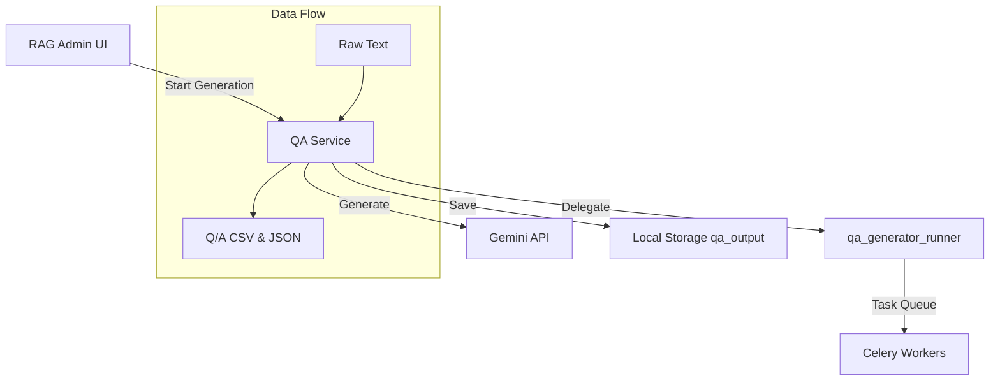
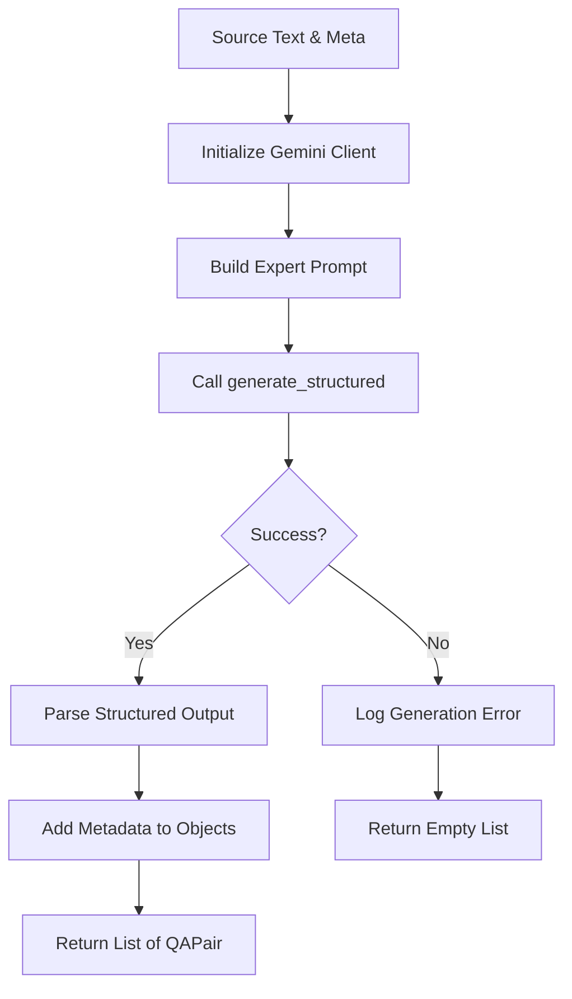
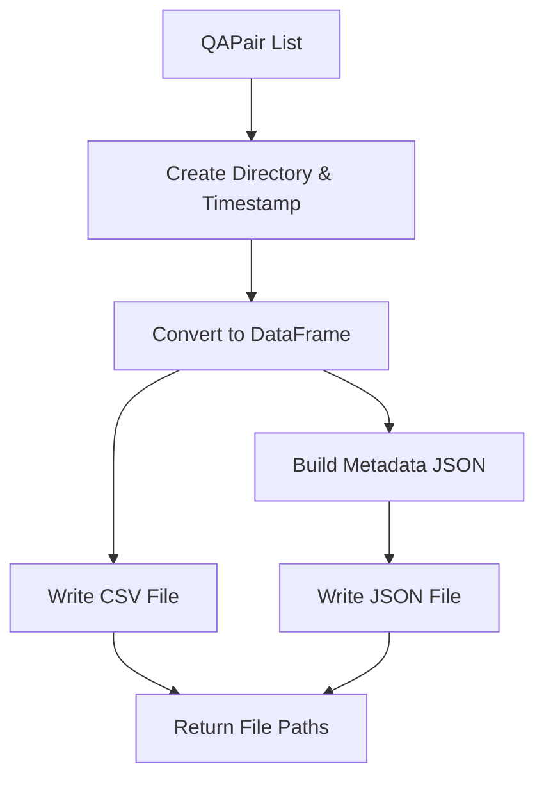

# Service: QA (Q/Aペア生成)

## 1. 概要
`QAService` は、RAGシステムの精度向上に不可欠な「評価用データセット（Q/Aペア）」を自動生成する中核サービスです。
テキストチャンクを入力とし、LLM（Gemini API等）を活用して、文脈に基づいた高品質な質問と回答のペアを大量生成します。
`dataset_service` で前処理されたテキストから知識を抽出し、`qdrant_service` での検索精度検証や、`agent_service` の回答品質評価に利用されるデータを供給します。

**本サービスの中核的役割:**
このサービスは、単なるデータ生成ツールではありません。GRACEシステムの「自己改善サイクル」の起点となる重要なモジュールです。
1.  **知識の蒸留**: 生のテキストデータから、LLMが理解しやすい「問い」と「答え」の形式に知識を構造化します。
2.  **評価基盤の確立**: 自動生成されたQ/Aペアは、RAG検索の正解データ（Ground Truth）として機能し、システムの検索精度（Retrieval Accuracy）を定量的に測定することを可能にします。
3.  **カバレッジ分析**: 文書のどの部分がQ/A化されたかを追跡することで、ナレッジベースの網羅性を可視化します。

**主な責務:**
*   **Pipeline Execution**: 大規模なQ/A生成パイプライン（`qa_generator_runner`）の起動と制御。
*   **LLM Generation**: プロンプトエンジニアリングを用いた、多様なタイプ（事実、概念、応用、分析）のQ/A生成。
*   **Result Persistence**: 生成されたペアのCSV/JSON形式での保存と履歴管理。
*   **Process Isolation**: Celeryワーカーや別プロセスを用いた、長時間実行タスクの安定実行。

## 2. モジュール構成

### 2.1 依存関係

QAServiceは、LLMクライアント、モデル定義、および外部ランナーモジュールと連携します。



### 2.2 ディレクトリ構成

```
services/
├── qa_service.py        # 【本モジュール】Q/A生成ロジック
└── ...
```

## 3. 関数一覧

| 関数名 | 概要 | 主要引数 |
| :--- | :--- | :--- |
| `run_advanced_qa_generation` | 高度なQ/A生成パイプラインを実行。カバレッジ分析や並列処理の設定が可能。 | `dataset`, `max_docs`, `use_celery`, `log_callback` |
| `generate_qa_pairs` | 1つのテキストチャンクから複数のQ/Aペアを生成。 | `text`, `qa_per_chunk`, `model` |
| `save_qa_pairs_to_file` | 生成結果をファイルに保存。 | `qa_pairs`, `dataset_type` |

## 4. IPO (Input-Process-Output)

### 4.1 `run_advanced_qa_generation` IPO

*   **Input**:
    *   `dataset` (Optional[str]): データセット名
    *   `input_file` (Optional[str]): 入力ファイルパス
    *   `use_celery` (bool): Celeryを使用するか
    *   `celery_workers` (int): ワーカー数
    *   `batch_chunks` (int): バッチサイズ
    *   `max_docs` (int): 最大処理ドキュメント数
    *   `model` (str): LLMモデル名
    *   `analyze_coverage` (bool): カバレッジ分析を有効にするか
    *   `log_callback` (Callable): ログ出力用コールバック
*   **Process**:
    1.  `qa_generator_runner` モジュールを動的にインポートし、パスを調整。
    2.  `run_qa_generator` を呼び出し、メインプロセスを起動。
    3.  指定されたパラメータに基づき、チャンク化、Embedding、Q/A生成、保存を実行。
    4.  Celeryが有効な場合はタスクキューへディスパッチ。
    5.  例外発生時はログにスタックトレースを出力。
*   **Output**:
    *   `Dict[str, Any]`: 実行結果のサマリー（成功・失敗フラグ、エラー内容など）

```mermaid
graph TD
    Input[Input Configuration] --> Prepare[Path Adjustment & Import]
    Prepare --> LogStart[Log Operation Start]
    LogStart --> RunRunner[Invoke run_qa_generator]
    
    subgraph Runner Process
        RunRunner --> Load[Load Data]
        Load --> Process[Chunking & Embedding]
        Process --> Generate[QA Pair Generation]
        Generate --> Save[Persistence]
    end
    
    Save --> SuccessRes[Return Success Summary]
    Runner Process --Error--> ErrorHandler[Log Traceback]
    ErrorHandler --> ErrorRes[Return Error Dict]
```

### 4.2 `generate_qa_pairs` IPO

*   **Input**:
    *   `text` (str): 質問生成のソースとなるテキスト
    *   `dataset_type` (str): データセットの種類
    *   `chunk_id` (str): ソースチャンクのID
    *   `model` (str): 使用するLLMモデル名
    *   `qa_per_chunk` (int): 生成するペアの数
    *   `log_callback` (Optional[Callable]): ログ出力用コールバック
*   **Process**:
    1.  Geminiクライアントを初期化。
    2.  「教育用Q/Aペア生成の専門家」としての役割と制約を含むプロンプトを作成。
    3.  `generate_structured` メソッドを用いて、`QAPairsResponse` スキーマに従った構造化データを生成。
    4.  得られたJSONレスポンスを `QAPair` オブジェクトのリストに変換。
    5.  各ペアにメタデータ（チャンクID、データタイプ等）を付与。
*   **Output**:
    *   `List[QAPair]`: 生成されたQ/Aペアのリスト



### 4.3 `save_qa_pairs_to_file` IPO

*   **Input**:
    *   `qa_pairs` (List[QAPair]): 生成されたQ/Aペアのリスト
    *   `dataset_type` (str): データセット識別子
    *   `log_callback` (Optional[Callable]): ログ出力用コールバック
*   **Process**:
    1.  出力先ディレクトリ `qa_output` の存在を確認し、なければ作成。
    2.  現在日時からタイムスタンプを生成。
    3.  Q/AペアリストをPandas DataFrameに変換し、CSV形式で書き出し。
    4.  総数や作成日時を含むメタデータ構造を構築し、JSON形式で書き出し。
*   **Output**:
    *   `Dict[str, str]`: 保存されたCSVとJSONのファイルパスを含む辞書



## 5. データモデル

`models` パッケージの `QAPair` クラスを使用します。

| フィールド | 説明 |
| :--- | :--- |
| `question` | 生成された質問 |
| `answer` | 生成された回答 |
| `question_type` | 質問の種類 (factual, conceptual 等) |
| `source_chunk_id` | 生成元のテキストチャンクID |
| `dataset_type` | データセットの種類 (wikipedia_ja 等) |

## 6. 利用方法

### UIからのパイプライン起動

```python
from services.qa_service import run_advanced_qa_generation

def log_func(msg):
    print(msg)

result = run_advanced_qa_generation(
    dataset="wikipedia_ja",
    input_file="datasets/wiki_sample.txt",
    use_celery=False,  # ローカル実行
    celery_workers=1,
    batch_chunks=10,
    max_docs=100,
    merge_chunks=True,
    min_tokens=100,
    max_tokens=2000,
    coverage_threshold=0.8,
    model="gemini-2.0-flash",
    analyze_coverage=True,
    log_callback=log_func
)

if result["success"]:
    print(f"Generated {result.get('total_qa_pairs')}" pairs.)
```

### 単一チャンクからの生成（テスト用）

```python
from services.qa_service import generate_qa_pairs

text = "GRACEは、GoogleのGeminiモデルを活用した次世代AIエージェントです。"
pairs = generate_qa_pairs(
    text=text,
    dataset_type="manual_test",
    chunk_id="chunk_001",
    qa_per_chunk=2
)

for pair in pairs:
    print(f"Q: {pair.question}\nA: {pair.answer}")
```
