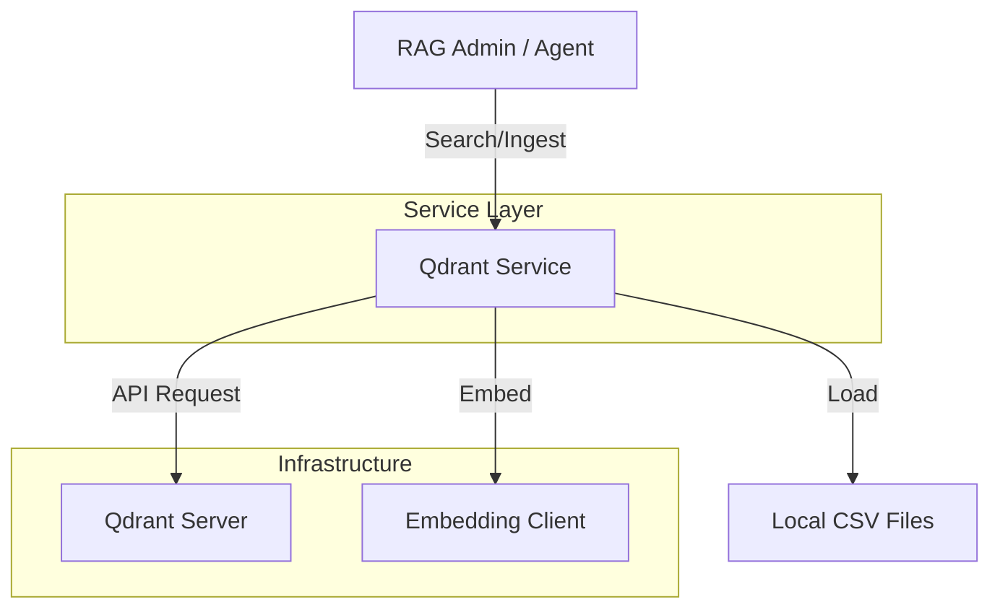
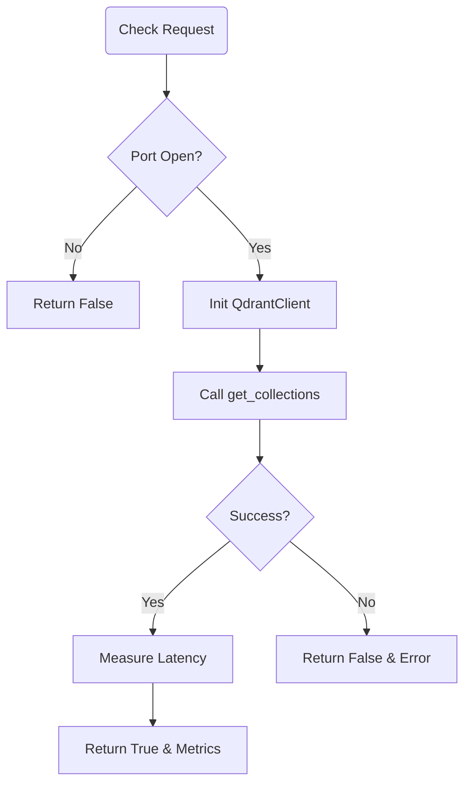
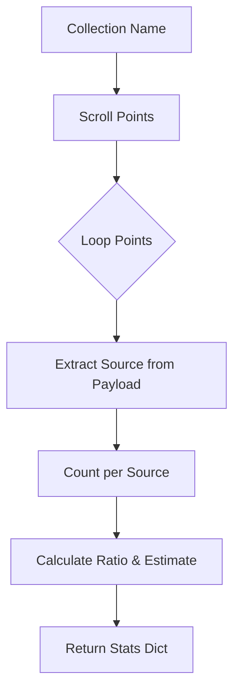
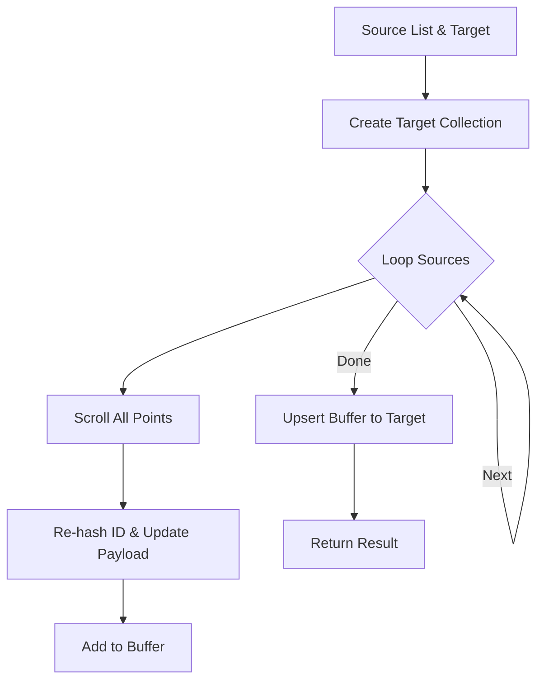

# Service: Qdrant (ベクトル検索エンジン操作)

## 1. 概要
`QdrantService` は、ベクトルデータベース **Qdrant** に対する全ての操作（コレクション管理、データ登録、検索、ヘルスチェック）を抽象化して提供する、GRACEシステムの中核的なインフラストラクチャサービスです。
`qdrant_client` ライブラリをラップし、GRACE特有のデータ構造（質問・回答・ソース情報を含むPayload）や、Gemini/OpenAIを用いたEmbedding処理との統合を担います。

**本サービスの中核的役割:**
このサービスは、GRACEシステムの「長期記憶（Long-term Memory）」と「知識検索（Knowledge Retrieval）」を司る、servicesパッケージ内でも特に重要な**中核モジュール**です。
*   **知識の永続化**: `qa_service` で生成された知識データをベクトル化し、効率的に検索可能な状態で保存します。
*   **文脈検索**: 単なるキーワード一致ではなく、意味的類似性（Cosine Similarity）に基づく検索を提供し、曖昧な質問に対する回答能力を支えます。
*   **スケーラビリティ**: 大規模なナレッジベースをコレクションとして分割・管理し、必要に応じて統合（Merge）する機能を提供します。

**主な責務:**
*   **Collection Management**: コレクションの作成、削除、一覧取得、およびスキーマ定義（Dense/Sparse Vector）。
*   **Data Ingestion**: CSVデータの読み込み、ベクトル化（Embedding）、およびQdrantへのアップサート（Upsert）。
*   **Search Interface**: クエリのベクトル化と類似度検索の実行。
*   **Health Check**: Qdrantサーバーへの接続確認とステータス監視。
*   **Maintenance**: コレクション間のデータ統合や移行。

## 2. モジュール構成

### 2.1 依存関係

QdrantServiceは、Qdrant Client、Embedding Client (Helper)、およびデータ処理用のPandasに依存します。



### 2.2 ディレクトリ構成

```
services/
├── qdrant_service.py    # 【本モジュール】Qdrant操作ロジック
└── ...
```

## 3. クラス・関数一覧

### クラス: `QdrantHealthChecker`
Qdrantサーバーの稼働状況を確認します。

| メソッド名 | 概要 |
| :--- | :--- |
| `check_qdrant` | ポート導通確認後、API経由でコレクション一覧取得を試行。 |

#### Method: `check_qdrant` IPO

*   **Input**: なし
*   **Process**:
    1.  指定ホスト・ポートへのSocket接続試行（タイムアウト付き）。
    2.  接続成功時、`QdrantClient` を初期化。
    3.  `get_collections()` APIを呼び出し、コレクション一覧を取得。
    4.  応答時間を計測し、メトリクスを作成。
*   **Output**:
    *   `Tuple[bool, str, Optional[Dict]]`: (成功フラグ, メッセージ, メトリクス辞書)



### クラス: `QdrantDataFetcher`
Qdrantからデータや統計情報を取得します。

| メソッド名 | 概要 |
| :--- | :--- |
| `fetch_collections` | コレクション一覧と各ベクトルの統計情報をDataFrameで返す。 |
| `fetch_collection_points` | 指定コレクション内のデータをスクロール取得し、DataFrame化。 |
| `fetch_collection_source_info` | Payload内の `source` フィールドを集計し、データソースの内訳を推定。 |

#### Method: `fetch_collections` IPO

*   **Input**: なし
*   **Process**:
    1.  `client.get_collections()` でコレクションリストを取得。
    2.  各コレクションについて `client.get_collection(name)` で詳細情報（ベクトル数、ポイント数など）を取得。
    3.  取得した情報をリストに格納し、Pandas DataFrameに変換。
    4.  エラー時はエラーメッセージを含むDataFrameを返す。
*   **Output**:
    *   `pd.DataFrame`: コレクション情報一覧。

#### Method: `fetch_collection_source_info` IPO

*   **Input**:
    *   `collection_name` (str): 対象コレクション名
    *   `sample_size` (int): サンプリング数（デフォルト200）
*   **Process**:
    1.  `client.scroll()` で指定数のポイントを取得（ベクトルなし、Payloadあり）。
    2.  各ポイントのPayloadから `source` フィールドを抽出。
    3.  ソースごとの出現回数をカウント。
    4.  全体に対する比率を計算し、総数から推定件数を算出。
*   **Output**:
    *   `Dict[str, Any]`: ソース別統計情報（件数、比率、推定合計）。



### コレクション管理・操作関数

| 関数名 | 概要 | 主要引数 |
| :--- | :--- | :--- |
| `create_or_recreate_collection_for_qdrant` | コレクションを作成（再作成）。Sparse Vector設定にも対応。 | `client`, `name`, `vector_size`, `use_sparse` |
| `upsert_points_to_qdrant` | ポイント（ベクトル+Payload）をバッチ登録。 | `client`, `collection`, `points` |
| `merge_collections` | 複数のコレクションを統合し、新しいコレクションを作成。 | `source_collections`, `target_collection` |

#### Function: `create_or_recreate_collection_for_qdrant` IPO

*   **Input**:
    *   `client` (QdrantClient): クライアント
    *   `name` (str): コレクション名
    *   `recreate` (bool): 再作成フラグ
    *   `vector_size` (int): ベクトル次元数
    *   `use_sparse` (bool): Sparse Vector使用フラグ
*   **Process**:
    1.  Dense Vector用の設定 (`VectorParams`) を作成。Hybrid Search時は辞書形式で定義。
    2.  Sparse Vector用の設定 (`SparseVectorParams`) を作成（必要な場合）。
    3.  `recreate` がTrueの場合、既存コレクションを削除 (`delete_collection`)。
    4.  `create_collection` APIを呼び出し、設定を適用して作成。
    5.  `domain` フィールドに対するPayloadインデックスを作成。
*   **Output**: なし（副作用としてQdrant上にコレクション作成）

#### Function: `merge_collections` IPO

*   **Input**:
    *   `source_collections` (List[str]): 統合元リスト
    *   `target_collection` (str): 統合先名
    *   他 (`recreate`, `vector_size`, `progress_callback`)
*   **Process**:
    1.  ターゲットコレクションを作成。
    2.  各ソースコレクションについて以下をループ:
        *   `scroll_all_points_with_vectors` で全データを取得。
        *   各ポイントのIDを再ハッシュして重複回避（`target-source-original_id`）。
        *   Payloadに `_source_collection` メタデータを追加。
        *   新しい `PointStruct` リストを作成。
    3.  変換された全ポイントをターゲットコレクションにアップサート。
*   **Output**:
    *   `Dict[str, Any]`: 統合結果サマリー。



### Embedding・データ構築関数

| 関数名 | 概要 |
| :--- | :--- |
| `embed_texts_for_qdrant` | テキストリストをバッチ処理でベクトル化（Gemini API等）。 |
| `build_points_for_qdrant` | DataFrameとベクトルから `PointStruct` オブジェクトを生成。 |
| `embed_query_for_search` | 検索クエリをベクトル化。モデル/次元数からプロバイダを自動選択。 |

#### Function: `embed_texts_for_qdrant` IPO

*   **Input**:
    *   `texts` (List[str]): テキストリスト
    *   `model` (str): Embeddingモデル名
*   **Process**:
    1.  `create_embedding_client` でクライアントを初期化。
    2.  空文字列を除外し、有効なテキストのみのリストを作成。
    3.  `client.embed_texts` を呼び出し、バッチ処理でベクトル化。
    4.  空文字列だった箇所にはゼロベクトルを挿入し、元のリスト長と整合させる。
*   **Output**:
    *   `List[List[float]]`: ベクトルのリスト。

#### Function: `build_points_for_qdrant` IPO

*   **Input**:
    *   `df` (pd.DataFrame): Q/Aデータ
    *   `vectors` (List[List[float]]): Denseベクトル
    *   `sparse_vectors` (Optional): Sparseベクトル
    *   `domain`, `source_file`: メタデータ
*   **Process**:
    1.  入力配列の長さ整合性をチェック。
    2.  DataFrameの各行についてループ:
        *   Payload辞書を作成（質問、回答、ソース、日時など）。
        *   一意なポイントIDをハッシュ生成。
        *   ベクトル構造を構築（Single or Named Vectors）。
        *   `models.PointStruct` オブジェクトを生成。
*   **Output**:
    *   `List[models.PointStruct]`: Qdrant登録用オブジェクトリスト。

#### Function: `embed_query_for_search` IPO

*   **Input**:
    *   `query` (str): 検索クエリ
    *   `dims` (Optional[int]): 次元数（プロバイダ判定用）
*   **Process**:
    1.  次元数またはモデル名から、適切なプロバイダ（Gemini/OpenAI）を判定。
    2.  Embeddingクライアントを初期化。
    3.  `client.embed_text(query)` を実行。
*   **Output**:
    *   `List[float]`: クエリベクトル。

## 4. 利用方法

### データの登録（インジェスト）

```python
from services.qdrant_service import (
    load_csv_for_qdrant,
    build_inputs_for_embedding,
    embed_texts_for_qdrant,
    build_points_for_qdrant,
    create_or_recreate_collection_for_qdrant,
    upsert_points_to_qdrant
)
from qdrant_client import QdrantClient

client = QdrantClient(url="http://localhost:6333")
collection_name = "demo_collection"

# 1. CSV読み込み
df = load_csv_for_qdrant("qa_output/demo.csv")

# 2. テキスト構築 (Q+A)
texts = build_inputs_for_embedding(df, include_answer=True)

# 3. ベクトル化
vectors = embed_texts_for_qdrant(texts)

# 4. コレクション作成
create_or_recreate_collection_for_qdrant(client, collection_name, recreate=True)

# 5. ポイント構築
points = build_points_for_qdrant(df, vectors, domain="demo", source_file="demo.csv")

# 6. アップサート
upsert_points_to_qdrant(client, collection_name, points)
```

### 検索用クエリ埋め込み

```python
from services.qdrant_service import embed_query_for_search

query_vector = embed_query_for_search("GRACEとは何ですか？", dims=3072)

results = client.search(
    collection_name="demo_collection",
    query_vector=query_vector,
    limit=3
)
```