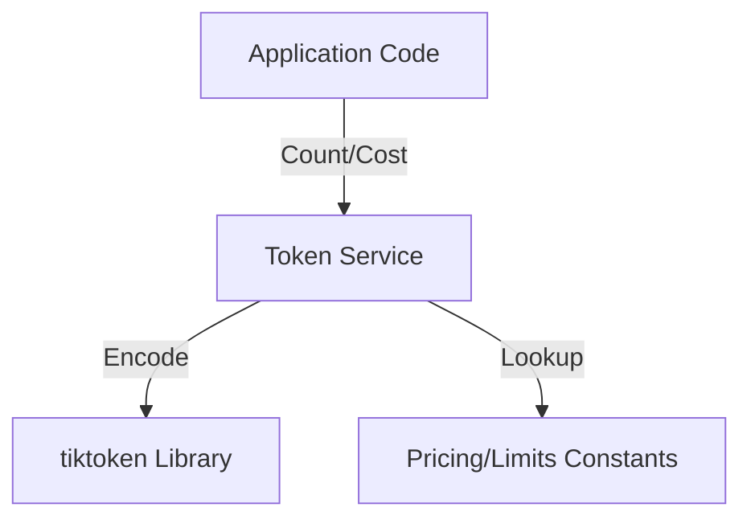
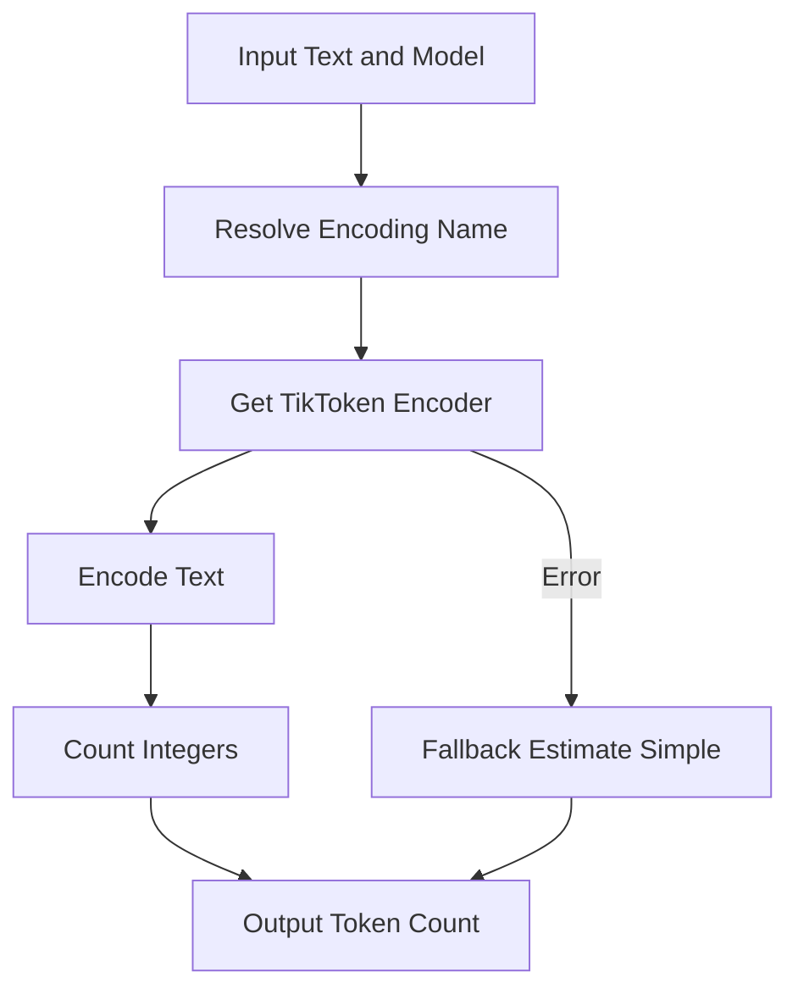
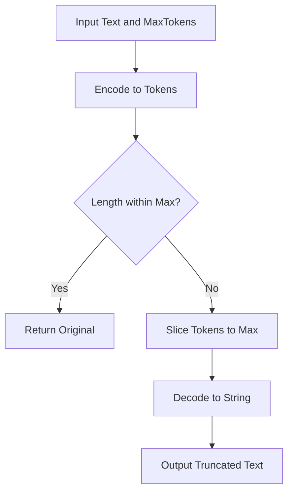
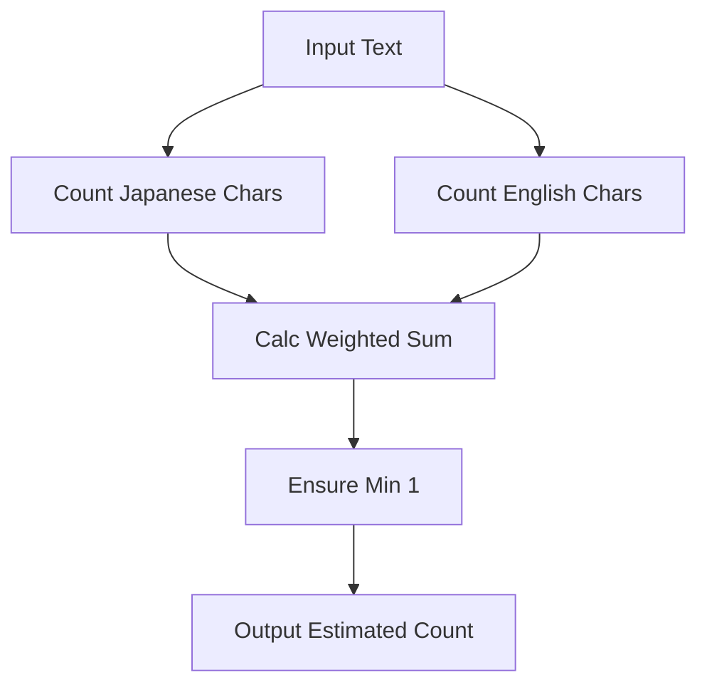

# Service: Token (トークン管理)

## 1. 概要
`TokenService` は、LLMアプリケーション開発におけるトークン数計算、コスト見積もり、およびテキスト切り詰め（Truncation）処理を一元管理するユーティリティサービスです。
`tiktoken` ライブラリをベースに、OpenAI系モデルおよびGemini系モデルのトークン仕様を抽象化し、統一インターフェースを提供します。

**主な責務:**
*   **Token Counting**: `tiktoken` を使用した正確なトークン数計測（Geminiは近似エンコーディングを使用）。
*   **Text Truncation**: コンテキストウィンドウ制限を超えないように、トークンベースでテキストを安全にカット。
*   **Cost Estimation**: モデルごとの単価（$/1k token）に基づいた、API利用コストの概算。
*   **Model Specs**: 各モデルの最大トークン数や出力制限などの仕様情報の提供。

## 2. モジュール構成

### 2.1 依存関係

TokenServiceは `tiktoken` ライブラリに依存します。



### 2.2 ディレクトリ構成

```
services/
├── token_service.py     # 【本モジュール】トークン管理実装
└── ...
```

## 3. クラス・関数一覧

### クラス: `TokenManager`
トークン関連処理を集約したクラスメソッド群です。

| メソッド名 | 概要 | 主要引数 |
| :--- | :--- | :--- |
| `count_tokens` | 指定テキストのトークン数をカウント。 | `text`, `model` |
| `truncate_text` | 指定トークン数に収まるようテキストを切り詰め。 | `text`, `max_tokens` |
| `estimate_cost` | 入出力トークン数からコスト（USD）を計算。 | `input_tokens`, `output_tokens`, `model` |
| `get_model_limits` | モデルのコンテキスト長や最大出力数を取得。 | `model` |

#### Method: `count_tokens` IPO (Input-Process-Output)

*   **Input**:
    *   `text` (str): カウント対象の文字列
    *   `model` (str): 使用するモデル名 (e.g., "gpt-4o", "gemini-1.5-flash")
*   **Process**:
    1.  モデル名から対応するエンコーディング名（`cl100k_base` 等）を解決。
    2.  `tiktoken.get_encoding` でエンコーダを取得。
    3.  テキストをエンコードして整数のリストに変換。
    4.  リストの長さを取得。
    5.  エラー時は `estimate_tokens_simple` で文字数から推定。
*   **Output**:
    *   `int`: トークン数



#### Method: `truncate_text` IPO

*   **Input**:
    *   `text` (str): 元のテキスト
    *   `max_tokens` (int): 上限トークン数
*   **Process**:
    1.  テキストをトークン（整数リスト）にエンコード。
    2.  リストの長さが `max_tokens` 以下ならそのままデコードして返す。
    3.  `max_tokens` を超える場合、リストをスライス（`[:max_tokens]`）。
    4.  スライスしたリストを文字列にデコード。
*   **Output**:
    *   `str`: 切り詰められたテキスト



### ユーティリティ関数（ショートカット）

`TokenManager` の機能を関数として直接呼び出せるようにしたものです。

| 関数名 | 概要 |
| :--- | :--- |
| `count_tokens` | `TokenManager.count_tokens` のエイリアス。 |
| `truncate_text` | 省略記号（...）の付与オプションを追加した切り詰め関数。 |
| `estimate_tokens_simple` | ライブラリを使わない簡易推定（日本語0.5, 英語0.25計算）。 |

#### Function: `estimate_tokens_simple` IPO

*   **Input**:
    *   `text` (str): カウント対象テキスト
*   **Process**:
    1.  ASCII文字（英数字）と非ASCII文字（日本語等）の文字数をそれぞれカウント。
    2.  日本語文字 * 0.5 + 英数字 * 0.25 の計算式でトークン数を概算。
    3.  最小値 1 を保証。
*   **Output**:
    *   `int`: 推定トークン数



## 4. 定数 (Pricing & Limits)

サポートしている主要モデルの価格と制限（2024年時点の概算）です。

*   **GPT-4o**: $5.00/1M In, $15.00/1M Out
*   **GPT-4o-mini**: $0.15/1M In, $0.60/1M Out
*   **Gemini 1.5 Flash**: $0.35/1M In, $1.05/1M Out (approx)

## 5. 利用方法

### トークン数のカウント

```python
from services.token_service import count_tokens

text = "こんにちは、GRACEエージェントです。"
count = count_tokens(text, model="gpt-4o")
print(f"Token count: {count}")
```

### コストの見積もり

```python
from services.token_service import TokenManager

cost = TokenManager.estimate_cost(
    input_tokens=1000,
    output_tokens=500,
    model="gpt-4o-mini"
)
print(f"Estimated cost: ${cost:.6f}")
```

### テキストの切り詰め

```python
from services.token_service import truncate_text

long_text = "..." * 1000
safe_text = truncate_text(long_text, max_tokens=100)
```