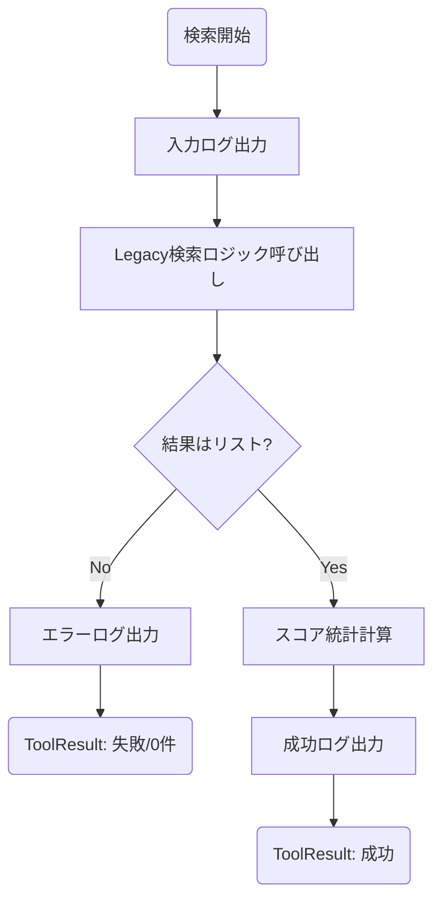
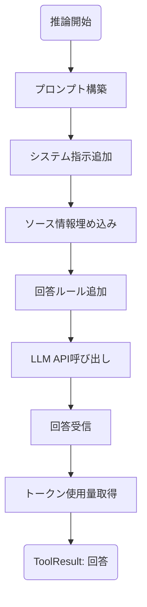
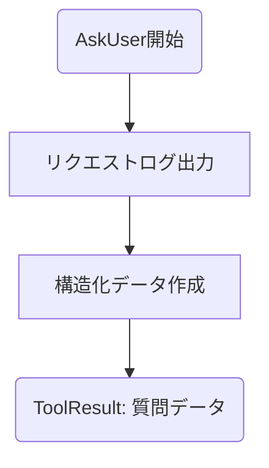
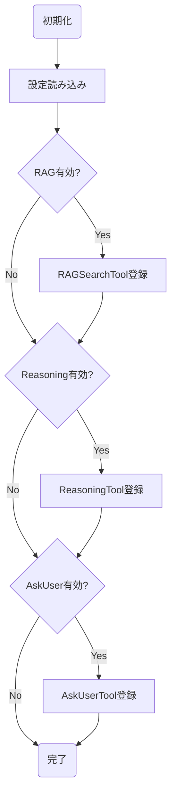

# GRACE Tools 詳細設計書

**ファイル名:** `grace/tools.py`

## 概要
`grace/tools.py` は、GRACEエージェントが実行可能なアクション（ツール）を定義・管理するモジュールです。
Strategyパターンを採用し、RAG検索、LLM推論、ユーザーへの問い合わせ（HITL）などを統一的なインターフェース（`BaseTool`）で扱います。
各ツールの実行結果には「信頼度係数（Confidence Factors）」が含まれ、後続のConfidence Score計算（`grace/confidence.py`）に必要な生データを提供します。

### ツール実装状況一覧

基本的にはすべて `grace/tools.py` に定義されており、`ToolRegistry` を通じて管理されています。

| ツール名 (enabled名) | ファイル名 | クラス名 | 主要メソッド名 | 備考 |
| :--- | :--- | :--- | :--- | :--- |
| `rag_search` | `grace/tools.py` | `RAGSearchTool` | `execute` | `agent_tools.py` の `search_rag_knowledge_base_structured` に処理を委譲 |
| `reasoning` | `grace/tools.py` | `ReasoningTool` | `execute` | Gemini API を使用して回答を生成 |
| `ask_user` | `grace/tools.py` | `AskUserTool` | `execute` | ユーザーへの質問用データを生成 |
| `web_search` | 未実装 / 計画中 | (なし) | (なし) | 現在の `grace/tools.py` には定義されていません |

---

## クラス・関数一覧

| 種類 | 名前 | 説明 |
| :--- | :--- | :--- |
| **DataClass** | `ToolResult` | ツール実行結果（成功可否、出力、信頼度係数、エラー等）を格納するクラス。 |
| **ABC** | `BaseTool` | 全てのツールの基底クラス。`execute` メソッドを定義。 |
| **Class** | `RAGSearchTool` | Qdrantを使用したベクトル検索を行うツール。`rag_search` アクションに対応。 |
| Method | `RAGSearchTool.execute` | 検索を実行し、結果と信頼度係数を返す。Legacyロジック (`agent_tools`) に委譲。 |
| Method | `RAGSearchTool._calculate_confidence_factors` | 検索スコアの分布（平均、分散等）を計算する。 |
| **Class** | `ReasoningTool` | LLMを使用した推論・回答生成を行うツール。`reasoning` アクションに対応。 |
| Method | `ReasoningTool.execute` | プロンプトを構築し、LLMに問い合わせて回答を生成する。 |
| Method | `ReasoningTool._build_prompt` | 検索結果やコンテキストを含む、構造化されたプロンプトを作成する。 |
| **Class** | `AskUserTool` | ユーザーへの質問情報を生成するツール。`ask_user` アクションに対応。 |
| Method | `AskUserTool.execute` | 質問内容を構造化データとして返す（実際の対話はExecutor/UIが担当）。 |
| **Class** | `ToolRegistry` | ツールの登録・検索を行うファクトリ兼レジストリ。 |
| Method | `ToolRegistry.register` | ツールインスタンスを登録する。 |
| Method | `ToolRegistry.get` | 名前指定でツールインスタンスを取得する。 |

---

## 詳細設計

### 1. Class: `RAGSearchTool`

ベクトルデータベース（Qdrant）から関連情報を検索します。既存の安定したロジック（Legacy Logic）を再利用しつつ、信頼度計算に必要な統計情報を付与します。

*   **処理の委譲**: 実際の検索処理（ベクトル変換、フィルタリング、Qdrant検索等）は、プロジェクトルートにある `agent_tools.py` の `search_rag_knowledge_base_structured` 関数に委譲しています。これにより、既存の安定したRAG機能をそのまま活用しています。

#### IPO (Method: `execute`)

*   **Input:**
    *   `query` (str): 検索クエリ
    *   `collection` (str, optional): 検索対象コレクション
    *   `limit` (int, optional): 件数上限
*   **Process:**
    *   `agent_tools.search_rag_knowledge_base_structured` を呼び出し、検索を実行。
    *   結果がリストかエラーメッセージかを判定。
    *   成功時、検索スコアリストから信頼度係数（件数、平均スコア、分散など）を計算。
*   **Output:**
    *   `ToolResult`: 検索結果リストと信頼度係数を含む。

---

### 2. Class: `ReasoningTool`

収集した情報（ソース）とコンテキストを元に、LLMを使って回答を生成します。

#### IPO (Method: `execute`)

*   **Input:**
    *   `query` (str): ユーザーの質問
    *   `context` (str, optional): 前ステップまでの文脈
    *   `sources` (List[Dict], optional): RAG検索結果
*   **Process:**
    *   `_build_prompt` でシステム指示、ソース情報、回答ルール（出典明示・捏造禁止）を含むプロンプトを構築。
    *   LLM (`google.genai`) に生成リクエストを送信。
    *   レスポンス（回答テキスト）とトークン使用量を取得。
*   **Output:**
    *   `ToolResult`: 生成された回答テキスト。

---

### 3. Class: `AskUserTool`

ユーザーに追加情報や確認を求める必要がある場合に使用します。

#### IPO (Method: `execute`)

*   **Input:**
    *   `question` (str): 質問文
    *   `reason` (str): 質問の理由
    *   `urgency` (str): 緊急度 ("blocking" / "optional")
*   **Process:**
    *   入力を受け取り、ログを出力。
    *   実際のユーザー対話はここでは行わず、Executorが処理可能な構造化データ（辞書）を作成する。
*   **Output:**
    *   `ToolResult`: 質問情報を含む辞書（`awaiting_response=True` フラグ付き）。

---

### 4. Class: `ToolRegistry`

設定に基づきツールを初期化・管理します。

#### IPO (Method: `register`, `get`)

*   **Input:**
    *   `config`: GRACE設定
*   **Process:**
    *   `__init__` で設定ファイル (`grace_config.yml`) の `enabled_tools` を確認。
    *   有効なツールのみインスタンス化して `_tools` 辞書に登録。
    *   `get(name)` で辞書からインスタンスを返却。
*   **Output:**
    *   指定されたツールのインスタンス（またはNone）。

