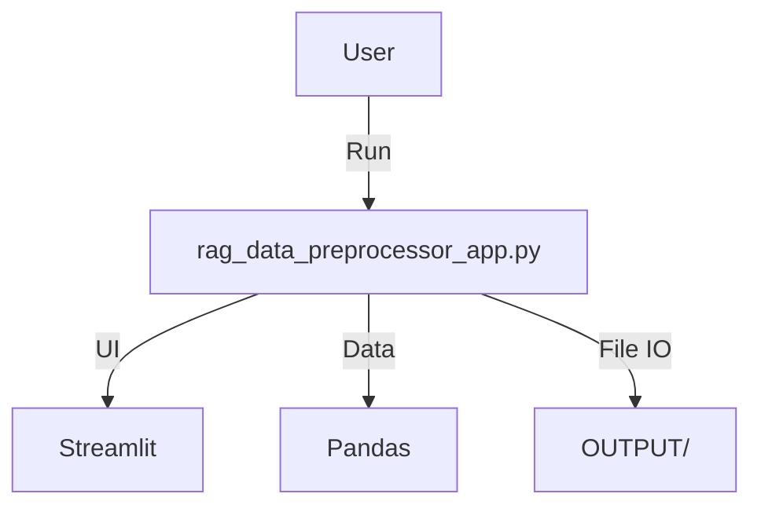
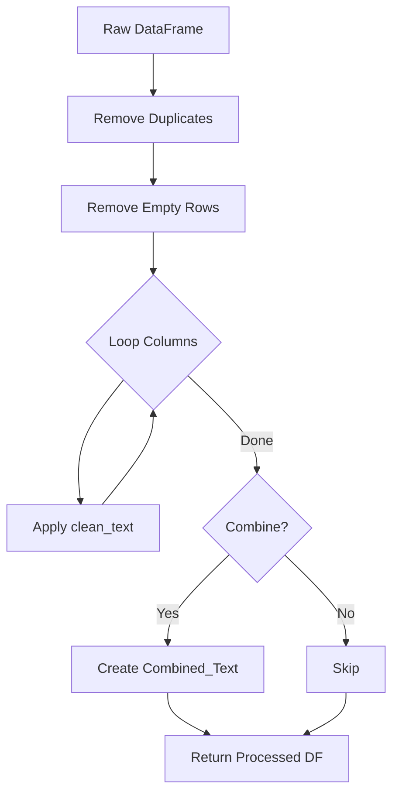

# Tool: RAG Data Preprocessor App (独立版前処理ツール)

## 1. 概要
`tools/rag_data_preprocessor_app.py` (旧 `a011_make_rag_data_customer.py`) は、カスタマーサポートFAQデータに特化した、スタンドアロン型のRAGデータ前処理アプリケーションです。
GRACEのコアモジュールに依存せず、単独のファイルとして動作するように設計されており（自己完結型）、Streamlitを使用してインタラクティブなUIを提供します。

**主な責務:**
*   **Standalone Operation**: 外部依存を極力排除し、単一スクリプトでRAG前処理を完結させる。
*   **FAQ Preprocessing**: 質問と回答のクリーニング、重複排除、およびトークン効率的な形式への結合。
*   **Token Estimation**: 選択されたOpenAI/Geminiモデルに基づくコスト試算。
*   **Data Export**: 前処理済みデータをCSV/TXT/JSON形式で出力。

## 2. モジュール構成

### 2.1 依存関係

Streamlit, Pandas, 正規表現などの標準ライブラリのみを使用し、複雑なフレームワーク依存を避けています。



### 2.2 ディレクトリ構成

```
tools/
└── rag_data_preprocessor_app.py  # 【本モジュール】独立版ツール
```

## 3. クラス一覧

### クラス: `AppConfig`
アプリケーション全体の設定（モデル一覧、価格、制限など）を管理する静的クラス。

### クラス: `RAGConfig`
データセット固有の設定（必須カラム名、結合テンプレートなど）を管理する静的クラス。

### クラス: `TokenManager` (Simplified)
簡易的なトークンカウント（文字数ベースの推定）とコスト計算機能を提供する静的クラス。

## 4. 関数一覧 & IPO

### UI・表示系関数

| 関数名 | 概要 |
| :--- | :--- |
| `select_model` | モデル選択ボックスを表示。 |
| `show_model_info` | 選択モデルの詳細スペックを表示。 |
| `display_statistics` | データ統計情報を表示。 |
| `show_usage_instructions` | 使用方法ガイドを表示。 |

### データ処理系関数

| 関数名 | 概要 | 主要引数 |
| :--- | :--- | :--- |
| `load_dataset` | CSVファイルの読み込みと検証。 | `uploaded_file` |
| `process_rag_data` | 前処理（クリーニング、結合）の実行。 | `df`, `dataset_type` |
| `clean_text` | テキストの正規化（改行削除等）。 | `text` |
| `combine_columns` | 質問と回答を結合。 | `row` |
| `validate_data` | データの品質チェック。 | `df` |

#### Function: `process_rag_data` IPO

*   **Input**:
    *   `df` (pd.DataFrame): 元データ
    *   `dataset_type` (str): データセット種別
    *   `combine_columns_option` (bool): 結合を行うか
*   **Process**:
    1.  重複行 (`drop_duplicates`) と空行 (`dropna`) を削除。
    2.  指定された必須カラムに対して `clean_text` を適用。
    3.  オプションが有効な場合、`combine_columns` で `Combined_Text` カラムを作成。
*   **Output**:
    *   `pd.DataFrame`: 前処理済みデータフレーム。



### ファイル保存系関数

| 関数名 | 概要 | 主要引数 |
| :--- | :--- | :--- |
| `save_files_to_output` | CSV/TXT/JSONファイルを保存。 | `df`, `csv_data`, `text_data` |
| `create_download_data` | ダウンロード用バッファを作成。 | `df` |

#### Function: `save_files_to_output` IPO

*   **Input**:
    *   `df_processed`, `csv_data`, `text_data`
*   **Process**:
    1.  `OUTPUT` ディレクトリの存在確認と作成。
    2.  タイムスタンプ付きのファイル名を生成。
    3.  CSVデータ、テキストデータ（あれば）を書き込み。
    4.  処理メタデータ（件数、日時、ファイルパス）をJSONとして保存。
*   **Output**:
    *   `Dict[str, str]`: 保存されたファイルパスの辞書。

## 5. 利用方法

コマンドラインからStreamlitアプリケーションとして起動します。

```bash
# ツールディレクトリへ移動
cd tools

# アプリ起動
streamlit run rag_data_preprocessor_app.py
```
