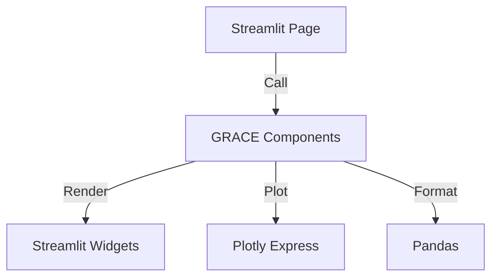
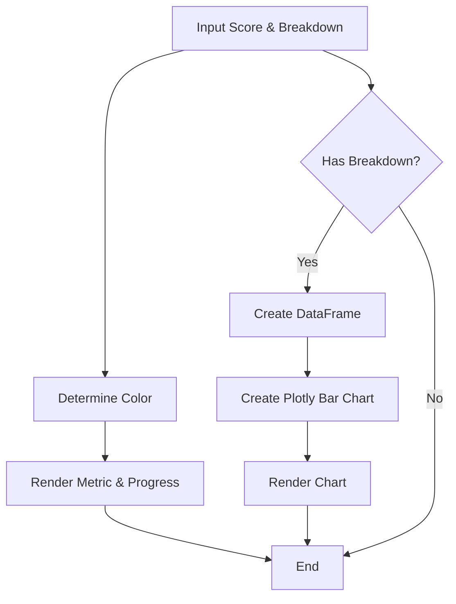
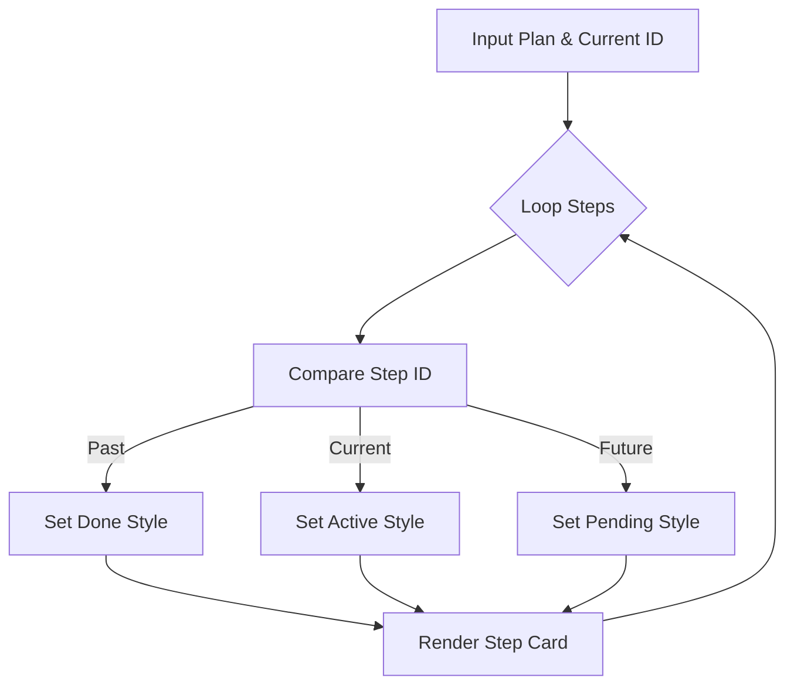
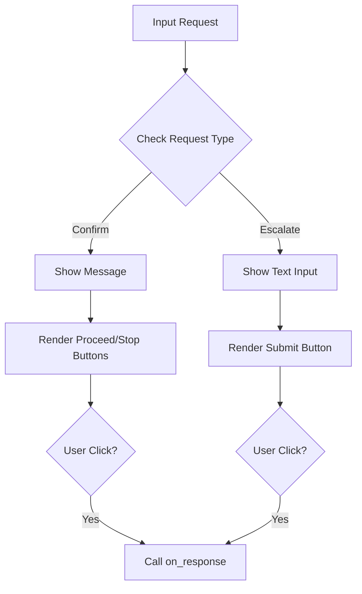

# UI Component: GRACE Components (Streamlit UI部品)

## 1. 概要
`grace_components.py` は、GRACEエージェントの内部状態（信頼度、実行計画、介入リクエスト）を Streamlit アプリケーション上で可視化するための再利用可能なUIコンポーネント群です。
複雑なエージェントの思考プロセスを、エンドユーザーが理解しやすい形式（グラフ、リスト、インタラクティブなウィジェット）で表示します。

**主な責務:**
*   **Metric Visualization**: 信頼度スコアとその内訳（Factor Breakdown）の可視化。
*   **Plan Rendering**: 実行計画のステップ一覧と現在の進行状況の表示。
*   **Intervention UI**: ユーザーへの確認要求や入力フォームの表示とイベントハンドリング。

## 2. モジュール構成

### 2.1 依存関係

Streamlit を中心に、データ可視化のための Plotly Express とデータ操作のための Pandas を使用します。



### 2.2 ディレクトリ構成

```
ui/
└── components/
    └── grace_components.py  # 【本モジュール】UI部品定義
```

## 3. 関数一覧

| 関数名 | 概要 | 主要引数 |
| :--- | :--- | :--- |
| `display_confidence_metric` | 信頼度スコアと要因内訳をバーチャートで表示。 | `score`, `level`, `breakdown` |
| `display_execution_plan` | 実行計画の各ステップをリスト表示し、進捗を可視化。 | `plan`, `current_step_id` |
| `display_intervention_request` | ユーザー介入（確認/入力）用のインタラクティブなUIを表示。 | `request`, `on_response` |

## 4. IPO (Input-Process-Output)

### 4.1 `display_confidence_metric` IPO

*   **Input**:
    *   `score` (float): 現在の信頼度スコア (0.0 - 1.0)
    *   `level` (str): 信頼度レベル (e.g., "HIGH", "LOW")
    *   `breakdown` (Dict[str, float]): 要因ごとのスコア (e.g., {"Search": 0.8, "Source": 0.9})
*   **Process**:
    1.  スコアに基づいて表示色（緑、オレンジ、赤）を決定。
    2.  `st.metric` と `st.progress` で総合スコアを表示。
    3.  内訳データがある場合、Pandas DataFrameに変換。
    4.  Plotly Express で横棒グラフを作成し、`st.plotly_chart` で表示。
*   **Output**: Streamlitウィジェットの描画（戻り値なし）。



### 4.2 `display_execution_plan` IPO

*   **Input**:
    *   `plan` (ExecutionPlan): 表示する実行計画オブジェクト
    *   `current_step_id` (int): 現在実行中のステップID
*   **Process**:
    1.  `plan.steps` をループ処理。
    2.  各ステップのIDと `current_step_id` を比較し、ステータス（完了✅/実行中▶️/待機⏳）を判定。
    3.  ステータスに応じたアイコンと背景色を設定。
    4.  `st.markdown` (HTML) を使用して、ステップごとの詳細情報（アクション、説明、クエリ）をカード形式でレンダリング。
*   **Output**: Streamlitウィジェットの描画（戻り値なし）。



### 4.3 `display_intervention_request` IPO

*   **Input**:
    *   `request` (Dict[str, Any]): 介入リクエストデータ (`type`, `data`)
    *   `on_response` (callable): ユーザーアクション時のコールバック関数
*   **Process**:
    1.  リクエストタイプ（`confirm` または `escalate`）を判定。
    2.  警告メッセージを表示。
    3.  **Confirmの場合**:
        *   「Proceed」「Stop」ボタンを表示。
        *   クリック時に `on_response("proceed")` または `on_response("stop")` を実行。
    4.  **Escalateの場合**:
        *   テキスト入力フィールドを表示。
        *   送信ボタンクリック時に `on_response(user_input)` を実行。
*   **Output**: Streamlitウィジェットの描画とコールバック実行。



## 5. 利用方法

### 信頼度メトリクスの表示

```python
from ui.components.grace_components import display_confidence_metric

breakdown = {"Search Quality": 0.85, "Source Agreement": 0.70}
display_confidence_metric(0.78, "HIGH", breakdown)
```

### 実行計画の表示

```python
from ui.components.grace_components import display_execution_plan
# planオブジェクトは別途生成
display_execution_plan(plan, current_step_id=2)
```

### 介入リクエストの表示

```python
from ui.components.grace_components import display_intervention_request

def handle_response(res):
    print(f"User response: {res}")

req = {"type": "confirm", "data": {"message": "外部APIを実行しますか？"}}
display_intervention_request(req, handle_response)
```
