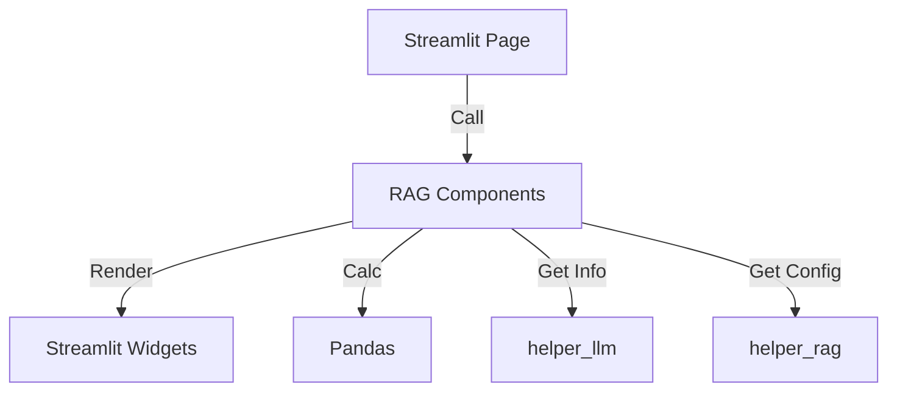
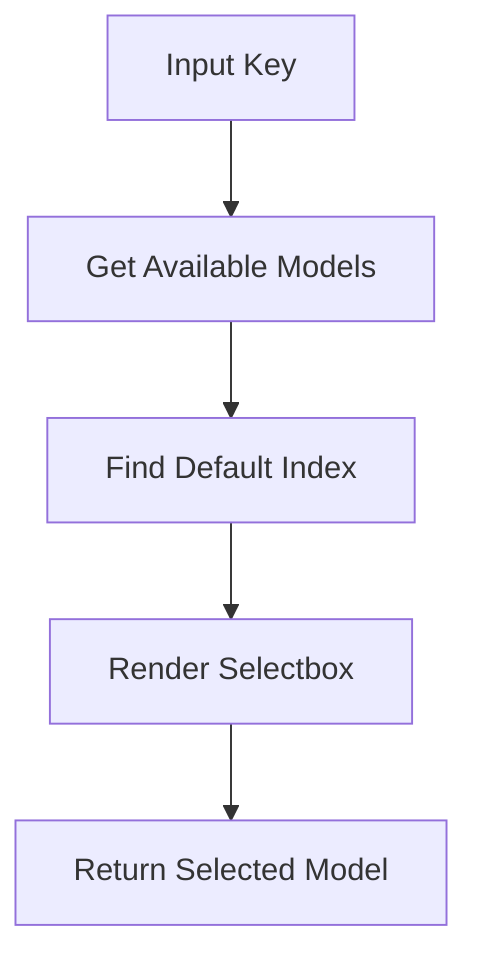
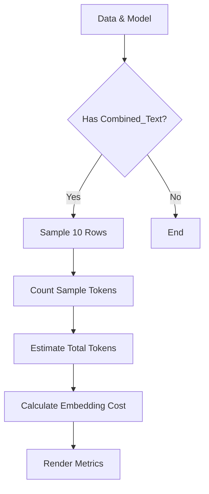
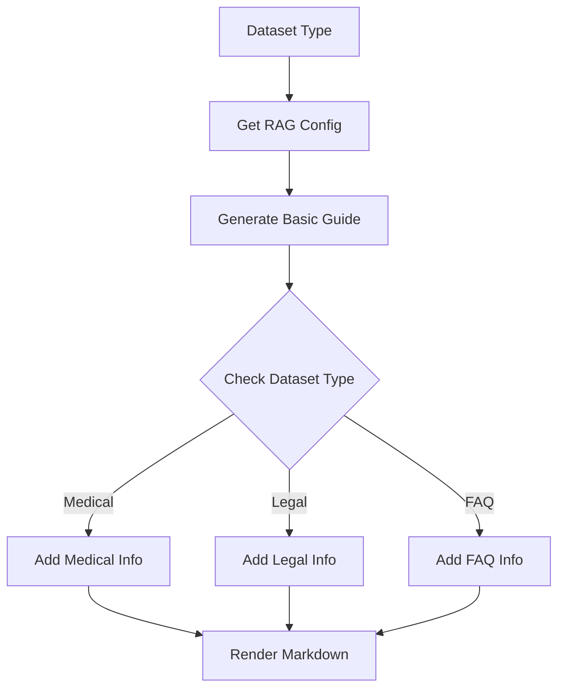

# UI Component: RAG Components (データ前処理用UI)

## 1. 概要
`rag_components.py` は、RAG（Retrieval-Augmented Generation）用データセットの前処理プロセスを支援する Streamlit UIコンポーネント集です。
モデル選択、トークン使用量見積もり、データ統計表示など、前処理ワークフローに必要な一連のUI部品を提供します。

**主な責務:**
*   **Model Selection**: 利用可能なLLM/Embeddingモデルの選択と情報表示。
*   **Token Estimation**: 選択されたモデルに基づくトークン消費量とコストの概算。
*   **Statistics Visualization**: 前処理前後のデータ件数や文字数分布の可視化。
*   **Guidance**: データセットの種類に応じた適切な使用方法の表示。
*   **Page Setup**: ページタイトルやヘッダーの統一的な初期化。

## 2. モジュール構成

### 2.1 依存関係

Streamlit を中心に、データ処理用の Pandas と、モデル情報を取得するためのヘルパーモジュールを使用します。



### 2.2 ディレクトリ構成

```
ui/
└── components/
    └── rag_components.py    # 【本モジュール】RAG前処理用UI部品
```

## 3. 関数一覧

| 関数名 | 概要 | 主要引数 |
| :--- | :--- | :--- |
| `select_model` | サイドバーでLLMモデルを選択するセレクトボックスを表示。 | `key` |
| `show_model_info` | 選択されたモデルのスペック（制限、料金）を表示。 | `selected_model` |
| `estimate_token_usage` | 前処理済みデータを元にトークン数とEmbeddingコストを推定。 | `df_processed`, `selected_model` |
| `display_statistics` | 前処理前後のデータ件数やテキスト統計を比較表示。 | `df_original`, `df_processed` |
| `show_usage_instructions` | データセットタイプに応じた具体的な使用手順を表示。 | `dataset_type` |
| `setup_page_config` | Streamlitのページ設定（タイトル、アイコン等）を初期化。 | `dataset_type` |
| `setup_page_header` | メインエリアのヘッダー（タイトル、説明）を表示。 | `dataset_type` |
| `setup_sidebar_header` | サイドバーのヘッダーを表示。 | `dataset_type` |

## 4. IPO (Input-Process-Output)

### 4.1 `select_model` IPO

*   **Input**:
    *   `key` (str): Streamlitウィジェットの一意なキー (default: "model_selection")
*   **Process**:
    1.  `get_available_llm_models()` で利用可能なモデルリストを取得。
    2.  デフォルトモデル（`DEFAULT_LLM_PROVIDER`）のインデックスを特定。
    3.  `st.sidebar.selectbox` で選択メニューを表示。
*   **Output**:
    *   `str`: ユーザーが選択したモデル名。



### 4.2 `show_model_info` IPO

*   **Input**:
    *   `selected_model` (str): 表示対象のモデル名
*   **Process**:
    1.  `get_llm_model_limits` でトークン制限を取得。
    2.  `get_llm_model_pricing` で料金情報を取得。
    3.  `st.sidebar.expander` 内に情報をレイアウト。
    4.  モデル名に基づき、特徴（Gemini/OpenAI等）やRAG適性を判定して表示。
*   **Output**: Streamlitウィジェットの描画（戻り値なし）。

### 4.3 `estimate_token_usage` IPO

*   **Input**:
    *   `df_processed` (pd.DataFrame): 前処理済みデータ
    *   `selected_model` (str): トークン計算に使用するモデル
*   **Process**:
    1.  `Combined_Text` カラムの存在を確認。
    2.  サンプル抽出（先頭10件）と結合。
    3.  `TokenManager.count_tokens` でサンプル実トークン数を計測。
    4.  文字数比率から全体トークン数を推定。
    5.  Embeddingモデルの単価を取得し、コストを計算。
    6.  `st.metric` で結果を表示。
*   **Output**: Streamlitウィジェットの描画（戻り値なし）。



### 4.4 `display_statistics` IPO

*   **Input**:
    *   `df_original` (pd.DataFrame): 前処理前のデータ
    *   `df_processed` (pd.DataFrame): 前処理後のデータ
*   **Process**:
    1.  行数比較（元データ vs 処理後）を表示。
    2.  `Combined_Text` の文字数（平均、最大、最小）を算出。
    3.  四分位数（25%, 50%, 75%）を計算し、分布を表示。
*   **Output**: Streamlitウィジェットの描画（戻り値なし）。

### 4.5 `show_usage_instructions` IPO

*   **Input**:
    *   `dataset_type` (str): データセット識別子 (e.g., "medical_qa")
*   **Process**:
    1.  `RAGConfig` からデータセット設定（必須カラム名など）を取得。
    2.  共通の「基本手順」テキストを生成。
    3.  データセットタイプに基づき、特有の説明（「特徴」や「注意点」）を選択。
    4.  Markdownとして結合し、`st.markdown` で表示。
*   **Output**: Streamlitウィジェットの描画（戻り値なし）。



### 4.6 `setup_page_config` IPO

*   **Input**:
    *   `dataset_type` (str): データセット識別子
*   **Process**:
    1.  `RAGConfig` からデータセットの設定情報（名前、アイコン）を取得。
    2.  `st.set_page_config` を呼び出し、ブラウザタブのタイトルやアイコン、レイアウトを設定。
    3.  例外（既に設定済みの場合など）は無視。
*   **Output**: Streamlitページ設定の適用（戻り値なし）。

### 4.7 `setup_page_header` & `setup_sidebar_header` IPO

*   **Input**:
    *   `dataset_type` (str): データセット識別子
*   **Process**:
    1.  `RAGConfig` からデータセットの設定情報（名前、アイコン）を取得。
    2.  `st.title` / `st.sidebar.title` を使用して、アイコン付きのタイトルを表示。
    3.  区切り線などを描画。
*   **Output**: Streamlitウィジェットの描画（戻り値なし）。

## 5. 利用方法

### 基本的なUI構築フロー

```python
import streamlit as st
from ui.components.rag_components import (
    setup_page_config,
    setup_page_header,
    setup_sidebar_header,
    select_model, 
    show_model_info, 
    show_usage_instructions
)

dataset_type = "wikipedia_ja"

# 1. ページ設定
setup_page_config(dataset_type)

# 2. サイドバー設定
setup_sidebar_header(dataset_type)
model_name = select_model()
show_model_info(model_name)

# 3. メインコンテンツ
setup_page_header(dataset_type)
show_usage_instructions(dataset_type)
```

### データ処理後の結果表示

```python
from ui.components.rag_components import display_statistics, estimate_token_usage

# df_raw, df_clean は別途ロード・処理済みとする
display_statistics(df_raw, df_clean)
estimate_token_usage(df_clean, "gemini-1.5-flash")
```
