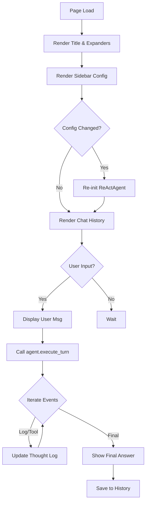

# UI Page: Agent Chat (エージェント対話画面)

## 1. 概要
`agent_chat_page.py` は、GRACEシステムのエンドユーザー向けメインインターフェースとなるStreamlitページです。
ユーザーは、この画面を通じてReActエージェントと自然言語で対話し、Qdrantに蓄積されたナレッジベースを活用した回答を得ることができます。
また、開発者向け機能として、元ドキュメントの閲覧や登録済みQ&Aのプレビュー機能も提供しています。

**主な責務:**
*   **Chat Interface**: ユーザー入力の受け付けと、エージェントからの応答（思考プロセス含む）の表示。
*   **Agent Configuration**: 使用するLLMモデルや検索対象コレクションの動的な選択。
*   **Session Management**: チャット履歴の保持と、設定変更時のエージェント再初期化。
*   **Debug/Inspection**: 参照元ドキュメントやQ&Aデータの可視化。

## 2. モジュール構成

### 2.1 依存関係

StreamlitをUIフレームワークとして使用し、バックエンドの `agent_service` および `qdrant_service` (helper経由) と連携します。

```mermaid
graph TD
    User[End User] -->|Interact| Page[Agent Chat Page]
    
    Page -->|Render| ST[Streamlit]
    Page -->|Execute| Agent[ReActAgent]
    Page -->|Get Collections| Helper[agent_service helper]
    
    Page -->|Inspect| File[Local Files (OUTPUT/)]
    Page -->|Preview| Qdrant[Qdrant Client]
```

### 2.2 ディレクトリ構成

```
ui/
└── pages/
    └── agent_chat_page.py   # 【本モジュール】チャット画面実装
```

## 3. 関数一覧

| 関数名 | 概要 | 主要引数 |
| :--- | :--- | :--- |
| `show_agent_chat_page` | チャット画面全体を描画するメイン関数。 | なし |

## 4. IPO (Input-Process-Output)

### 4.1 `show_agent_chat_page` IPO

*   **Input**:
    *   ユーザーインタラクション（テキスト入力、セレクトボックス操作、ボタンクリック）
    *   Streamlit セッション状態 (`st.session_state`)
*   **Process**:
    1.  **ヘッダー描画**: タイトルと説明を表示。
    2.  **ドキュメント参照**: `OUTPUT/` ディレクトリ内のテキストファイルを検索し、選択されたファイルの内容を表示 (`st.expander`)。
    3.  **Q&A参照**: QdrantからQ&Aデータをサンプリングし、DataFrameとして表示 (`st.expander`)。
    4.  **サイドバー設定**:
        *   LLMモデル選択。
        *   検索対象コレクション選択（Qdrantから動的取得）。
        *   履歴クリアボタンの処理。
    5.  **エージェント初期化**:
        *   セッション状態に履歴リストがない場合は作成。
        *   前回と設定（モデル/コレクション）が異なる場合、`ReActAgent` を再インスタンス化。
    6.  **チャット履歴表示**: 過去のメッセージをループして描画。
    7.  **インタラクション処理**:
        *   `st.chat_input` で入力を受け付け。
        *   ユーザーメッセージを表示＆履歴追加。
        *   `agent.execute_turn` を呼び出し、ジェネレータからイベントを取得。
        *   イベントタイプ (`log`, `tool_call`, `final_answer`) に応じて思考ログや回答をリアルタイム描画。
        *   最終回答を履歴に追加。
*   **Output**: Streamlit画面の更新。



## 5. 利用方法

メインアプリケーション（`agent_rag.py` 等）からページとしてインポートされ、呼び出されます。

```python
import streamlit as st
from ui.pages.agent_chat_page import show_agent_chat_page

# ページルーティングの一部として実行
if selected_page == "Agent Chat":
    show_agent_chat_page()
```
