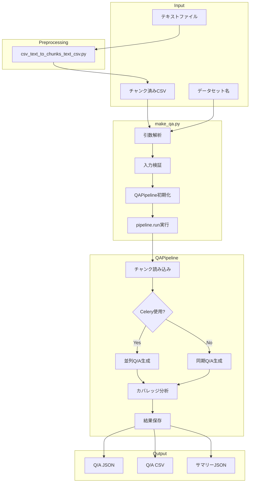
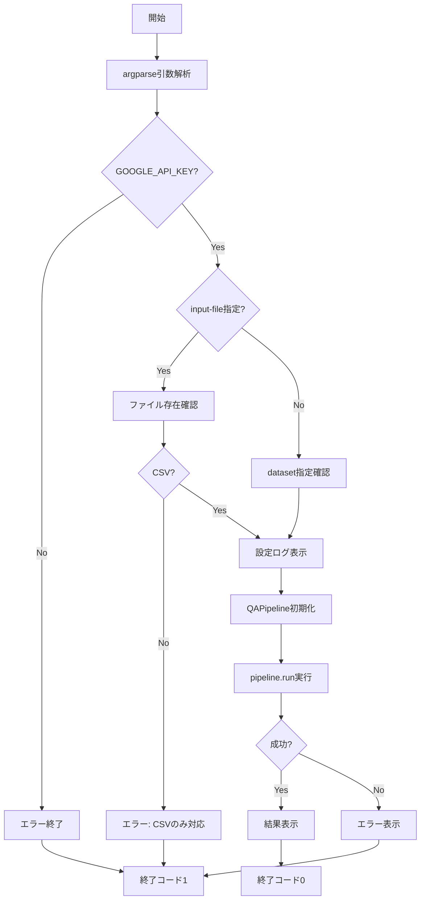

# make_qa.py 完全ガイド（v3.0）

## 概要

`qa_qdrant/make_qa.py` は、**Q/Aペア生成のCLIエントリーポイント**です。チャンク済みCSVファイルまたは事前定義データセットからQ/Aペアを自動生成します。Celery並列処理に対応し、大規模データの効率的な処理が可能です。

---

## 目次

1. [v3.0の変更点](#v30の変更点)
2. [モジュール構成](#モジュール構成)
3. [アーキテクチャ](#アーキテクチャ)
4. [関数一覧](#関数一覧)
5. [IPO詳細（Input/Process/Output）](#ipo詳細inputprocessoutput)
6. [コマンドライン引数](#コマンドライン引数)
7. [使用方法](#使用方法)
8. [関連ツール](#関連ツール)

---

## v3.0の変更点

| 項目 | v2.x | v3.0 |
|-----|------|------|
| 入力方式 | `--input-chunks` と `--input-file` 分離 | `--input-file` に統一 |
| チャンク処理 | 内部でチャンク化 | **外部で事前チャンク化必須** |
| 並列制御 | `--celery-workers` | `-c, --concurrency` 追加 |
| Q/A生成 | 固定数 | **スマート生成（動的Q/A数）** |

### 削除された引数

```
--input-chunks        → --input-file に統合
--merge-chunks        → 削除（外部チャンク化で対応）
--min-tokens          → 削除
--max-tokens          → 削除
--overlap-tokens      → 削除
--use-similarity      → 削除
--similarity-threshold → 削除
```

### 追加された引数

```
-c, --concurrency          # 並列タスク数
--use-smart-generation     # スマートQ/A生成（デフォルト有効）
--no-smart-generation      # 従来方式に切り替え
```

---

## モジュール構成

```
qa_qdrant/
├── make_qa.py                    # Q/A生成CLIエントリーポイント ← このドキュメント
├── make_qa_register_qdrant.py    # Q/A生成 + Qdrant登録 統合ツール
└── register_to_qdrant.py         # Qdrant登録専用ツール

qa_generation/
├── pipeline.py                   # Q/A生成パイプライン（コア）
├── smart_qa_generator.py         # スマートQ/A生成エンジン
├── evaluation.py                 # カバレッジ分析
├── semantic.py                   # セマンティック分析
├── data_io.py                    # データ入出力
└── models.py                     # データモデル

chunking/
└── csv_text_to_chunks_text_csv.py  # テキスト→チャンクCSV変換（前処理）
```

---

## アーキテクチャ

### 全体構成図

```
┌────────────────────────────────────────────────────────────────┐
│                        make_qa.py                              │
│                    (CLIエントリーポイント)                        │
├────────────────────────────────────────────────────────────────┤
│  main()                                                        │
│    ├── 引数解析 (argparse)                                      │
│    ├── 入力検証                                                 │
│    ├── QAPipeline初期化                                         │
│    └── pipeline.run() 実行                                      │
└────────────────────────────────────────────────────────────────┘
                              │
                              ▼
┌────────────────────────────────────────────────────────────────┐
│                    qa_generation/pipeline.py                   │
│                        (QAPipeline)                            │
├────────────────────────────────────────────────────────────────┤
│  ├── チャンクCSV読み込み                                         │
│  ├── Q/A生成（Celery並列 or 同期）                               │
│  ├── カバレッジ分析（オプション）                                  │
│  └── 結果保存（JSON/CSV）                                        │
└────────────────────────────────────────────────────────────────┘
                              │
              ┌───────────────┼───────────────┐
              ▼               ▼               ▼
┌──────────────────┐ ┌──────────────────┐ ┌──────────────────┐
│ SmartQAGenerator │ │    evaluation    │ │     data_io      │
│  (Q/A生成)        │ │  (カバレッジ)      │ │   (入出力)       │
└──────────────────┘ └──────────────────┘ └──────────────────┘
```

### 処理フロー

```
┌─────────────┐     ┌─────────────┐     ┌─────────────┐
│ テキスト     │     │ チャンクCSV   │     │ Q/Aペア     │
│ ファイル     │────▶│ (前処理済み)  │────▶│ JSON/CSV    │
└─────────────┘     └─────────────┘     └─────────────┘
       │                   │                   │
       │                   │                   │
       ▼                   ▼                   ▼
┌─────────────┐     ┌─────────────┐     ┌─────────────┐
│ csv_text_to │     │  make_qa.py │     │ register_to │
│ _chunks_... │     │             │     │ _qdrant.py  │
└─────────────┘     └─────────────┘     └─────────────┘
   (前処理)          (Q/A生成)          (Qdrant登録)
```

### Mermaid図



---

## 関数一覧

| 関数名 | 機能概要 |
|-------|---------|
| `main()` | CLIエントリーポイント。引数解析、検証、パイプライン実行を統括 |

### 使用する外部クラス・関数

| モジュール | クラス/関数 | 用途 |
|-----------|-----------|------|
| `qa_generation.pipeline` | `QAPipeline` | Q/A生成パイプラインのコアクラス |
| `config` | `DATASET_CONFIGS` | 事前定義データセットの設定辞書 |

---

## IPO詳細（Input/Process/Output）

### main()

#### IPO

| 区分 | 内容 |
|-----|------|
| **Input** | コマンドライン引数（argparse経由）<br>環境変数: `GOOGLE_API_KEY` |
| **Process** | 1. 引数解析<br>2. APIキー確認<br>3. 入力ファイル検証<br>4. 設定ログ表示<br>5. QAPipeline初期化<br>6. pipeline.run()実行<br>7. 結果表示 |
| **Output** | 終了コード: 0（成功）/ 1（失敗）<br>ファイル出力: Q/A JSON, CSV, サマリー |

#### プロセスフロー



#### 入力パラメータ（コマンドライン）

| パラメータ | 型 | 必須 | デフォルト | 説明 |
|----------|---|:---:|----------|------|
| `--dataset` | str | ※1 | - | 事前定義データセット名 |
| `--input-file` | str | ※1 | - | チャンク済みCSVファイルパス |
| `--model` | str | No | gemini-2.0-flash | 使用するGeminiモデル |
| `--output` | str | No | qa_output/pipeline | 出力ディレクトリ |
| `--max-docs` | int | No | None | 処理する最大チャンク数 |
| `--analyze-coverage` | flag | No | False | カバレッジ分析を実行 |
| `--coverage-threshold` | float | No | None | カバレッジ判定閾値 |
| `--batch-chunks` | int | No | 3 | 1回のAPIで処理するチャンク数 |
| `--use-smart-generation` | flag | No | True | スマートQ/A生成を使用 |
| `--no-smart-generation` | flag | No | - | 従来方式を使用 |
| `--use-celery` | flag | No | False | Celery並列処理を使用 |
| `-c, --concurrency` | int | No | 8 | 並列タスク数 |
| `--celery-workers` | int | No | 1 | (非推奨) ワーカー数チェック用 |

※1: `--dataset` と `--input-file` はいずれか一方が必須（排他的）

#### 出力構造

```python
# pipeline.run()の戻り値
{
    'qa_pairs': [...],           # 生成されたQ/Aペアリスト
    'qa_count': 250,             # 生成Q/A数
    'saved_files': {
        'summary': 'qa_output/pipeline/qa_pairs_xxx_summary.json',
        'qa_csv': 'qa_output/pipeline/qa_pairs_xxx.csv',
        'qa_json': 'qa_output/pipeline/qa_pairs_xxx.json'
    },
    'coverage_results': {        # --analyze-coverage時のみ
        'coverage_rate': 0.85,
        'covered_chunks': 85,
        'total_chunks': 100,
        ...
    }
}
```

---

## コマンドライン引数

### 入力ソース（排他的・必須）

| 引数 | 説明 |
|-----|------|
| `--dataset` | 事前定義データセット（DATASET_CONFIGSのキー） |
| `--input-file` | チャンク済みCSVファイルのパス |

### 共通パラメータ

| 引数 | デフォルト | 説明 |
|-----|----------|------|
| `--model` | gemini-2.0-flash | 使用するGeminiモデル |
| `--output` | qa_output/pipeline | 出力ディレクトリ |
| `--max-docs` | None | 処理する最大チャンク数 |

### カバレッジ分析

| 引数 | デフォルト | 説明 |
|-----|----------|------|
| `--analyze-coverage` | False | カバレッジ分析を実行 |
| `--coverage-threshold` | None | カバレッジ判定の類似度閾値 |

### Q/A生成パラメータ

| 引数 | デフォルト | 説明 |
|-----|----------|------|
| `--batch-chunks` | 3 | 1回のAPIで処理するチャンク数（1-5） |
| `--use-smart-generation` | True | スマートQ/A生成を使用 |
| `--no-smart-generation` | - | 従来方式を使用 |

### Celery並列処理

| 引数 | デフォルト | 説明 |
|-----|----------|------|
| `--use-celery` | False | Celery並列処理を使用 |
| `-c, --concurrency` | 8 | 並列タスク数 |
| `--celery-workers` | 1 | (非推奨) ワーカープロセス数チェック用 |

---

## 使用方法

### 基本的な使用例

```bash
# チャンク済みCSVからQ/A生成（同期処理）
python qa_qdrant/make_qa.py \
  --input-file output_chunked/data_chunks.csv \
  --analyze-coverage

# Celery並列処理を使用
python qa_qdrant/make_qa.py \
  --input-file output_chunked/data_chunks.csv \
  --use-celery \
  -c 8 \
  --analyze-coverage

# 事前定義データセットを使用
python qa_qdrant/make_qa.py \
  --dataset wikipedia_ja \
  --use-celery \
  -c 4
```

### Celery使用時の手順

```bash
# 1. Celeryワーカー起動（別ターミナル）
./start_celery.sh restart -c 8 --flower

# 2. make_qa.py実行
python qa_qdrant/make_qa.py \
  --input-file output_chunked/data_chunks.csv \
  --use-celery \
  -c 8 \
  --use-smart-generation \
  --analyze-coverage
```

### 従来方式のQ/A生成

```bash
# スマート生成を無効化
python qa_qdrant/make_qa.py \
  --input-file output_chunked/data_chunks.csv \
  --no-smart-generation \
  --analyze-coverage
```

### テキストファイルからの処理（前処理必要）

```bash
# Step 1: テキストファイルをチャンクCSVに変換
python -m chunking.csv_text_to_chunks_text_csv \
  --input-file data/document.txt \
  --output output_chunked

# Step 2: Q/A生成
python qa_qdrant/make_qa.py \
  --input-file output_chunked/document_chunks.csv \
  --use-celery \
  -c 8
```

---

## 関連ツール

### make_qa_register_qdrant.py

Q/A生成とQdrant登録を一括実行する統合ツール。

```bash
python qa_qdrant/make_qa_register_qdrant.py \
  --input-file output_chunked/data_chunks.csv \
  --collection my_collection \
  --use-celery \
  -c 8 \
  --recreate
```

### register_to_qdrant.py

Q/AペアCSVをQdrantに登録する専用ツール。

```bash
python qa_qdrant/register_to_qdrant.py \
  --input-file qa_output/pipeline/qa_pairs.csv \
  --collection my_collection \
  --recreate
```

### csv_text_to_chunks_text_csv.py

テキストファイルをチャンクCSVに変換する前処理ツール。

```bash
python -m chunking.csv_text_to_chunks_text_csv \
  --input-file data/document.txt \
  --output output_chunked \
  --max-tokens 200 \
  --min-tokens 50
```

---

## エラーハンドリング

### よくあるエラーと対処法

| エラー | 原因 | 対処法 |
|-------|------|-------|
| `GOOGLE_API_KEYが設定されていません` | 環境変数未設定 | `export GOOGLE_API_KEY=xxx` |
| `入力ファイルが見つかりません` | パスが間違っている | ファイルパスを確認 |
| `CSVファイル以外は直接処理できません` | txt等を直接指定 | `csv_text_to_chunks_text_csv.py`で前処理 |
| `Celeryタスクがタイムアウト` | ワーカー未起動 | `./start_celery.sh restart -c 8` |

---

## ベストプラクティス

### 1. 並列数の設定

```bash
# CPUコア数に合わせて設定
# M2 MacBook Air (8 vCPU): -c 8
# M1 Pro (10 vCPU): -c 10
# サーバー (32 vCPU): -c 16〜24
```

### 2. バッチチャンク数の調整

```bash
# 短いチャンク: --batch-chunks 5
# 長いチャンク: --batch-chunks 1-2
# 標準: --batch-chunks 3（デフォルト）
```

### 3. スマート生成の活用

```bash
# 推奨: スマート生成（デフォルト）
--use-smart-generation

# メタ情報の多いデータ: スマート生成で0個判定を活用
# 技術文書: スマート生成で4-5個の詳細Q/A生成
```

---

**作成日**: 2025-01-27
**対象ファイル**: `qa_qdrant/make_qa.py`
**バージョン**: v3.0（pipeline.py v3.0対応版）
