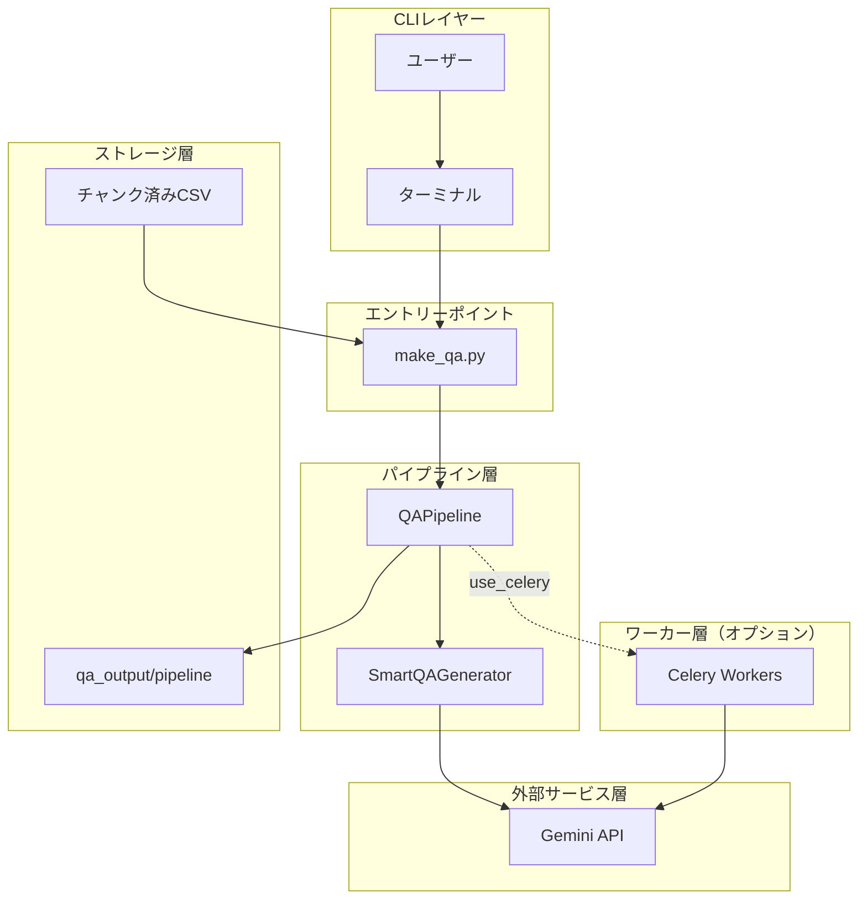
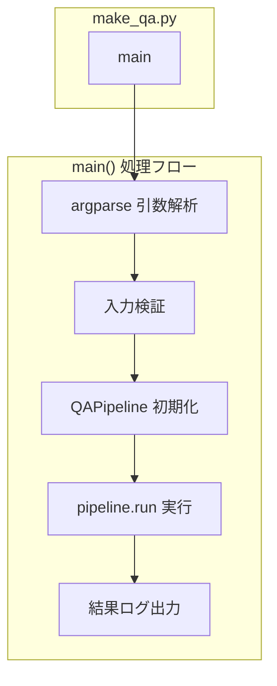
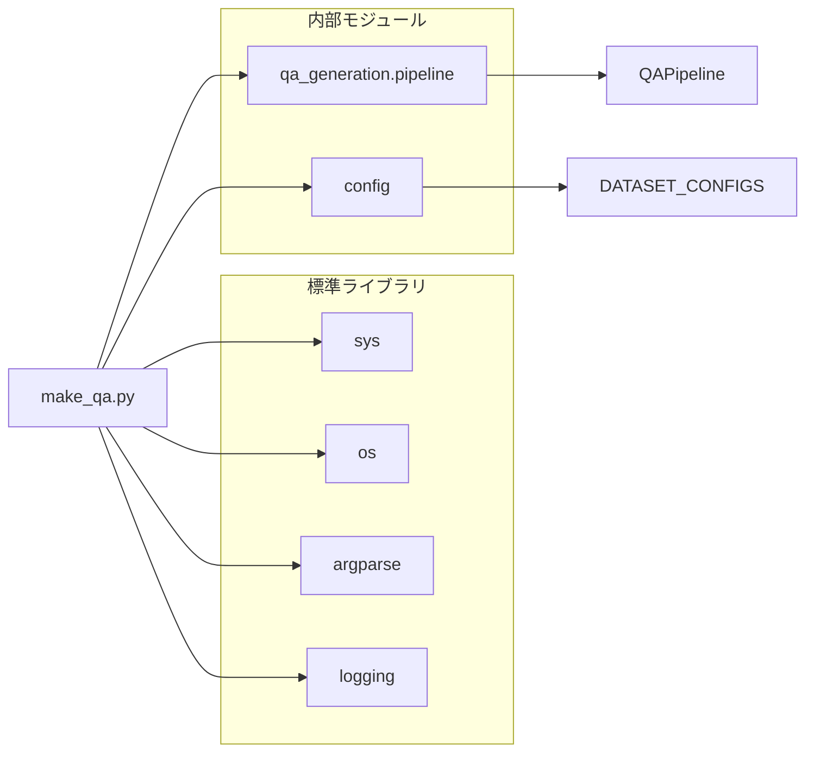
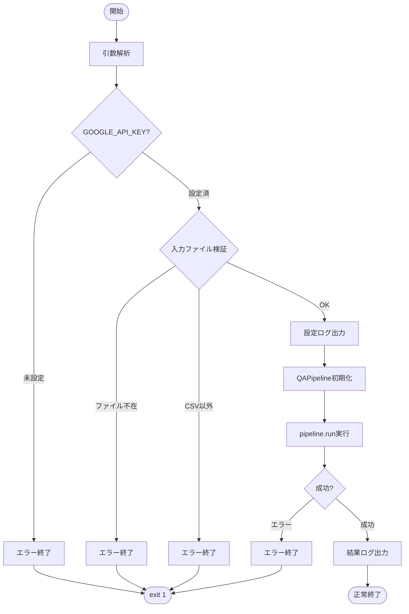

# make_qa.py - Q/Aペア生成 CLIエントリーポイント ドキュメント

**Version 1.0** | 最終更新: 2025-01-29

---

## 目次

1. [概要](#概要)
2. [アーキテクチャ構成図](#1-アーキテクチャ構成図)
3. [モジュール構成図](#2-モジュール構成図)
4. [クラス・関数一覧表](#3-クラス関数一覧表)
5. [クラス・関数 IPO詳細](#4-クラス関数-ipo詳細)
6. [CLI引数仕様](#5-cli引数仕様)
7. [使用例](#6-使用例)
8. [変更履歴](#7-変更履歴)
9. [付録: 依存関係図](#付録-依存関係図)

---

## 概要

`make_qa.py`は、チャンク済みCSVファイルからQ/Aペアを自動生成するCLIエントリーポイント。`QAPipeline`を呼び出し、Celery並列処理またはシンク処理でQ/Aペアを生成する。

### 主な責務

- CLI引数の解析と検証
- 入力ファイル/データセットの検証
- `QAPipeline`の初期化と実行
- 実行結果のログ出力

### 主要機能一覧

| 機能 | 説明 |
|------|------|
| `main()` | CLIエントリーポイント関数 |

### 前提条件

- 入力CSVは既にチャンク済み（`csv_text_to_chunks_text_csv.py`で処理済み）
- `GOOGLE_API_KEY` 環境変数が設定されていること

---

## 1. アーキテクチャ構成図

### 1.1 システム全体構成



### 1.2 データフロー

1. ユーザーがCLI引数を指定して`make_qa.py`を実行
2. 引数解析・検証後、`QAPipeline`を初期化
3. パイプラインがCSVを読み込み、Q/Aペアを生成
4. 結果を`qa_output/pipeline`に保存
5. サマリーをログ出力

---

## 2. モジュール構成図

### 2.1 内部モジュール構成



### 2.2 外部依存関係

| ライブラリ | バージョン | 用途 |
|-----------|-----------|------|
| `argparse` | 標準 | CLI引数解析 |
| `logging` | 標準 | ログ出力 |
| `os` | 標準 | 環境変数・パス操作 |
| `sys` | 標準 | パス追加・終了コード |

### 2.3 内部依存モジュール

| モジュール | 用途 |
|-----------|------|
| `qa_generation.pipeline.QAPipeline` | Q/A生成パイプライン |
| `config.DATASET_CONFIGS` | 事前定義データセット設定 |

---

## 3. クラス・関数一覧表

### 3.1 関数一覧

#### エントリーポイント関数

| 関数名 | 概要 |
|-------|------|
| `main()` | CLIエントリーポイント。引数解析・検証・パイプライン実行を行う |

---

## 4. クラス・関数 IPO詳細

### 4.1 エントリーポイント関数

#### `main`

**概要**: CLI引数を解析し、`QAPipeline`を初期化・実行するエントリーポイント関数。

```python
def main() -> None
```

| パラメータ | 型 | デフォルト | 説明 |
|------------|------|-----------|------|
| - | - | - | パラメータなし（CLI引数から取得） |

| 項目 | 内容 |
|------|------|
| **Input** | CLI引数（`sys.argv`経由） |
| **Process** | 1. `argparse`で引数を解析<br>2. `GOOGLE_API_KEY`環境変数を確認<br>3. 入力ファイルの存在・形式を検証<br>4. 設定内容をログ出力<br>5. `QAPipeline`を初期化<br>6. `pipeline.run()`を実行<br>7. 結果サマリーをログ出力<br>8. エラー時は`sys.exit(1)` |
| **Output** | `None`（標準出力へのログ、ファイル出力は`QAPipeline`が担当） |

**終了コード**:

| コード | 説明 |
|--------|------|
| `0` | 正常終了 |
| `1` | エラー終了（APIキー未設定、ファイル不在、実行エラー等） |

---

## 5. CLI引数仕様

### 5.1 入力ソース（排他的・必須）

| 引数 | 型 | 説明 |
|------|------|------|
| `--dataset` | str | 事前定義データセット名（`DATASET_CONFIGS`のキー） |
| `--input-file` | str | チャンク済みCSVファイルのパス |

> 📝 **注意**: `--dataset` と `--input-file` は排他的。いずれか一方を必ず指定。

### 5.2 共通パラメータ

| 引数 | 型 | デフォルト | 説明 |
|------|------|-----------|------|
| `--model` | str | `gemini-2.0-flash` | 使用するGeminiモデル |
| `--output` | str | `{PROJECT_ROOT}/qa_output/pipeline` | 出力ディレクトリ |
| `--max-docs` | int | `None` | 処理する最大チャンク数 |

### 5.3 カバレージ分析パラメータ

| 引数 | 型 | デフォルト | 説明 |
|------|------|-----------|------|
| `--analyze-coverage` | flag | `False` | カバレージ分析を実行 |
| `--coverage-threshold` | float | `None` | カバレージ判定の類似度閾値 |

### 5.4 Q/A生成パラメータ

| 引数 | 型 | デフォルト | 説明 |
|------|------|-----------|------|
| `--batch-chunks` | int | `3` | 1回のAPIで処理するチャンク数（1-5） |
| `--use-smart-generation` | flag | `True` | スマートQ/A生成を使用（LLMによる動的Q/A数決定） |
| `--no-smart-generation` | flag | - | 従来方式のQ/A生成を使用（トークン数ベース） |

### 5.5 Celery並列処理パラメータ

| 引数 | 型 | デフォルト | 説明 |
|------|------|-----------|------|
| `--use-celery` | flag | `False` | Celeryによる非同期並列処理を使用 |
| `-c`, `--concurrency` | int | `8` | 並列タスク数 |
| `--celery-workers` | int | `1` | ⚠️ 非推奨。`--concurrency`を使用 |

### 5.6 削除された引数（v3.0）

> ⚠️ **非推奨**: 以下の引数はv3.0で削除されました。

| 削除された引数 | 代替方法 |
|---------------|---------|
| `--input-chunks` | `--input-file`に統一 |
| `--merge-chunks` | 削除（前段のchunkingで完了） |
| `--min-tokens` | 削除 |
| `--max-tokens` | 削除 |
| `--overlap-tokens` | 削除 |
| `--use-similarity` | 削除 |
| `--similarity-threshold` | 削除 |

---

## 6. 使用例

### 6.1 基本的なワークフロー（同期処理）

```bash
# チャンク済みCSVからQ/A生成（同期処理）
python qa_qdrant/make_qa.py \
  --input-file output_chunked/data_chunks.csv \
  --analyze-coverage
```

### 6.2 Celery並列処理

```bash
# Celeryワーカーを起動（別ターミナル）
./start_celery.sh -c 8

# Celery並列処理でQ/A生成
python qa_qdrant/make_qa.py \
  --input-file output_chunked/data_chunks.csv \
  --use-celery \
  -c 8 \
  --use-smart-generation \
  --analyze-coverage
```

### 6.3 事前定義データセットを使用

```bash
# wikipedia_ja データセットを処理
python qa_qdrant/make_qa.py \
  --dataset wikipedia_ja \
  --use-celery \
  -c 4
```

### 6.4 処理チャンク数を制限

```bash
# 最初の100チャンクのみ処理（テスト用）
python qa_qdrant/make_qa.py \
  --input-file output_chunked/large_data.csv \
  --max-docs 100 \
  --analyze-coverage
```

### 6.5 従来方式のQ/A生成

```bash
# スマート生成を無効化
python qa_qdrant/make_qa.py \
  --input-file output_chunked/data_chunks.csv \
  --no-smart-generation \
  --analyze-coverage
```

---

## 7. 変更履歴

| バージョン | 変更内容 |
|-----------|---------|
| 1.0 | 初版作成 |
| 3.0 | pipeline.py v3.0対応、チャンク関連引数を削除、`-c, --concurrency`引数を追加、`--use-smart-generation`引数を追加 |

---

## 付録: 依存関係図



---

## 付録: 実行フローチャート


