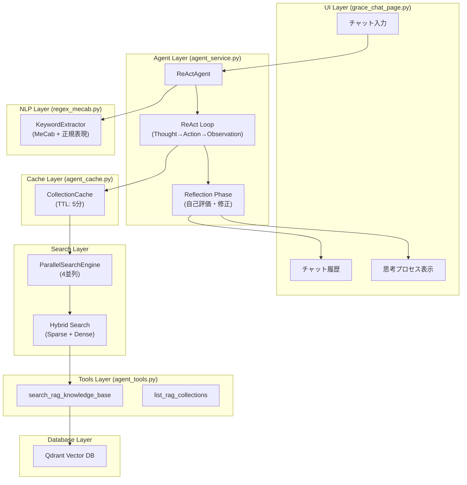
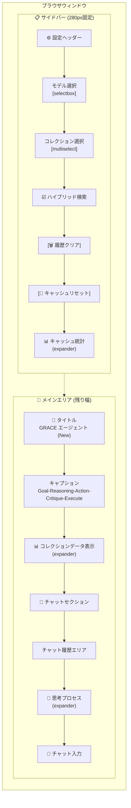
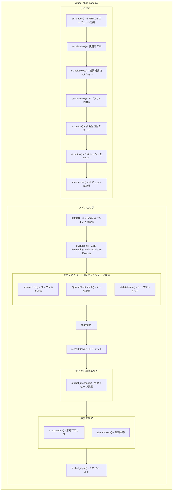
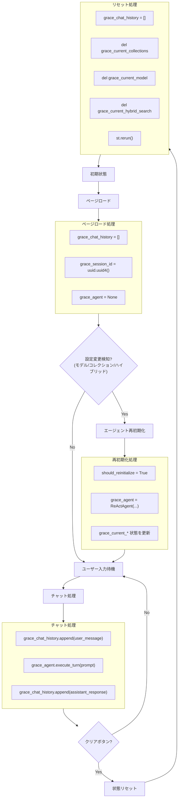
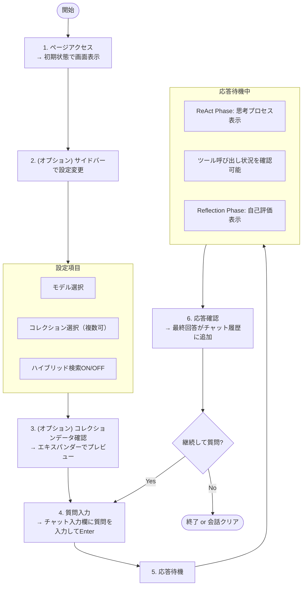
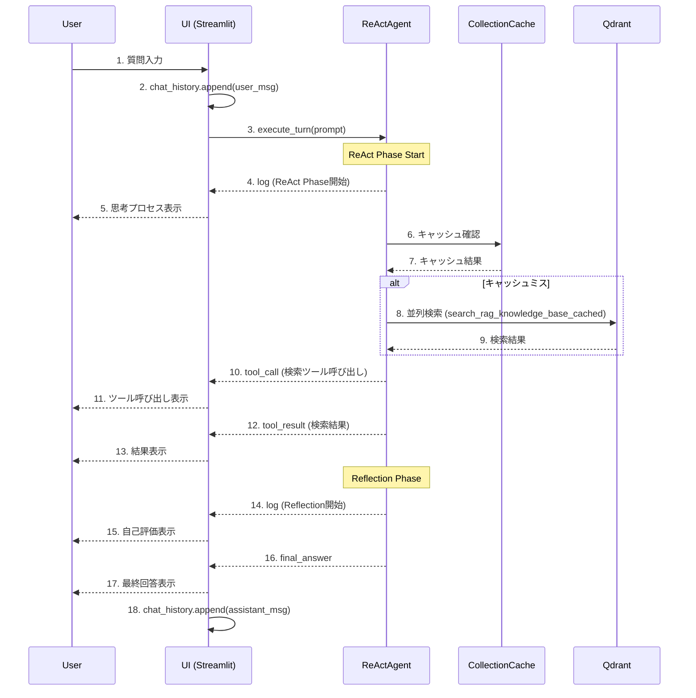
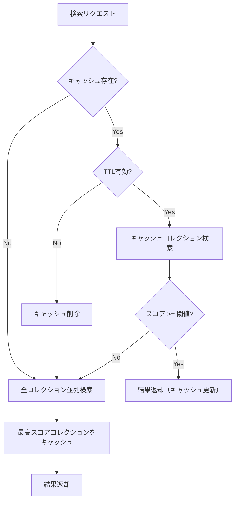
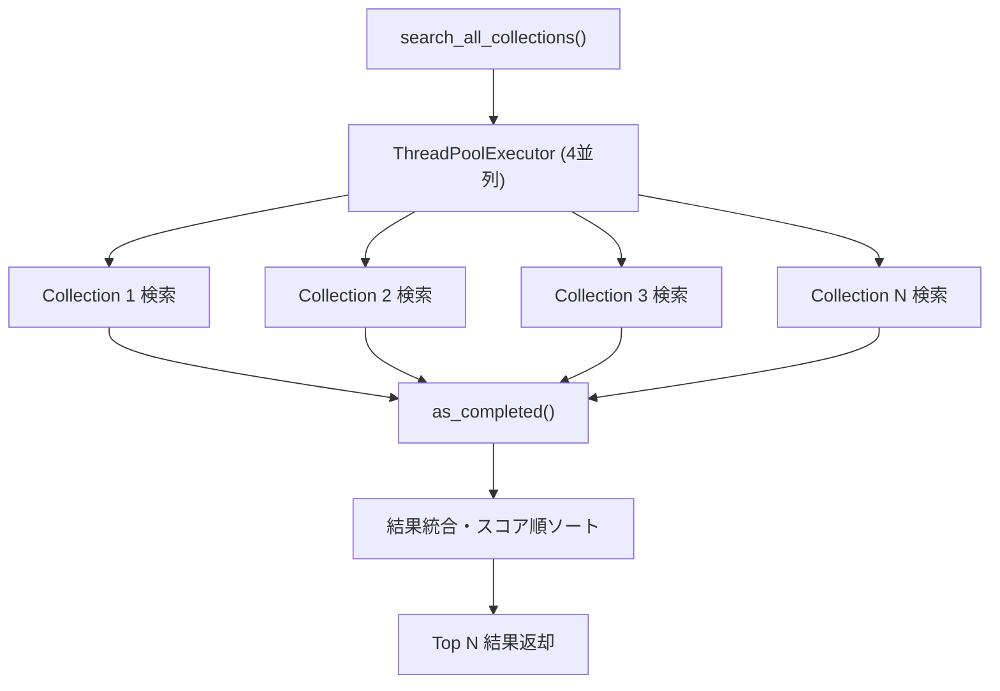
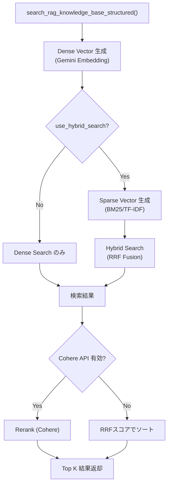

# grace_chat_page.py - GRACE エージェント チャット画面 ドキュメント

**Version 1.0** | 最終更新: 2025-01-29

---

## 目次

1. [概要](#概要)
2. [画面レイアウト図](#1-画面レイアウト図)
3. [UIコンポーネント詳細](#2-uiコンポーネント詳細)
4. [セッション状態管理](#3-セッション状態管理)
5. [ユーザー操作フロー](#4-ユーザー操作フロー)
6. [関数一覧表](#5-関数一覧表)
7. [関数 IPO詳細](#6-関数-ipo詳細)
8. [依存関係](#7-依存関係)
9. [イベント処理](#8-イベント処理)
10. [エラーハンドリング](#9-エラーハンドリング)
11. [使用例](#10-使用例)
12. [変更履歴](#11-変更履歴)

---

## 概要

`grace_chat_page.py`は、GRACE（Goal-Reasoning-Action-Critique-Execute）アーキテクチャを使用したエージェントとの対話インターフェースを提供するStreamlit UIページです。ReActエージェントを用いたRAG（Retrieval-Augmented Generation）検索と、リアルタイムの思考プロセス可視化機能を備えています。

### 主な責務

- ユーザーからの質問入力の受付
- ReActエージェントへのクエリ送信と応答表示
- エージェントの思考プロセス（Thought → Action → Observation）のリアルタイム可視化
- 会話履歴の管理とセッション状態の維持
- 検索対象コレクションの選択と設定
- ハイブリッド検索（Sparse + Dense）の有効/無効切り替え
- Qdrantコレクションデータのプレビュー表示
- キャッシュ管理と統計表示

### 主要機能一覧

| 機能 | 説明 |
|------|------|
| `show_grace_chat_page()` | メインページ表示関数 |
| サイドバー設定 | モデル選択、コレクション選択、ハイブリッド検索ON/OFF、キャッシュ管理 |
| コレクションデータ表示 | Qdrantコレクションの内容プレビュー（最大100件） |
| チャット履歴表示 | 会話履歴のストリーミング表示 |
| 思考プロセス表示 | エージェント推論（ReAct + Reflection）のリアルタイム表示 |

### アーキテクチャ概要



---

## 1. 画面レイアウト図

### 1.1 全体レイアウト



### 1.2 コンポーネント配置図



---

## 2. UIコンポーネント詳細

### 2.1 サイドバー

| コンポーネント | 種類 | キー | デフォルト値 | 説明 |
|---------------|------|------|-------------|------|
| 設定ヘッダー | `st.header` | - | - | 「⚙️ GRACE エージェント設定」 |
| モデル選択 | `st.selectbox` | - | `AgentConfig.MODEL_NAME` | 使用するLLMモデル（Gemini） |
| コレクション選択 | `st.multiselect` | - | 全コレクション | 検索対象コレクション（複数選択可） |
| ハイブリッド検索 | `st.checkbox` | - | `True` | Sparse + Dense検索の有効化 |
| 履歴クリア | `st.button` | - | - | 会話履歴と状態のクリア |
| キャッシュリセット | `st.button` | - | - | セッションキャッシュのクリア |
| キャッシュ統計 | `st.expander` | - | 折りたたみ | キャッシュ状態の詳細表示 |

#### モデル選択の詳細

```python
selected_model = st.selectbox(
    "使用モデル (Model)",
    options=GeminiConfig.AVAILABLE_MODELS,
    index=GeminiConfig.AVAILABLE_MODELS.index(AgentConfig.MODEL_NAME)
    if AgentConfig.MODEL_NAME in GeminiConfig.AVAILABLE_MODELS else 0
)
```

**オプション一覧** (`GeminiConfig.AVAILABLE_MODELS`):

| モデル名 | 説明 |
|---------|------|
| `gemini-2.5-flash` | 高速推論モデル（デフォルト） |
| `gemini-3-pro-preview` | 最新Proモデル |
| `gemini-2.5-pro-preview` | 高性能Proモデル |
| `gemini-2.0-flash` | 安定版高速モデル |

#### キャッシュ統計の詳細

| 表示項目 | 説明 |
|---------|------|
| キャッシュ状態 | 🟢 ヒット / ⚪ なし |
| コレクション | キャッシュされているコレクション名 |
| 前回スコア | 直近の検索スコア |
| ヒット回数 | キャッシュヒット累計 |
| 経過時間 | キャッシュ作成からの経過秒数 |

### 2.2 メインエリア

| コンポーネント | 種類 | 説明 |
|---------------|------|------|
| タイトル | `st.title` | 「🧠 GRACE エージェント (New)」 |
| キャプション | `st.caption` | 「Goal-Reasoning-Action-Critique-Execute Architecture」 |
| コレクションデータ表示 | `st.expander` + `st.dataframe` | Qdrantデータのプレビュー |
| チャットセクション見出し | `st.markdown` | 「### 💬 チャット」 |
| チャット履歴 | `st.chat_message` | 会話の表示 |
| 思考プロセス | `st.expander` | エージェント推論の表示 |
| チャット入力 | `st.chat_input` | ユーザー入力 |

### 2.3 エキスパンダー

| エキスパンダー名 | 初期状態 | 内容 |
|-----------------|---------|------|
| 📊 コレクションデータの表示 | 折りたたみ | コレクション選択 + DataFrameプレビュー（100件） |
| 🤔 エージェントの思考プロセス | 展開 | Thought, Tool Call, Tool Result のリアルタイム表示 |
| 📊 キャッシュ統計 | 折りたたみ | キャッシュヒット状態、統計情報 |

### 2.4 ダイアログ・モーダル

（このページではダイアログ・モーダルは使用していません）

---

## 3. セッション状態管理

### 3.1 状態一覧

| キー | 型 | 初期値 | 説明 | リセット条件 |
|-----|-----|-------|------|-------------|
| `grace_chat_history` | `List[Dict]` | `[]` | 会話履歴（role, content） | クリアボタン |
| `grace_session_id` | `str` | `uuid.uuid4()` | セッション識別子 | ページリロード |
| `grace_agent` | `ReActAgent` | `None` | エージェントインスタンス | 設定変更時 |
| `grace_current_collections` | `List[str]` | - | 選択中コレクション | コレクション変更時 |
| `grace_current_model` | `str` | - | 選択中モデル | モデル変更時 |
| `grace_current_hybrid_search` | `bool` | `True` | ハイブリッド検索状態 | チェックボックス変更時 |

### 3.2 状態遷移図



### 3.3 初期化・リセット条件

| 条件 | 対象状態 | 処理 |
|------|---------|------|
| ページ初回ロード | 全状態 | デフォルト値で初期化 |
| モデル変更 | `grace_agent`, `grace_current_model` | エージェント再初期化、トースト表示 |
| コレクション変更 | `grace_agent`, `grace_current_collections` | エージェント再初期化、トースト表示 |
| ハイブリッド検索変更 | `grace_agent`, `grace_current_hybrid_search` | エージェント再初期化、トースト表示 |
| クリアボタン | `grace_chat_history`, `grace_current_*` | 全状態クリア後リロード |
| キャッシュリセット | キャッシュのみ | `collection_cache.clear(session_id)` |

---

## 4. ユーザー操作フロー

### 4.1 基本操作フロー



### 4.2 操作シーケンス図



---

## 5. 関数一覧表

### 5.1 メイン関数

| 関数名 | 概要 |
|-------|------|
| `show_grace_chat_page()` | ページ全体のレンダリングと制御 |

### 5.2 ヘルパー関数（インポート）

| 関数名 | モジュール | 概要 |
|-------|-----------|------|
| `get_available_collections_from_qdrant_helper()` | `services.agent_service` | Qdrantコレクション一覧取得 |
| `ReActAgent` | `services.agent_service` | ReActエージェントクラス |
| `collection_cache` | `agent_cache` | コレクションキャッシュ管理 |

---

## 6. 関数 IPO詳細

### 6.1 `show_grace_chat_page`

**概要**: GRACEエージェントチャットページのメイン表示関数。サイドバー設定、コレクションデータプレビュー、チャット履歴、ユーザー入力処理を統合管理する。

```python
def show_grace_chat_page() -> None
```

| 項目 | 内容 |
|------|------|
| **Input** | なし（セッション状態から取得） |
| **Process** | 1. コレクションデータ表示エリアの描画<br>2. サイドバー設定UIの描画<br>3. セッション状態の初期化・更新チェック<br>4. エージェントの初期化（必要時）<br>5. チャット履歴の表示<br>6. ユーザー入力の処理<br>7. エージェント応答のストリーミング表示 |
| **Output** | なし（画面描画のみ） |

**主要処理フロー**:

```python
# 1. コレクションデータ表示
with st.expander("📊 コレクションデータの表示", expanded=False):
    target_collection = st.selectbox("コレクションを選択:", preview_collections)
    points, _ = client.scroll(collection_name=target_collection, limit=100)
    st.dataframe(df_preview)

# 2. サイドバー設定
with st.sidebar:
    selected_model = st.selectbox("使用モデル", options=GeminiConfig.AVAILABLE_MODELS)
    selected_collections = st.multiselect("検索対象コレクション", options=all_collections)
    use_hybrid_search = st.checkbox("ハイブリッド検索", value=True)

# 3. セッション状態初期化
if "grace_chat_history" not in st.session_state:
    st.session_state.grace_chat_history = []
if "grace_session_id" not in st.session_state:
    st.session_state.grace_session_id = str(uuid.uuid4())

# 4. エージェント初期化（設定変更時）
if should_reinitialize:
    st.session_state.grace_agent = ReActAgent(
        selected_collections,
        selected_model,
        session_id=st.session_state.grace_session_id,
        use_hybrid_search=use_hybrid_search
    )

# 5. チャット履歴表示
for message in st.session_state.grace_chat_history:
    with st.chat_message(message["role"]):
        st.markdown(message["content"])

# 6. ユーザー入力処理
if prompt := st.chat_input("質問を入力してください..."):
    st.session_state.grace_chat_history.append({"role": "user", "content": prompt})

    # 7. エージェント応答処理
    for event in st.session_state.grace_agent.execute_turn(prompt):
        if event["type"] == "log":
            # 思考ログ表示
        elif event["type"] == "tool_call":
            # ツール呼び出し表示
        elif event["type"] == "tool_result":
            # ツール結果表示
        elif event["type"] == "final_answer":
            # 最終回答表示
```

### 6.2 `get_available_collections_from_qdrant_helper`

**概要**: Qdrantから利用可能なコレクション一覧を取得する。

**参照**: `services/agent_service.py`

| 項目 | 内容 |
|------|------|
| **Input** | なし |
| **Process** | Qdrantクライアントでコレクション一覧を取得 |
| **Output** | `List[str]`: コレクション名のリスト（エラー時は空リスト） |

### 6.3 イベント処理コールバック

#### チャット入力コールバック

```python
if prompt := st.chat_input("質問を入力してください..."):
    # ユーザーメッセージを履歴に追加
    st.session_state.grace_chat_history.append({"role": "user", "content": prompt})

    # エージェント応答処理（ジェネレータ）
    for event in st.session_state.grace_agent.execute_turn(prompt):
        if event["type"] == "log":
            # 思考ログをエキスパンダーに追加
            current_thought_log_content.append(event["content"])
        elif event["type"] == "tool_call":
            # ツール呼び出し情報を表示（スピナー付き）
            current_thought_log_content.append(
                f"🛠️ **Tool Call:** `{event['name']}`\nArgs: `{event['args']}`"
            )
        elif event["type"] == "tool_result":
            # ツール結果を表示
            current_thought_log_content.append(f"📝 **Tool Result:**\n{event['content']}")
        elif event["type"] == "final_answer":
            # 最終回答をマークダウン表示
            final_response_content = event["content"]
            response_text_placeholder.markdown(final_response_content)
```

---

## 7. 依存関係

### 7.1 外部ライブラリ

| ライブラリ | バージョン | 用途 |
|-----------|-----------|------|
| `streamlit` | >= 1.28 | UIフレームワーク |
| `pandas` | >= 2.0 | データフレーム表示 |
| `qdrant-client` | >= 1.6 | Qdrant接続・データ取得 |
| `google-genai` | >= 0.4 | Gemini API（新SDK） |
| `MeCab` | (Optional) | 日本語形態素解析 |
| `cohere` | (Optional) | Re-ranking API |

### 7.2 内部モジュール

| モジュール | 用途 |
|-----------|------|
| `config.AgentConfig` | エージェント設定（デフォルトモデル、RAG設定） |
| `config.GeminiConfig` | Geminiモデル設定（利用可能モデル一覧） |
| `config.CohereConfig` | Cohere API設定（Re-ranking） |

### 7.3 サービス層

| サービス | 用途 |
|---------|------|
| `services.agent_service.ReActAgent` | ReActエージェント処理（思考→行動→観察サイクル） |
| `services.agent_service.get_available_collections_from_qdrant_helper` | Qdrantコレクション取得 |
| `agent_cache.collection_cache` | セッションベースのキャッシュ管理 |
| `agent_parallel_search.parallel_search_engine` | 並列検索エンジン |
| `agent_tools` | RAG検索ツール群 |

### 7.4 依存モジュール詳細

#### 7.4.1 agent_cache.py - コレクションキャッシュマネージャー

前回の検索成功コレクションをセッション単位でキャッシュし、検索効率を向上させます。

**主要クラス・関数**:

| 名前 | 種類 | 説明 |
|------|------|------|
| `CollectionCache` | クラス | キャッシュ管理クラス |
| `CollectionCacheEntry` | dataclass | キャッシュエントリ（collection_name, last_score, timestamp, hit_count, query_history） |
| `collection_cache` | グローバルインスタンス | デフォルトキャッシュ（TTL: 5分） |

**キャッシュ設定**:

| 設定項目 | デフォルト値 | 説明 |
|---------|-------------|------|
| TTL | 300秒（5分） | キャッシュの有効期限 |
| max_history | 5件 | 保持するクエリ履歴数 |

**キャッシュ戦略**:



#### 7.4.2 agent_parallel_search.py - 並列検索エンジン

複数のQdrantコレクションを並列検索し、検索時間を大幅に短縮します。

**主要クラス・関数**:

| 名前 | 種類 | 説明 |
|------|------|------|
| `ParallelSearchEngine` | クラス | 並列検索エンジン |
| `SearchResult` | dataclass | 検索結果ラッパー（collection_name, results, top_score, elapsed_ms, error） |
| `parallel_search_engine` | グローバルインスタンス | デフォルト並列検索エンジン |

**並列検索設定**:

| 設定項目 | デフォルト値 | 説明 |
|---------|-------------|------|
| max_workers | 4 | 並列実行スレッド数 |
| timeout_per_collection | 10秒 | コレクション毎のタイムアウト |

**検索フロー**:



#### 7.4.3 agent_tools.py - RAG検索ツール

Qdrantベクトルデータベースへの検索インターフェースを提供します。

**主要関数**:

| 関数名 | 説明 |
|-------|------|
| `search_rag_knowledge_base(query, collection_name, use_hybrid_search)` | RAG検索（文字列出力版） |
| `search_rag_knowledge_base_structured(query, collection_name, use_hybrid_search)` | RAG検索（構造化データ版） |
| `search_rag_knowledge_base_cached(query, session_id, collection_name, cache_threshold, use_hybrid_search)` | キャッシュ+並列検索を使用したスマート検索 |
| `list_rag_collections()` | 利用可能なコレクション一覧取得 |
| `rerank_results(query, results, top_k, threshold)` | Cohere Rerank APIによる再評価 |

**カスタム例外**:

| 例外クラス | 説明 |
|-----------|------|
| `RAGToolError` | RAGツール固有のエラー基底クラス |
| `QdrantConnectionError` | Qdrant接続エラー |
| `CollectionNotFoundError` | コレクション未存在エラー |
| `EmbeddingError` | 埋め込み生成エラー |

**ハイブリッド検索フロー**:



#### 7.4.4 regex_mecab.py - キーワード抽出

MeCabと正規表現を統合したロバストなキーワード抽出システムです。

**主要クラス**:

| クラス名 | 説明 |
|---------|------|
| `KeywordExtractor` | MeCab/正規表現統合キーワード抽出クラス |

**抽出戦略**:

| モード | 条件 | 説明 |
|-------|------|------|
| MeCab複合名詞 | 日本語テキスト + MeCab利用可能 | 複合名詞を抽出（高精度） |
| 正規表現 | 英語テキスト or MeCab不可 | カタカナ語、漢字複合語、英数字を抽出 |
| 統合版 | extract_with_details() | 両手法の結果をマージ |

**スコアリング要素**:

| 要素 | 重み | 説明 |
|------|------|------|
| 頻度スコア | 0.3 | 出現回数（最大3回まで正規化） |
| 長さスコア | 0.3 | 文字数（複合語優遇） |
| 重要キーワードブースト | 0.5 | AI, NLP, 医療等の重要キーワード |
| 文字種スコア | 0.1-0.3 | カタカナ、漢字、英語頭字語等 |

**ストップワード**:

日本語（こと、もの、これ、ため等）と英語（the, is, are, have等）の一般的なストップワードを除外。

---

## 8. イベント処理

### 8.1 ボタンイベント

| ボタン | イベント | 処理内容 |
|-------|---------|---------|
| 🗑️ 会話履歴をクリア | クリック | `grace_chat_history`クリア、`grace_current_*`状態削除、`st.rerun()` |
| 🔄 キャッシュをリセット | クリック | `collection_cache.clear(session_id)`、トースト表示 |

### 8.2 入力イベント

| コンポーネント | イベント | 処理内容 |
|---------------|---------|---------|
| モデル選択 | 変更 | `should_reinitialize = True`、エージェント再初期化 |
| コレクション選択 | 変更 | `should_reinitialize = True`、エージェント再初期化 |
| ハイブリッド検索 | 変更 | `should_reinitialize = True`、エージェント再初期化 |
| コレクション選択（プレビュー用） | 変更 | Qdrantからデータ取得、DataFrame更新 |
| チャット入力 | Enter | エージェント処理開始 |

### 8.3 リアルタイム更新

| イベント種別 | 更新内容 |
|-------------|---------|
| `log` | 思考プロセスエキスパンダーに追記（🧠 Thought, 🔄 Reflection等） |
| `tool_call` | ツール呼び出し情報を表示（🛠️）、スピナー表示 |
| `tool_result` | ツール結果を表示（📝）、500文字で切り詰め |
| `final_answer` | 最終回答をマークダウン表示、履歴に追加 |

---

## 9. エラーハンドリング

### 9.1 エラー種別

| エラー種別 | 発生条件 | 対処 |
|-----------|---------|------|
| Qdrant接続エラー | サーバー未起動、ネットワーク障害 | `st.warning`で警告表示、空コレクションリストで続行 |
| エージェント初期化エラー | API認証失敗、設定エラー | `st.error`でエラー表示、`return`で処理中断 |
| チャット処理エラー | API呼び出し失敗、タイムアウト | `st.error`でエラー表示、ログ出力（`exc_info=True`） |
| コレクションデータ取得エラー | コレクション不在、スキーマ不一致 | `st.error`でエラー表示 |

### 9.2 エラー表示

| 表示種別 | Streamlitコンポーネント | 用途 |
|---------|------------------------|------|
| エラー | `st.error()` | 致命的エラー（エージェント初期化失敗等） |
| 警告 | `st.warning()` | 注意喚起（コレクション未選択等） |
| 情報 | `st.info()` | 補足情報（データなし等） |
| トースト | `st.toast()` | 一時的な通知（設定変更、キャッシュクリア等） |

### 9.3 エラー処理コード例

```python
# エージェント初期化エラー
try:
    st.session_state.grace_agent = ReActAgent(
        selected_collections,
        selected_model,
        session_id=st.session_state.grace_session_id,
        use_hybrid_search=use_hybrid_search
    )
    st.toast("GRACEエージェントの準備が完了しました（キャッシュ+並列検索）。")
except Exception as e:
    st.error(f"エージェントの初期化に失敗しました: {e}")
    return

# チャット処理エラー
try:
    for event in st.session_state.grace_agent.execute_turn(prompt):
        # イベント処理
        ...
except Exception as e:
    st.error(f"エラーが発生しました: {e}")
    logger.error(f"GRACE Chat Error: {e}", exc_info=True)
```

---

## 10. 使用例

### 10.1 基本的な使用方法

1. ページにアクセス
2. サイドバーで必要に応じて設定を変更
   - 使用モデルの選択（Gemini 2.5 Flash推奨）
   - 検索対象コレクションの選択（複数選択可）
   - ハイブリッド検索の有効/無効
3. （オプション）コレクションデータのプレビュー
   - エキスパンダーを開いてコレクションを選択
   - 登録されているQ&Aデータを確認
4. チャット入力欄に質問を入力してEnter
5. 思考プロセスを確認しながら応答を待機
   - ReAct Phase: 思考→ツール呼び出し→観察
   - Reflection Phase: 自己評価と修正
6. 最終回答を確認
7. 必要に応じて追加の質問を続ける

### 10.2 画面スクリーンショット

（実際のドキュメントでは、スクリーンショット画像を挿入）

### 10.3 典型的な質問例

```
- 「カリン・フォン・アロルディンゲンについて教えてください」
- 「Wikipediaの情報から、〇〇の歴史を説明してください」
- 「ライブドアニュースで報じられた××について教えて」
- 「△△と□□の違いは何ですか？」
```

### 10.4 思考プロセス表示例

```
🤖 **ReAct Phase Start**
📖 **説明**: エージェントが「思考→行動→観察」のサイクルで問題を解決します。
⚡ **ハイブリッド検索**: 有効 (Sparse + Dense)

🧠 **Thought:**
この質問に答えるには、社内ナレッジベースを検索する必要があります...

🛠️ **Tool Call:** `search_rag_knowledge_base`
Args: `{'query': 'カリン・フォン・アロルディンゲン'}`

📝 **Tool Result:**
【検索結果】コレクション: wikipedia_ja_5per, スコア: 0.723...

🔄 **Reflection Phase (推敲)**
📖 **説明**: エージェントが作成した回答案を客観的に評価・修正します。
```

---

## 11. 変更履歴

| バージョン | 日付 | 変更内容 |
|-----------|------|---------|
| 1.0 | 2025-01-29 | 初版作成 |
| 1.1 | 2025-01-29 | 依存モジュール詳細（agent_cache, agent_parallel_search, agent_tools, regex_mecab）を追加 |

---

## 付録A: アプリケーション構成

### A.1 メインアプリケーション (agent_rag.py)

`grace_chat_page.py`は`agent_rag.py`からインポートされ、サイドバーのメニューから呼び出されます。

```python
# agent_rag.py より抜粋
from ui.pages import show_grace_chat_page

page_mapping = {
    "grace_chat": show_grace_chat_page,
    # 他のページ...
}
```

**利用可能なページ一覧**:

| ページID | 表示名 | 説明 |
|---------|-------|------|
| `explanation` | 📖 説明 | システム説明ページ |
| `agent_chat` | 🤖 エージェント対話 | ReAct+Reflectionエージェント |
| `grace_chat` | 🧠 GRACE エージェント | **本ページ** |
| `log_viewer` | 📊 未回答ログ | 未回答質問のログ閲覧 |
| `rag_download` | 📥 RAGデータダウンロード | データセットダウンロード |
| `qa_generation` | 🤖 Q/A生成 | Q&Aペア生成 |
| `qdrant_registration` | 📥 CSVデータ登録 | Qdrantへのデータ登録 |
| `show_qdrant` | 🗄️ Qdrantデータ管理 | コレクション管理 |
| `qdrant_search` | 🔎 Qdrant検索 | 検索テスト |

### A.2 CLI版エージェント (agent_main.py)

同等の機能を持つCLI版エージェントも提供されています。

```bash
# CLI版エージェントの実行
python agent_main.py
```

**CLI版の機能**:
- ReAct + Reflection 2段階処理
- 動的コレクション取得
- キーワード抽出（オプション）
- 多言語対応の検索戦略
- 再試行メカニズム

---

## 付録B: 設定リファレンス

### B.1 AgentConfig

| 設定項目 | デフォルト値 | 説明 |
|---------|-------------|------|
| `RAG_DEFAULT_COLLECTION` | `"wikipedia_ja_5per"` | デフォルト検索コレクション |
| `RAG_SEARCH_LIMIT` | 3 | 検索結果の最大件数 |
| `RAG_SCORE_THRESHOLD` | 0.50 | 検索結果として採用する最小スコア |
| `MODEL_NAME` | `GeminiConfig.DEFAULT_MODEL` | デフォルトモデル |
| `CHAT_LOG_FILE_NAME` | `"agent_chat.log"` | チャットログファイル名 |
| `CHAT_LOG_LEVEL` | `"INFO"` | ログレベル |

### B.2 GeminiConfig

| 設定項目 | デフォルト値 | 説明 |
|---------|-------------|------|
| `DEFAULT_MODEL` | `"gemini-2.5-flash"` | デフォルトモデル |
| `EMBEDDING_MODEL` | `"gemini-embedding-001"` | 埋め込みモデル |
| `EMBEDDING_DIMS` | 3072 | 埋め込み次元数 |
| `DEFAULT_TEMPERATURE` | 1.0 | 温度パラメータ |

### B.3 CohereConfig

| 設定項目 | デフォルト値 | 説明 |
|---------|-------------|------|
| `API_KEY` | `os.getenv("COHERE_API_KEY")` | Cohere APIキー |
| `RERANK_MODEL` | `"rerank-multilingual-v3.0"` | Rerankモデル |

---

## 付録C: トラブルシューティング

### C.1 よくある問題と解決策

| 問題 | 原因 | 解決策 |
|------|------|-------|
| 「コレクションがありません」と表示される | Qdrantサーバー未起動 | `docker-compose up -d qdrant`でQdrantを起動 |
| エージェント初期化エラー | APIキー未設定 | `GEMINI_API_KEY`または`GOOGLE_API_KEY`を設定 |
| 検索結果が見つからない | コレクションにデータがない | CSVデータ登録ページでデータを登録 |
| MeCabエラー | MeCab未インストール | `pip install mecab-python3`でインストール |
| キャッシュが効かない | TTL切れ | 5分以内に同一セッションで検索を実行 |

### C.2 ログの確認方法

```bash
# アプリケーションログ
journalctl -u streamlit-app -f

# エージェントログ
tail -f logs/agent_chat.log
```
